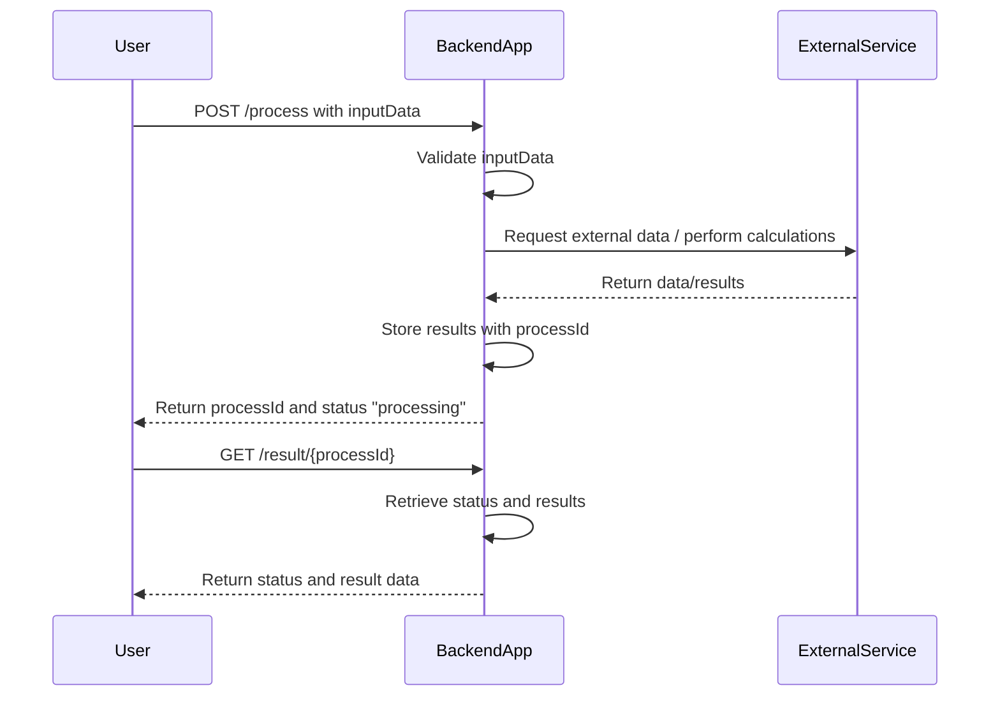

```markdown
# Functional Requirements Specification

## API Endpoints

### 1. POST /process
- **Purpose:** Accept input data for processing, invoke any external data sources or perform calculations, and store results.
- **Request Format:** JSON  
  ```json
  {
    "inputData": { /* user-provided data */ }
  }
  ```
- **Response Format:** JSON  
  ```json
  {
    "processId": "string",      // Unique identifier for the processing request
    "status": "processing"      // Initial status of the process
  }
  ```
- **Business Logic:**  
  - Validates input data.  
  - Calls external data sources or performs calculations as required.  
  - Stores results linked to `processId`.

---

### 2. GET /result/{processId}
- **Purpose:** Retrieve the results of a previously processed request using the process ID.
- **Request Format:** URL parameter: `processId`  
- **Response Format:** JSON  
  ```json
  {
    "processId": "string",
    "status": "completed | processing | failed",
    "result": { /* processed data or error details */ }
  }
  ```
- **Business Logic:**  
  - Retrieves stored results or current processing status for the given `processId`.

---

## User-App Interaction Sequence


```mermaid
sequenceDiagram
    participant User
    participant BackendApp
    participant ExternalService

    User->>BackendApp: POST /process with inputData
    BackendApp->>BackendApp: Validate inputData
    BackendApp->>ExternalService: Request external data / perform calculations
    ExternalService-->>BackendApp: Return data/results
    BackendApp->>BackendApp: Store results with processId
    BackendApp-->>User: Return processId and status "processing"

    User->>BackendApp: GET /result/{processId}
    BackendApp->>BackendApp: Retrieve status and results
    BackendApp-->>User: Return status and result data
```
```