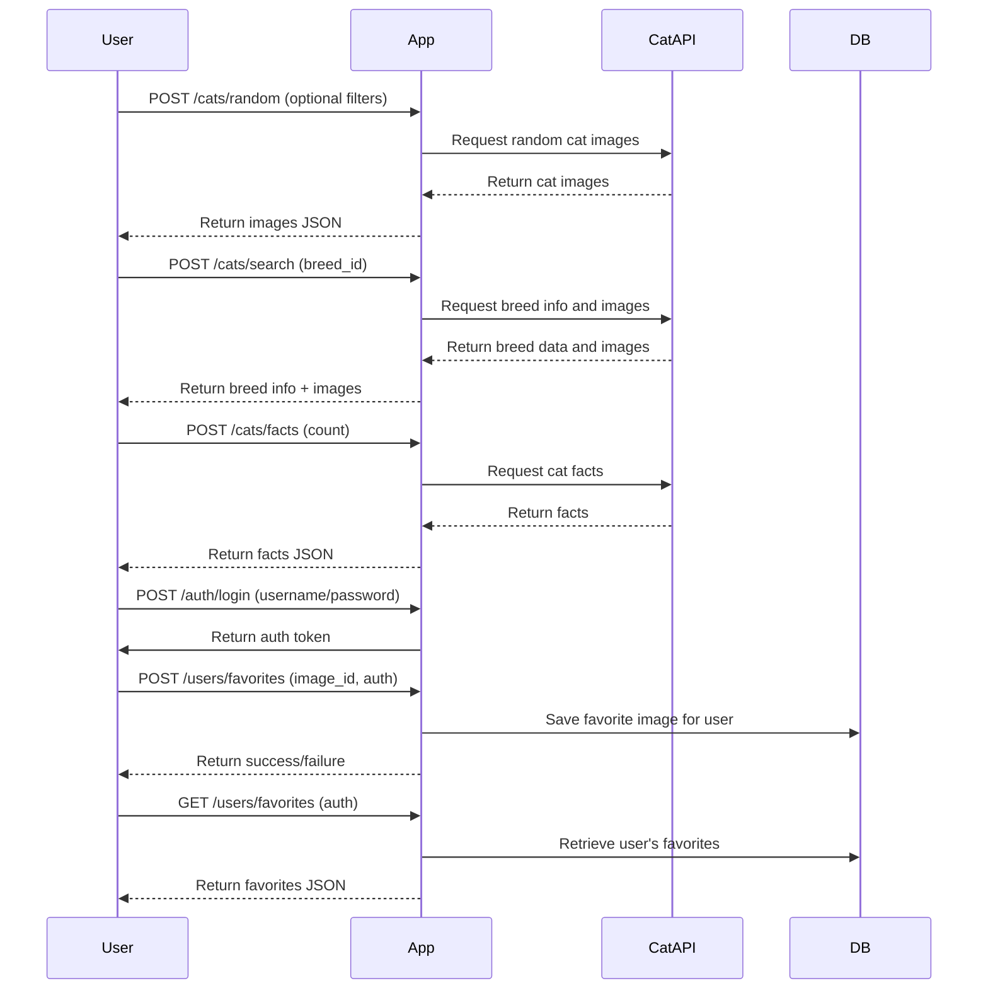

```markdown
# Functional Requirements and API Specification for Cat API Backend

## Overview
This backend application provides cat-related data and user-specific features by integrating with the external Cat API. Business logic that involves external data retrieval or processing is handled via POST endpoints, while GET endpoints serve cached or stored results.

---

## API Endpoints

### 1. Fetch Random Cat Images  
**POST** `/cats/random`  
- **Description:** Retrieve random cat images from external Cat API with optional filters.  
- **Request:**  
```json
{
  "category": "string (optional)",
  "limit": "integer (optional, default 1)"
}
```  
- **Response:**  
```json
{
  "images": [
    {
      "id": "string",
      "url": "string",
      "breeds": ["string"],
      "metadata": {}
    }
  ]
}
```

### 2. Search Cats by Breed  
**POST** `/cats/search`  
- **Description:** Search cats by breed name or ID; fetch images and breed info from external API.  
- **Request:**  
```json
{
  "breed_id": "string",
  "limit": "integer (optional, default 5)"
}
```  
- **Response:**  
```json
{
  "breed_info": {
    "id": "string",
    "name": "string",
    "description": "string",
    "temperament": "string"
  },
  "images": [
    {
      "id": "string",
      "url": "string"
    }
  ]
}
```

### 3. Get Cat Facts  
**POST** `/cats/facts`  
- **Description:** Retrieve random cat facts from external data source.  
- **Request:**  
```json
{
  "count": "integer (optional, default 1)"
}
```  
- **Response:**  
```json
{
  "facts": ["string"]
}
```

### 4. Upload Cat Image  
**POST** `/cats/upload`  
- **Description:** Upload a cat image with metadata (requires authentication).  
- **Request:**  
Content-Type: multipart/form-data  
Fields:
- `image_file` (file)  
- `metadata` (JSON string, optional)  
- **Response:**  
```json
{
  "upload_status": "success|failure",
  "image_id": "string",
  "message": "string"
}
```

### 5. Add Favorite Cat  
**POST** `/users/favorites`  
- **Description:** Add a cat image to user's favorites (requires authentication).  
- **Request:**  
```json
{
  "image_id": "string"
}
```  
- **Response:**  
```json
{
  "status": "success|failure",
  "message": "string"
}
```

### 6. Get User Favorites  
**GET** `/users/favorites`  
- **Description:** Retrieve user's favorite cat images (from internal DB).  
- **Response:**  
```json
{
  "favorites": [
    {
      "image_id": "string",
      "url": "string",
      "metadata": {}
    }
  ]
}
```

### 7. User Authentication (example token-based)  
**POST** `/auth/login`  
- **Request:**  
```json
{
  "username": "string",
  "password": "string"
}
```  
- **Response:**  
```json
{
  "token": "string",
  "expires_in": "integer"
}
```

---

## User-App Interaction Sequence


```mermaid
sequenceDiagram
    participant User
    participant App
    participant CatAPI

    User->>App: POST /cats/random (optional filters)
    App->>CatAPI: Request random cat images
    CatAPI-->>App: Return cat images
    App-->>User: Return images JSON

    User->>App: POST /cats/search (breed_id)
    App->>CatAPI: Request breed info and images
    CatAPI-->>App: Return breed data and images
    App-->>User: Return breed info + images

    User->>App: POST /cats/facts (count)
    App->>CatAPI: Request cat facts
    CatAPI-->>App: Return facts
    App-->>User: Return facts JSON

    User->>App: POST /auth/login (username/password)
    App->>User: Return auth token

    User->>App: POST /users/favorites (image_id, auth)
    App->>DB: Save favorite image for user
    App-->>User: Return success/failure

    User->>App: GET /users/favorites (auth)
    App->>DB: Retrieve user's favorites
    App-->>User: Return favorites JSON
```

---

## Notes  
- All POST endpoints involving external data retrieval or processing.  
- GET endpoints serve user-specific stored data or cached results.  
- Authentication required for user-specific actions.  
- Request/response formats use JSON unless file upload (multipart/form-data).  
- Pagination or limits are included for endpoints returning lists.
```