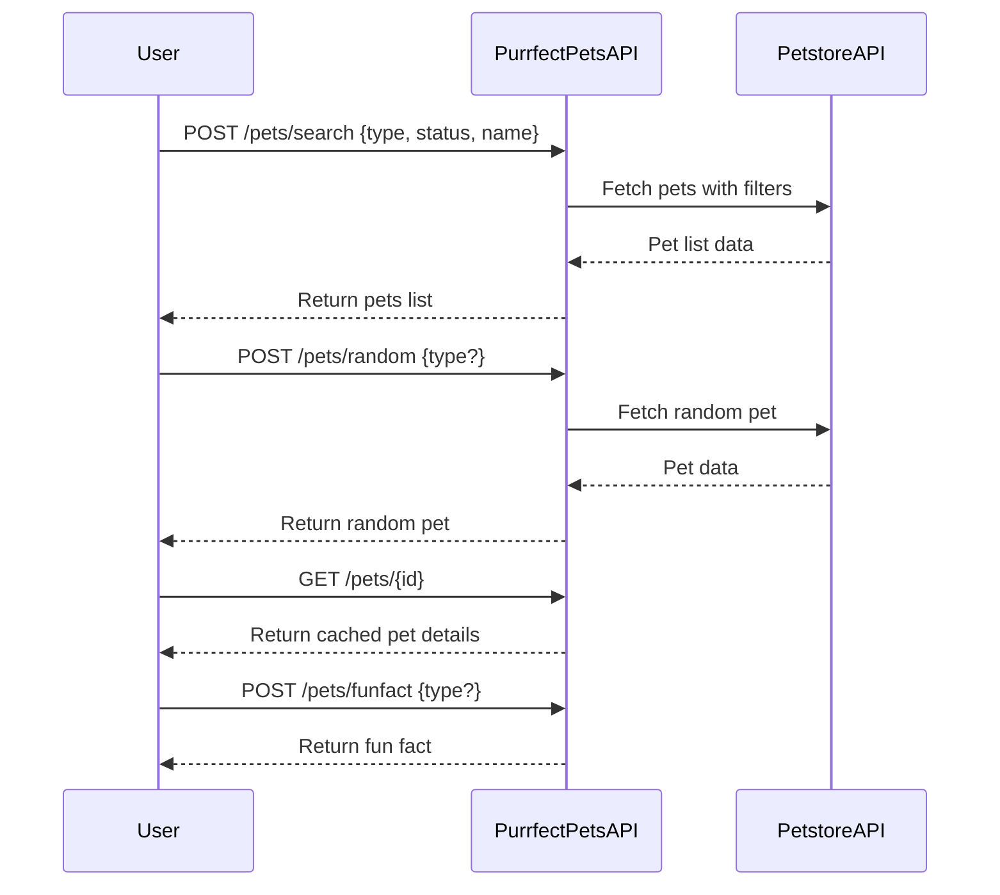
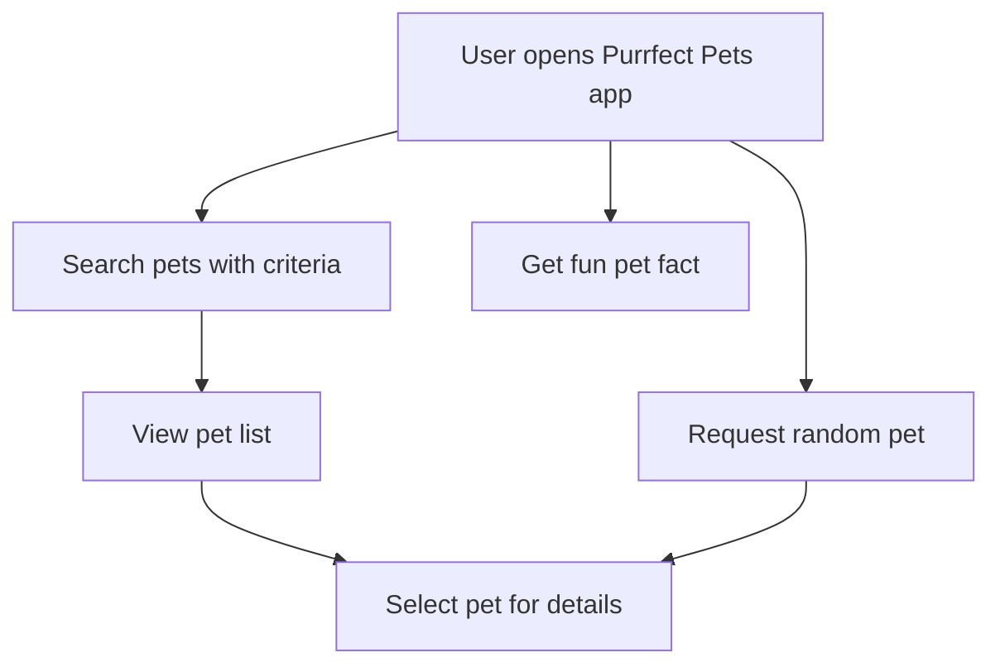

```markdown
# Functional Requirements for 'Purrfect Pets' API App

## API Endpoints

### 1. POST /pets/search
- **Description:** Search for pets by criteria using Petstore API (external data fetch).
- **Request:**
  ```json
  {
    "type": "string",       // optional, e.g. "cat", "dog"
    "status": "string",     // optional, e.g. "available", "sold"
    "name": "string"        // optional, partial or full name search
  }
  ```
- **Response:**
  ```json
  {
    "pets": [
      {
        "id": "integer",
        "name": "string",
        "type": "string",
        "status": "string",
        "photoUrls": ["string"]
      }
    ]
  }
  ```

### 2. POST /pets/random
- **Description:** Fetch a random pet from Petstore API (external data fetch).
- **Request:** 
  ```json
  {
    "type": "string"  // optional filter by pet type
  }
  ```
- **Response:**
  ```json
  {
    "pet": {
      "id": "integer",
      "name": "string",
      "type": "string",
      "status": "string",
      "photoUrls": ["string"]
    }
  }
  ```

### 3. GET /pets/{id}
- **Description:** Retrieve pet details by pet ID from previously fetched/search results (no external call).
- **Response:**
  ```json
  {
    "id": "integer",
    "name": "string",
    "type": "string",
    "status": "string",
    "photoUrls": ["string"]
  }
  ```

### 4. POST /pets/funfact
- **Description:** Return a fun fact about pets (internal logic, no external calls).
- **Request:**
  ```json
  {
    "type": "string"  // optional, e.g. "cat" or "dog"
  }
  ```
- **Response:**
  ```json
  {
    "fact": "string"
  }
  ```

---

## User-App Interaction Sequence Diagram


```mermaid
sequenceDiagram
  participant User
  participant PurrfectPetsAPI
  participant PetstoreAPI

  User->>PurrfectPetsAPI: POST /pets/search {type, status, name}
  PurrfectPetsAPI->>PetstoreAPI: Fetch pets with filters
  PetstoreAPI-->>PurrfectPetsAPI: Pet list data
  PurrfectPetsAPI-->>User: Return pets list

  User->>PurrfectPetsAPI: POST /pets/random {type?}
  PurrfectPetsAPI->>PetstoreAPI: Fetch random pet
  PetstoreAPI-->>PurrfectPetsAPI: Pet data
  PurrfectPetsAPI-->>User: Return random pet

  User->>PurrfectPetsAPI: GET /pets/{id}
  PurrfectPetsAPI-->>User: Return cached pet details

  User->>PurrfectPetsAPI: POST /pets/funfact {type?}
  PurrfectPetsAPI-->>User: Return fun fact
```

---

## User Journey Diagram


```mermaid
flowchart TD
  A[User opens Purrfect Pets app]
  B[Search pets with criteria]
  C[View pet list]
  D[Select pet for details]
  E[Request random pet]
  F[Get fun pet fact]

  A --> B --> C --> D
  A --> E --> D
  A --> F
```
```