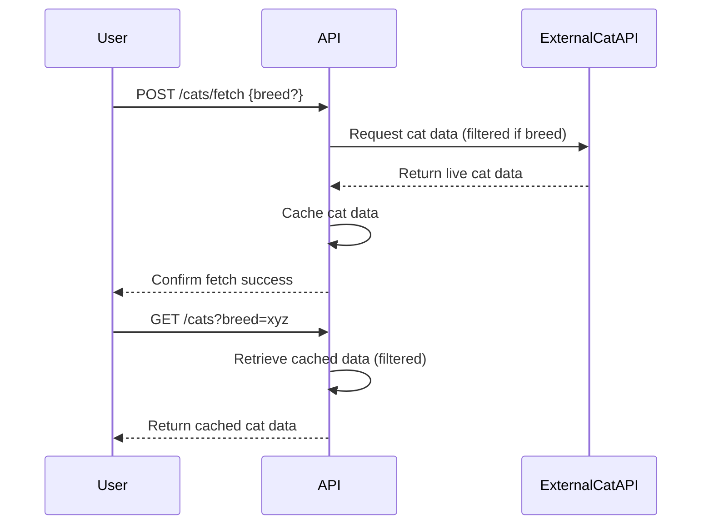
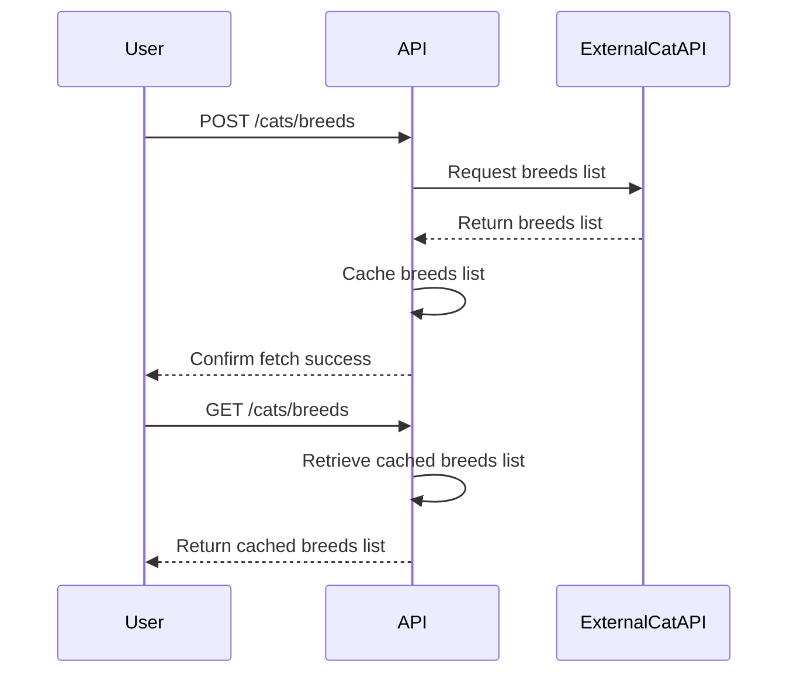

```markdown
# Purrfect Pets API - Functional Requirements

## Overview
The API provides live cat data (images and breed info) from a public cat API.  
- External data fetching and any business logic are done in POST endpoints.  
- GET endpoints are used only for retrieving cached or processed results.

---

## API Endpoints

### 1. POST /cats/fetch
- **Purpose:** Fetch live cat data (images + breed info) from external API and cache/store results.
- **Request:**  
```json
{
  "breed": "optional string to filter by breed"
}
```
- **Response:**  
```json
{
  "status": "success",
  "message": "Data fetched and cached",
  "count": 25
}
```

### 2. GET /cats
- **Purpose:** Retrieve cached cat data (images + breed info).
- **Query Parameters (optional):**  
  - `breed` (string) — filter results by breed.
- **Response:**  
```json
[
  {
    "id": "cat_id",
    "name": "breed name",
    "image_url": "image link",
    "description": "breed description"
  },
  ...
]
```

### 3. POST /cats/breeds
- **Purpose:** Fetch and cache list of all cat breeds from external API.
- **Request:** No body required.
- **Response:**  
```json
{
  "status": "success",
  "message": "Breeds list fetched and cached",
  "count": 50
}
```

### 4. GET /cats/breeds
- **Purpose:** Retrieve cached list of cat breeds.
- **Response:**  
```json
[
  {
    "id": "breed_id",
    "name": "breed name",
    "description": "breed description",
    "origin": "country"
  },
  ...
]
```

---

## Business Logic Summary
- POST endpoints trigger external API calls and cache results.
- GET endpoints serve cached data for fast access.
- Filtering by breed is supported via query parameters on GET endpoints.

---

## User-App Interaction Sequence Diagram


```mermaid
sequenceDiagram
  participant User
  participant API
  participant ExternalCatAPI

  User->>API: POST /cats/fetch {breed?}
  API->>ExternalCatAPI: Request cat data (filtered if breed)
  ExternalCatAPI-->>API: Return live cat data
  API->>API: Cache cat data
  API-->>User: Confirm fetch success

  User->>API: GET /cats?breed=xyz
  API->>API: Retrieve cached data (filtered)
  API-->>User: Return cached cat data
```

---

## Breed Fetch Interaction Diagram


```mermaid
sequenceDiagram
  participant User
  participant API
  participant ExternalCatAPI

  User->>API: POST /cats/breeds
  API->>ExternalCatAPI: Request breeds list
  ExternalCatAPI-->>API: Return breeds list
  API->>API: Cache breeds list
  API-->>User: Confirm fetch success

  User->>API: GET /cats/breeds
  API->>API: Retrieve cached breeds list
  API-->>User: Return cached breeds list
```
```
