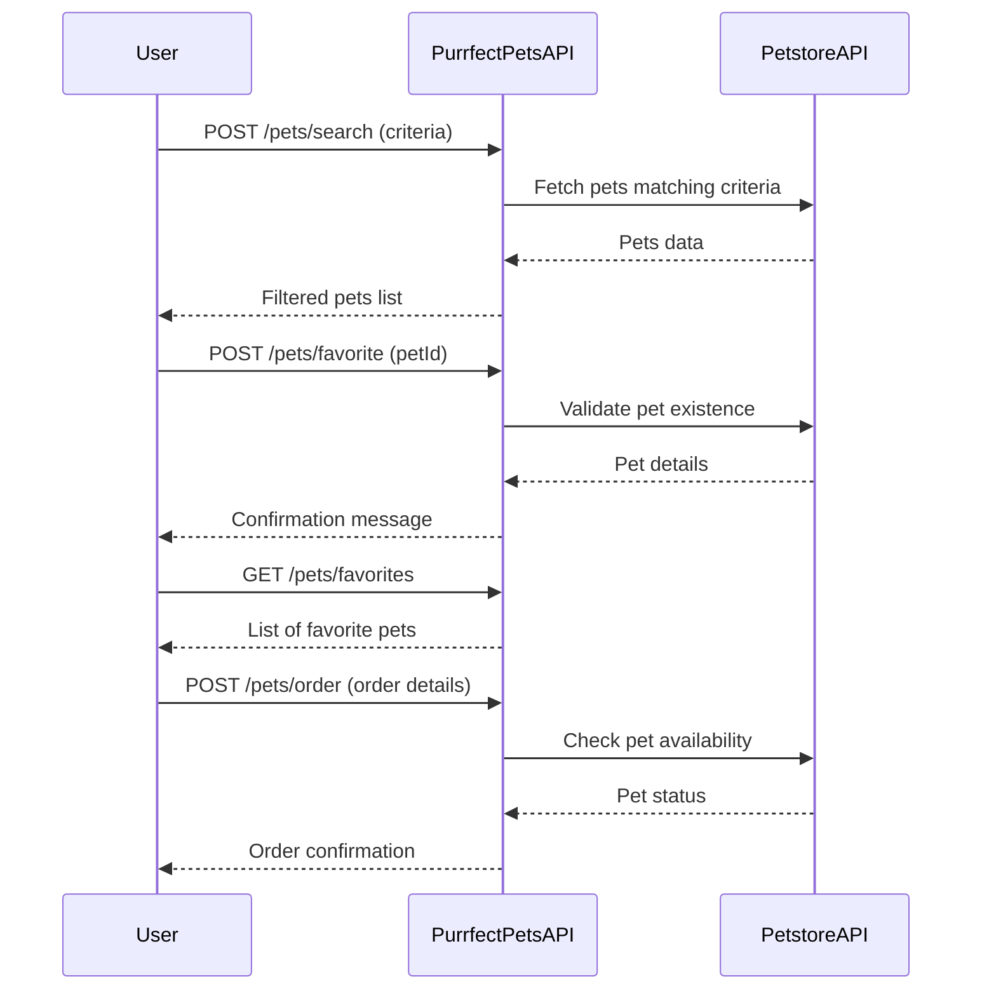

```markdown
# Purrfect Pets API - Functional Requirements

## Overview  
The API provides pet-related data based on Petstore API. Business logic and external data retrieval are implemented in POST endpoints. GET endpoints only return processed results for the client.

---

## API Endpoints

### 1. **POST /pets/search**  
Search pets by category, status, or name. Retrieves and processes data from Petstore API.

- **Request:**  
```json
{
  "category": "string (optional)",
  "status": "string (optional, e.g. available, sold)",
  "name": "string (optional)"
}
```

- **Response:**  
```json
{
  "pets": [
    {
      "id": "integer",
      "name": "string",
      "category": "string",
      "status": "string",
      "photoUrls": ["string"]
    }
  ]
}
```

---

### 2. **POST /pets/favorite**  
Add a pet to user's favorites (in-memory or simple store). Business logic validates pet existence via Petstore API.

- **Request:**  
```json
{
  "petId": "integer"
}
```

- **Response:**  
```json
{
  "message": "string, e.g. 'Pet added to favorites'",
  "favoritePet": {
    "id": "integer",
    "name": "string"
  }
}
```

---

### 3. **GET /pets/favorites**  
Retrieve the list of favorite pets added by the user.

- **Response:**  
```json
{
  "favorites": [
    {
      "id": "integer",
      "name": "string",
      "category": "string",
      "status": "string"
    }
  ]
}
```

---

### 4. **POST /pets/order**  
Place an order for a pet. Validates pet availability and records order details.

- **Request:**  
```json
{
  "petId": "integer",
  "quantity": "integer",
  "shipDate": "ISO8601 string (optional)"
}
```

- **Response:**  
```json
{
  "orderId": "integer",
  "petId": "integer",
  "quantity": "integer",
  "shipDate": "string",
  "status": "string"
}
```

---

## User-App Interaction Sequence


```mermaid
sequenceDiagram
    participant User
    participant PurrfectPetsAPI
    participant PetstoreAPI

    User->>PurrfectPetsAPI: POST /pets/search (criteria)
    PurrfectPetsAPI->>PetstoreAPI: Fetch pets matching criteria
    PetstoreAPI-->>PurrfectPetsAPI: Pets data
    PurrfectPetsAPI-->>User: Filtered pets list

    User->>PurrfectPetsAPI: POST /pets/favorite (petId)
    PurrfectPetsAPI->>PetstoreAPI: Validate pet existence
    PetstoreAPI-->>PurrfectPetsAPI: Pet details
    PurrfectPetsAPI-->>User: Confirmation message

    User->>PurrfectPetsAPI: GET /pets/favorites
    PurrfectPetsAPI-->>User: List of favorite pets

    User->>PurrfectPetsAPI: POST /pets/order (order details)
    PurrfectPetsAPI->>PetstoreAPI: Check pet availability
    PetstoreAPI-->>PurrfectPetsAPI: Pet status
    PurrfectPetsAPI-->>User: Order confirmation
```

---

## Summary  
- All external data fetches and business logic are in POST endpoints.  
- GET endpoints deliver application state/results only.  
- Simple pet favorites and ordering supported.  
- Clear JSON request/response formats for easy frontend integration.  
```