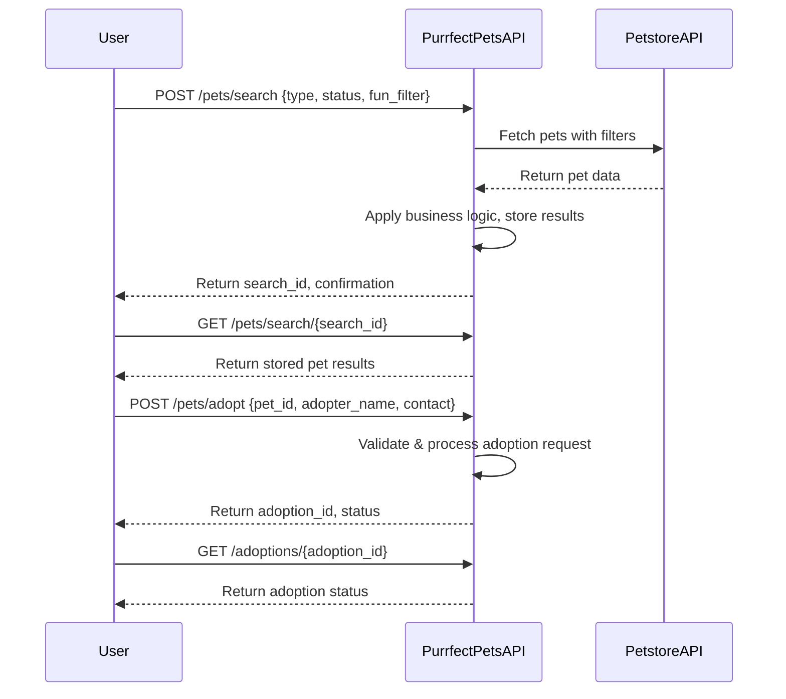

```markdown
# Purrfect Pets API - Functional Requirements

## Overview
This API allows users to interact with pet data sourced from the Petstore API, applying fun business logic on POST endpoints and retrieving results via GET endpoints. All external data fetching and processing happen in POST calls, while GET calls provide stored or computed data.

---

## API Endpoints

### 1. POST /pets/search
- **Purpose:** Fetch pets from external Petstore API based on search criteria, apply any fun business logic (e.g., filtering, matching), and store results internally.
- **Request Body:**
  ```json
  {
    "type": "string",          // e.g. "cat", "dog"; optional filter
    "status": "string",        // e.g. "available", "sold"; optional filter
    "fun_filter": "string"     // e.g. "purrfect_match", optional special filter
  }
  ```
- **Response:**
  ```json
  {
    "search_id": "string",     // Unique ID for this search
    "result_count": 10,
    "message": "Pets fetched and processed."
  }
  ```

---

### 2. GET /pets/search/{search_id}
- **Purpose:** Retrieve results of a previous pet search by ID.
- **Response:**
  ```json
  {
    "search_id": "string",
    "pets": [
      {
        "id": "int",
        "name": "string",
        "type": "string",
        "status": "string",
        "description": "string"
      }
    ]
  }
  ```

---

### 3. POST /pets/adopt
- **Purpose:** Submit pet adoption request with validation and business logic.
- **Request Body:**
  ```json
  {
    "pet_id": "int",
    "adopter_name": "string",
    "adopter_contact": "string"
  }
  ```
- **Response:**
  ```json
  {
    "adoption_id": "string",
    "status": "pending/approved/denied",
    "message": "Adoption request received."
  }
  ```

---

### 4. GET /adoptions/{adoption_id}
- **Purpose:** Retrieve adoption request status.
- **Response:**
  ```json
  {
    "adoption_id": "string",
    "pet_id": "int",
    "adopter_name": "string",
    "status": "pending/approved/denied"
  }
  ```

---

## User-App Interaction Sequence


```mermaid
sequenceDiagram
    participant User
    participant PurrfectPetsAPI
    participant PetstoreAPI

    User->>PurrfectPetsAPI: POST /pets/search {type, status, fun_filter}
    PurrfectPetsAPI->>PetstoreAPI: Fetch pets with filters
    PetstoreAPI-->>PurrfectPetsAPI: Return pet data
    PurrfectPetsAPI->>PurrfectPetsAPI: Apply business logic, store results
    PurrfectPetsAPI-->>User: Return search_id, confirmation

    User->>PurrfectPetsAPI: GET /pets/search/{search_id}
    PurrfectPetsAPI-->>User: Return stored pet results

    User->>PurrfectPetsAPI: POST /pets/adopt {pet_id, adopter_name, contact}
    PurrfectPetsAPI->>PurrfectPetsAPI: Validate & process adoption request
    PurrfectPetsAPI-->>User: Return adoption_id, status

    User->>PurrfectPetsAPI: GET /adoptions/{adoption_id}
    PurrfectPetsAPI-->>User: Return adoption status
```

---

## Notes
- POST endpoints are responsible for all external data fetching and processing.
- GET endpoints only serve stored or computed results.
- Business logic can include filters, fun matches, adoption validations, etc.
```
