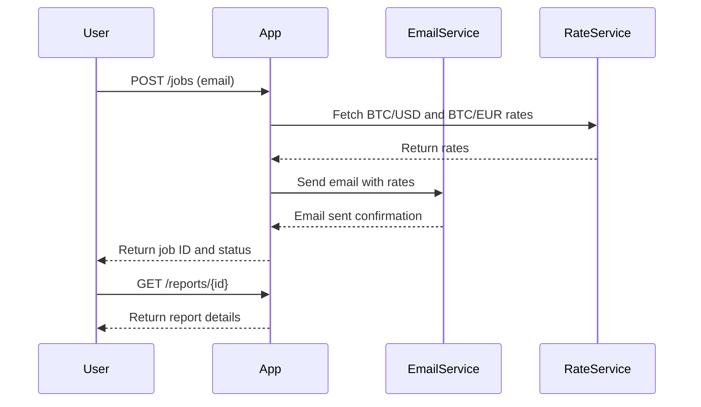

Here are the well-formatted final functional requirements for your application:

### Functional Requirements

#### 1. Report Creation

- **User Story**: As a user, I want to initiate a report creation process so that I can receive the latest Bitcoin conversion rates.
- **Endpoint**: `POST /jobs`
  - **Request Format**: 
    ```json
    {
      "email": "user@example.com"
    }
    ```
  - **Response Format**: 
    ```json
    {
      "job_id": "12345",
      "status": "processing"
    }
    ```
- **Description**: This endpoint accepts an email address and initiates the process to fetch the latest Bitcoin conversion rates. It returns a job ID to track the report status.

#### 2. Report Retrieval

- **User Story**: As a user, I want to retrieve a previously generated report by its ID so that I can view the conversion rates.
- **Endpoint**: `GET /reports/{id}`
  - **Response Format**: 
    ```json
    {
      "id": "12345",
      "timestamp": "2023-10-01T12:00:00Z",
      "btc_usd": "50000",
      "btc_eur": "42000",
      "email_sent": true
    }
    ```
- **Description**: This endpoint retrieves a report based on the provided ID. It returns the conversion rates along with the timestamp and email status.

### Additional Considerations

- **Error Handling**: The application should handle errors gracefully, returning appropriate HTTP status codes and messages for failed requests (e.g., 404 for report not found, 500 for internal server errors).
  
- **Data Storage**: Reports should be stored in a database to allow for retrieval and management.

- **Email Service Integration**: The application should integrate with an email service to send reports to the specified email address.

### User-App Interaction Diagram


```mermaid
sequenceDiagram
    participant User
    participant App
    participant EmailService
    participant RateService

    User->>App: POST /jobs (email)
    App->>RateService: Fetch BTC/USD and BTC/EUR rates
    RateService-->>App: Return rates
    App->>EmailService: Send email with rates
    EmailService-->>App: Email sent confirmation
    App-->>User: Return job ID and status

    User->>App: GET /reports/{id}
    App-->>User: Return report details
```

This comprehensive documentation outlines the functional requirements, ensuring clarity for development and future iterations. Let me know if you need any further enhancements!