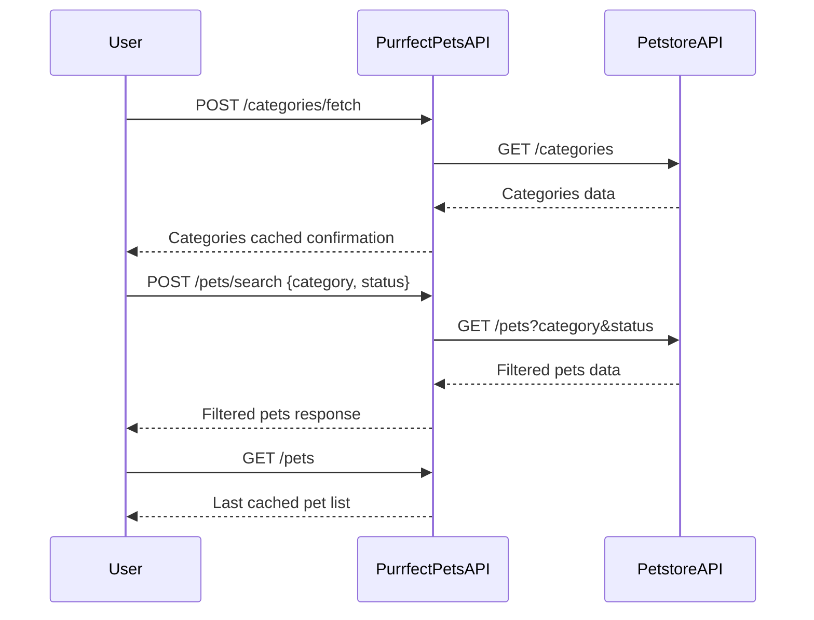

```markdown
# Purrfect Pets API - Functional Requirements

## Overview
The 'Purrfect Pets' API app integrates with the external Petstore API to provide pet-related data with filtering capabilities. The app follows RESTful principles:

- **POST endpoints**: Trigger business logic that calls the external Petstore API, processes data, and returns results.
- **GET endpoints**: Retrieve previously processed or cached data.

---

## API Endpoints

### 1. `POST /pets/search`
- **Purpose**: Search pets with optional filters by category and status from Petstore API data.
- **Request Body** (JSON):
  ```json
  {
    "category": "string",  // optional, e.g. "Cats", "Dogs"
    "status": "string"     // optional, e.g. "available", "pending", "sold"
  }
  ```
- **Response** (JSON):
  ```json
  {
    "pets": [
      {
        "id": "integer",
        "name": "string",
        "category": "string",
        "status": "string",
        "photoUrls": ["string"]
      }
    ]
  }
  ```

### 2. `GET /pets`
- **Purpose**: Retrieve the last search result or cached pet list.
- **Response** (JSON):
  ```json
  {
    "pets": [
      {
        "id": "integer",
        "name": "string",
        "category": "string",
        "status": "string",
        "photoUrls": ["string"]
      }
    ]
  }
  ```

### 3. `POST /categories/fetch`
- **Purpose**: Fetch pet categories from Petstore API and cache them.
- **Request Body**: Empty or optional to force refresh.
- **Response** (JSON):
  ```json
  {
    "categories": [
      {
        "id": "integer",
        "name": "string"
      }
    ]
  }
  ```

### 4. `GET /categories`
- **Purpose**: Retrieve cached pet categories.
- **Response** (JSON):
  ```json
  {
    "categories": [
      {
        "id": "integer",
        "name": "string"
      }
    ]
  }
  ```

---

## User-App Interaction Sequence Diagram


```mermaid
sequenceDiagram
    participant User
    participant PurrfectPetsAPI
    participant PetstoreAPI

    User->>PurrfectPetsAPI: POST /categories/fetch
    PurrfectPetsAPI->>PetstoreAPI: GET /categories
    PetstoreAPI-->>PurrfectPetsAPI: Categories data
    PurrfectPetsAPI-->>User: Categories cached confirmation

    User->>PurrfectPetsAPI: POST /pets/search {category, status}
    PurrfectPetsAPI->>PetstoreAPI: GET /pets?category&status
    PetstoreAPI-->>PurrfectPetsAPI: Filtered pets data
    PurrfectPetsAPI-->>User: Filtered pets response

    User->>PurrfectPetsAPI: GET /pets
    PurrfectPetsAPI-->>User: Last cached pet list
```

---

## Summary
- Use **POST** to trigger fetching/filtering from Petstore API.
- Use **GET** to retrieve cached results.
- Support category fetching and pet searching with filters.
- JSON-formatted requests and responses for easy consumption.

```