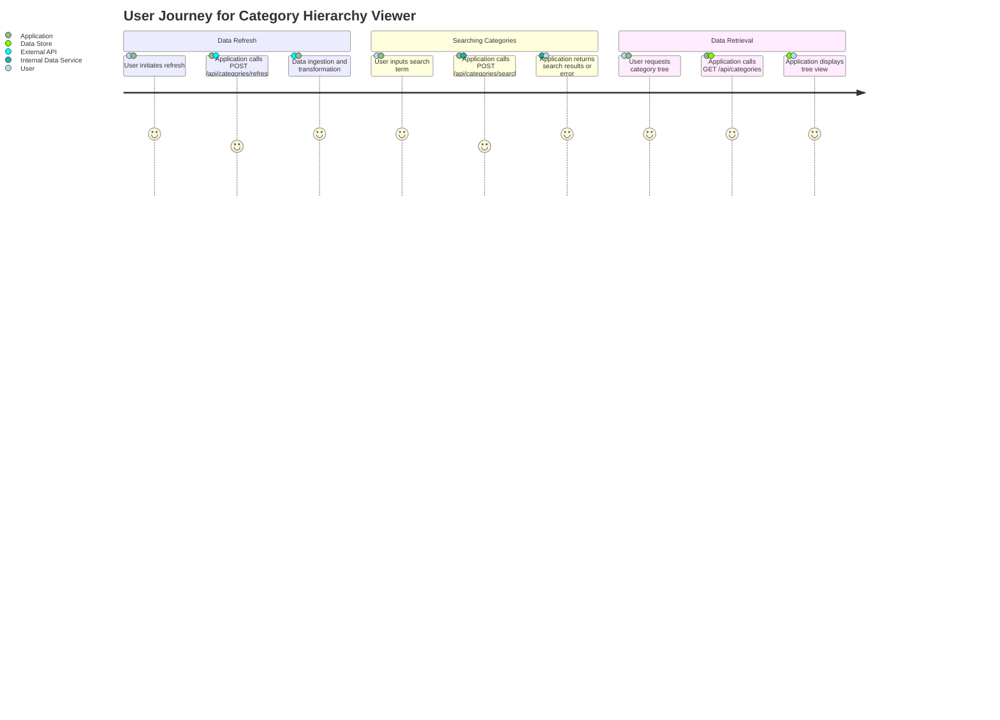
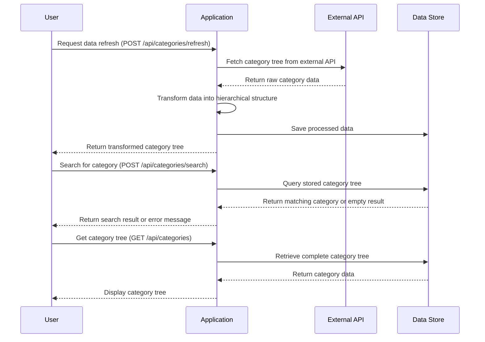

# Functional Requirements Document for Category Hierarchy Viewer Application

## 1. Overview
The Category Hierarchy Viewer Application allows users to visualize and interact with a hierarchical structure of categories sourced from the Practice Software Testing API. The application provides functionality for data ingestion, transformation, display, and user interaction.

## 2. API Endpoints

### 2.1 POST /api/categories/refresh
- **Purpose**: Ingest external category data and transform it into a hierarchical structure.
- **Request Format** (JSON):
  ```json
  {
    "forceRefresh": true  // Optional flag to force refresh data from the external API
  }
  ```
- **Response Format** (JSON):
  ```json
  {
    "status": "success",
    "categories": [
      {
        "id": 1,
        "name": "Category Name",
        "subCategories": [
          { "id": 11, "name": "Sub-category Name", "subCategories": [] }
        ]
      }
    ]
  }
  ```

### 2.2 POST /api/categories/search
- **Purpose**: Retrieve and filter processed category data based on a search query.
- **Request Format** (JSON):
  ```json
  {
    "searchTerm": "category name or id"  // Accepts full or partial text/string values
  }
  ```
- **Response Format** (JSON):
  - **Success**:
    ```json
    {
      "status": "success",
      "result": {
        "id": 1,
        "name": "Category Name",
        "subCategories": [ … ]
      }
    }
    ```
  - **Error** (if not found):
    ```json
    {
      "status": "error",
      "message": "Category not found"
    }
    ```

### 2.3 GET /api/categories
- **Purpose**: Retrieve the stored category tree from the application.
- **Request**: No body required.
- **Response Format** (JSON):
  ```json
  {
    "status": "success",
    "categories": [
      {
        "id": 1,
        "name": "Category Name",
        "subCategories": [ … ]
      }
    ]
  }
  ```

## 3. User-Application Interaction

### 3.1 Journey Diagram

```mermaid
journey
    title User Journey for Category Hierarchy Viewer
    section Data Refresh
      User initiates refresh: 5: User, Application
      Application calls POST /api/categories/refresh: 4: Application, External API
      Data ingestion and transformation: 5: External API, Application
    section Searching Categories
      User inputs search term: 5: User, Application
      Application calls POST /api/categories/search: 4: Application, Internal Data Service
      Application returns search results or error: 5: Internal Data Service, User
    section Data Retrieval
      User requests category tree: 5: User, Application
      Application calls GET /api/categories: 5: Application, Data Store
      Application displays tree view: 5: Data Store, User
```

### 3.2 Sequence Diagram

```mermaid
sequenceDiagram
    participant U as User
    participant A as Application
    participant E as External API
    participant D as Data Store

    U->>A: Request data refresh (POST /api/categories/refresh)
    A->>E: Fetch category tree from external API
    E-->>A: Return raw category data
    A->>A: Transform data into hierarchical structure
    A->>D: Save processed data
    A-->>U: Return transformed category tree

    U->>A: Search for category (POST /api/categories/search)
    A->>D: Query stored category tree
    D-->>A: Return matching category or empty result
    A-->>U: Return search result or error message

    U->>A: Get category tree (GET /api/categories)
    A->>D: Retrieve complete category tree
    D-->>A: Return category data
    A-->>U: Display category tree
```