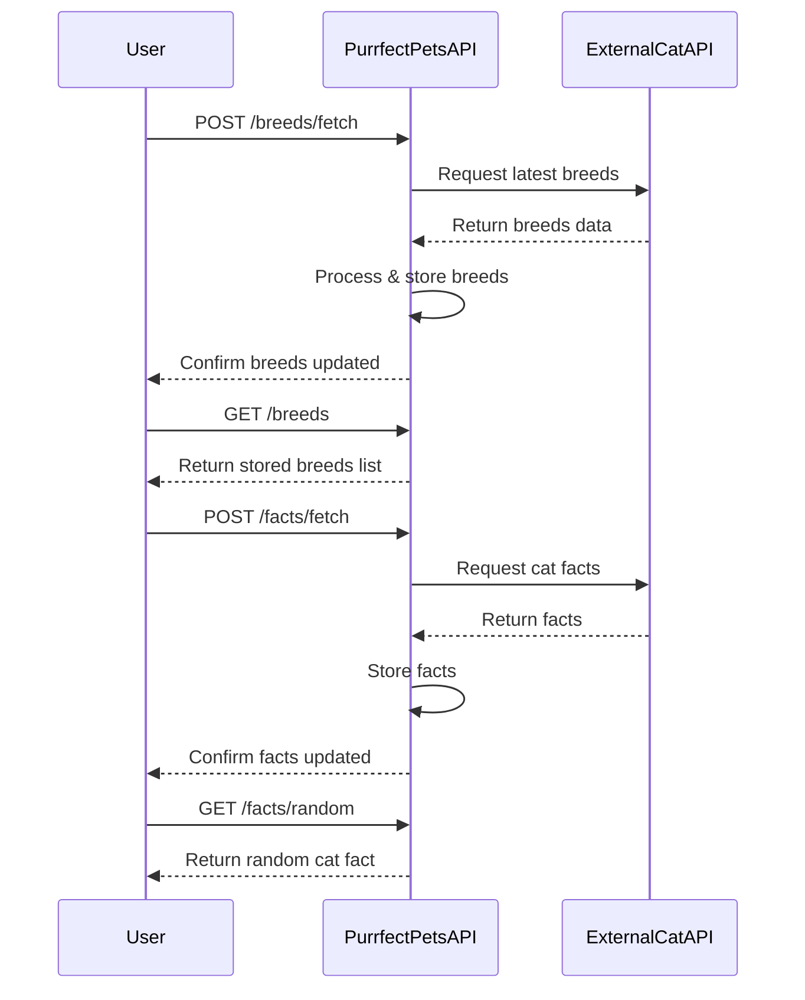
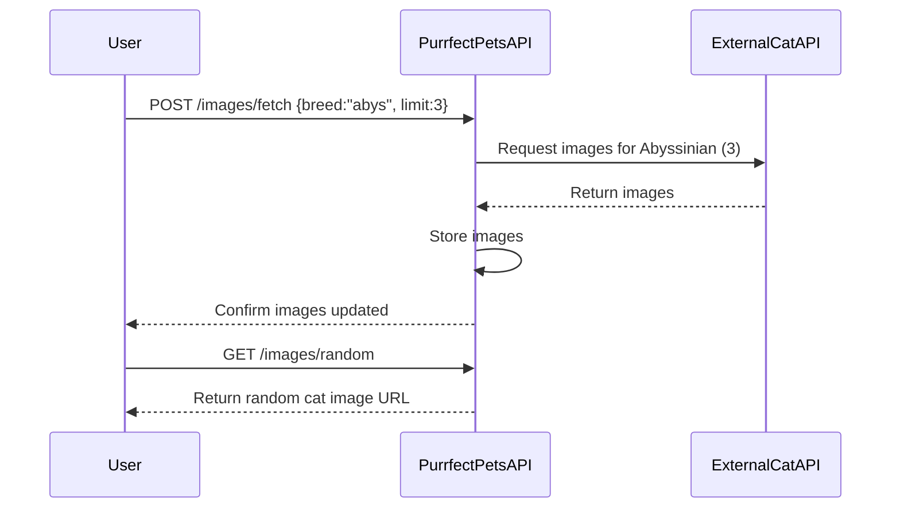

```markdown
# Purrfect Pets API - Functional Requirements

## Overview
The API provides fun and live cat data by integrating external data sources. Following RESTful principles:
- **POST** endpoints perform external data retrieval or business logic.
- **GET** endpoints retrieve stored or processed results within the app.

---

## API Endpoints

### 1. Retrieve Cat Breeds List (Cached/Stored Data)
- **GET** `/breeds`
- **Description:** Returns a list of cat breeds stored in the system.
- **Response:**
```json
[
  {
    "id": "abys",
    "name": "Abyssinian",
    "origin": "Egypt",
    "description": "Active, playful, and curious breed."
  }
]
```

---

### 2. Fetch and Store Latest Cat Breeds from External API
- **POST** `/breeds/fetch`
- **Description:** Calls external API to retrieve latest cat breeds data, processes, and stores it for future GET requests.
- **Request:** Empty body or optional filters
- **Response:**
```json
{
  "status": "success",
  "message": "Breeds data updated",
  "count": 67
}
```

---

### 3. Retrieve Random Cat Fact (Stored)
- **GET** `/facts/random`
- **Description:** Returns a random cat fact from stored facts.
- **Response:**
```json
{
  "fact": "Cats have five toes on their front paws, but only four toes on their back paws."
}
```

---

### 4. Fetch and Store Cat Facts from External API
- **POST** `/facts/fetch`
- **Description:** Fetches new cat facts from external source and stores them.
- **Request:** Empty body
- **Response:**
```json
{
  "status": "success",
  "message": "Cat facts updated",
  "count": 20
}
```

---

### 5. Retrieve Random Cat Image (Stored)
- **GET** `/images/random`
- **Description:** Returns a random cat image URL from stored images.
- **Response:**
```json
{
  "url": "https://cdn2.thecatapi.com/images/MTY3ODIyMQ.jpg"
}
```

---

### 6. Fetch and Store Cat Images from External API
- **POST** `/images/fetch`
- **Description:** Retrieves cat images from external API and stores them.
- **Request:** Optional parameters like breed or limit
```json
{
  "breed": "abys",
  "limit": 5
}
```
- **Response:**
```json
{
  "status": "success",
  "message": "Cat images updated",
  "count": 5
}
```

---

## Request / Response Format Summary
- All POST endpoints accept JSON payloads for filters or parameters, or empty JSON if none.
- All GET endpoints return JSON data representing stored information.
- Error responses follow:
```json
{
  "status": "error",
  "message": "Description of the error"
}
```

---

## User-App Interaction Sequence


```mermaid
sequenceDiagram
    participant User
    participant PurrfectPetsAPI
    participant ExternalCatAPI

    User->>PurrfectPetsAPI: POST /breeds/fetch
    PurrfectPetsAPI->>ExternalCatAPI: Request latest breeds
    ExternalCatAPI-->>PurrfectPetsAPI: Return breeds data
    PurrfectPetsAPI->>PurrfectPetsAPI: Process & store breeds
    PurrfectPetsAPI-->>User: Confirm breeds updated

    User->>PurrfectPetsAPI: GET /breeds
    PurrfectPetsAPI-->>User: Return stored breeds list

    User->>PurrfectPetsAPI: POST /facts/fetch
    PurrfectPetsAPI->>ExternalCatAPI: Request cat facts
    ExternalCatAPI-->>PurrfectPetsAPI: Return facts
    PurrfectPetsAPI->>PurrfectPetsAPI: Store facts
    PurrfectPetsAPI-->>User: Confirm facts updated

    User->>PurrfectPetsAPI: GET /facts/random
    PurrfectPetsAPI-->>User: Return random cat fact
```

---

### Optional Extended Interaction: Fetching Images


```mermaid
sequenceDiagram
    participant User
    participant PurrfectPetsAPI
    participant ExternalCatAPI

    User->>PurrfectPetsAPI: POST /images/fetch {breed:"abys", limit:3}
    PurrfectPetsAPI->>ExternalCatAPI: Request images for Abyssinian (3)
    ExternalCatAPI-->>PurrfectPetsAPI: Return images
    PurrfectPetsAPI->>PurrfectPetsAPI: Store images
    PurrfectPetsAPI-->>User: Confirm images updated

    User->>PurrfectPetsAPI: GET /images/random
    PurrfectPetsAPI-->>User: Return random cat image URL
```
```