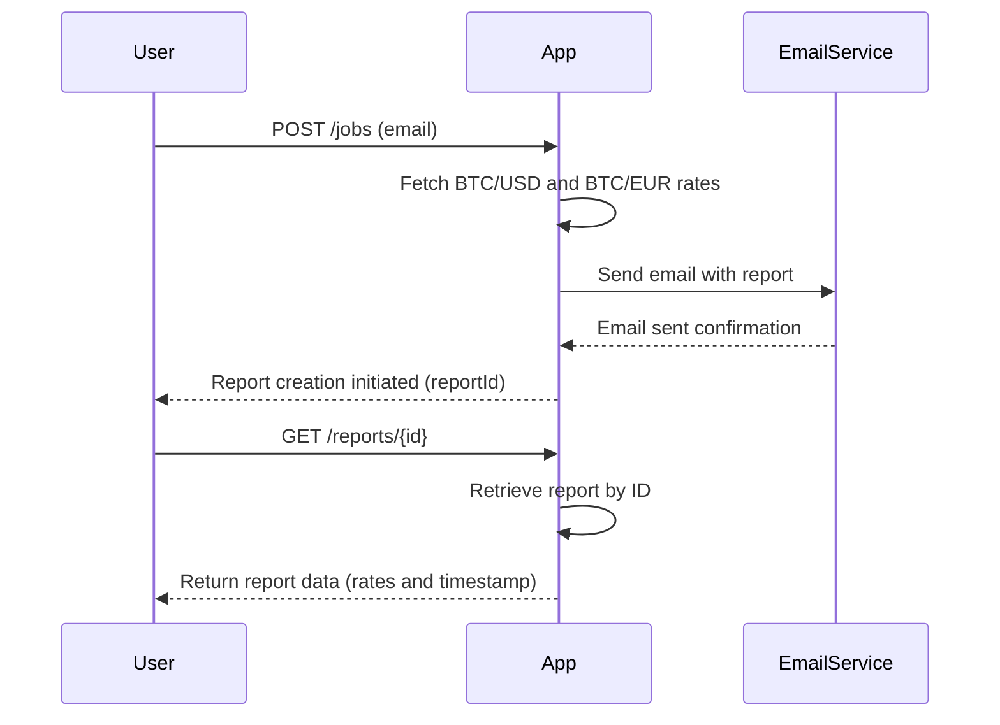

Here are the final functional requirements for your application, organized clearly and concisely:

### Functional Requirements

#### User Stories

1. **Initiate Report Creation**
   - **As a user**, I want to initiate a report creation process so that I can receive the latest Bitcoin conversion rates via email.
   - **Endpoint**: `POST /jobs`
     - **Request Format**:
       ```json
       {
         "email": "user@example.com"
       }
       ```
     - **Response Format**:
       ```json
       {
         "reportId": "12345",
         "status": "Report creation initiated."
       }
       ```

2. **Retrieve Report by ID**
   - **As a user**, I want to retrieve a previously generated report by its ID so that I can view the conversion rates.
   - **Endpoint**: `GET /reports/{id}`
     - **Response Format**:
       ```json
       {
         "reportId": "12345",
         "btcToUsdRate": "50000",
         "btcToEurRate": "42000",
         "timestamp": "2023-10-01T12:00:00Z"
       }
       ```

### Summary of API Endpoints

- **POST /jobs**
  - **Description**: Initiates the report creation process.
  - **Parameters**: Accepts an email address to send the report.
  - **Response**: Returns a report ID and status message.

- **GET /reports/{id}**
  - **Description**: Retrieves the stored report by its ID.
  - **Response**: Returns the conversion rates (BTC to USD and BTC to EUR) and the timestamp of the report.

### User-App Interaction Sequence


```mermaid
sequenceDiagram
    participant User
    participant App
    participant EmailService

    User->>App: POST /jobs (email)
    App->>App: Fetch BTC/USD and BTC/EUR rates
    App->>EmailService: Send email with report
    EmailService-->>App: Email sent confirmation
    App-->>User: Report creation initiated (reportId)

    User->>App: GET /reports/{id}
    App->>App: Retrieve report by ID
    App-->>User: Return report data (rates and timestamp)
```

These functional requirements outline the necessary features of your application, ensuring a clear understanding of the expected behavior and interactions. If you need further modifications or additional details, let me know!