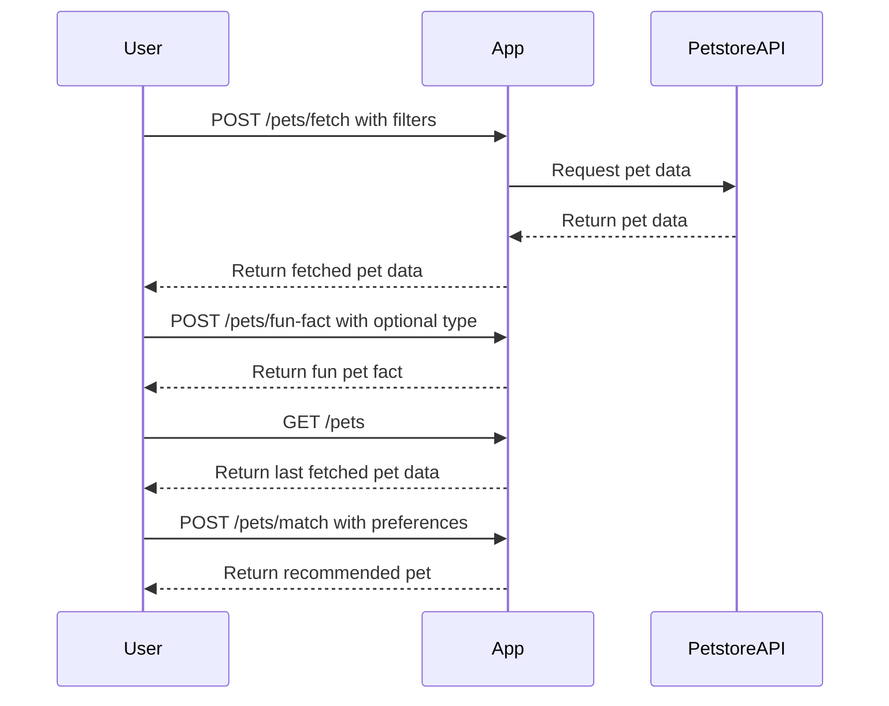

```markdown
# Functional Requirements for "Purrfect Pets" API App

## Overview
The app interacts with the Petstore API to fetch pet data and provide a playful, user-friendly interface. All external data fetching and business logic occur via POST endpoints. GET endpoints serve only stored or processed results.

---

## API Endpoints

### 1. POST /pets/fetch  
**Purpose:** Fetch pet data from the external Petstore API based on filters or criteria provided by the user.

**Request:**
```json
{
  "type": "string",      // optional, e.g., "cat", "dog", or "all"
  "status": "string"     // optional, e.g., "available", "sold"
}
```

**Response:**
```json
{
  "success": true,
  "pets": [
    {
      "id": "integer",
      "name": "string",
      "type": "string",
      "status": "string",
      "photoUrls": ["string"]
    }
  ],
  "message": "Data fetched from Petstore API"
}
```

---

### 2. POST /pets/fun-fact  
**Purpose:** Return a random fun fact about pets, optionally filtered by type.

**Request:**
```json
{
  "type": "string"  // optional, e.g., "cat", "dog"
}
```

**Response:**
```json
{
  "success": true,
  "funFact": "string"
}
```

---

### 3. GET /pets  
**Purpose:** Retrieve the last fetched pet data stored in the app (from previous POST /pets/fetch).

**Response:**
```json
{
  "success": true,
  "pets": [
    {
      "id": "integer",
      "name": "string",
      "type": "string",
      "status": "string",
      "photoUrls": ["string"]
    }
  ]
}
```

---

### 4. POST /pets/match  
**Purpose:** Provide a pet recommendation based on user preferences.

**Request:**
```json
{
  "preferredType": "string",    // e.g., "cat", "dog"
  "preferredStatus": "string"   // e.g., "available"
}
```

**Response:**
```json
{
  "success": true,
  "recommendedPet": {
    "id": "integer",
    "name": "string",
    "type": "string",
    "status": "string",
    "photoUrls": ["string"]
  }
}
```

---

## User-App Interaction Sequence


```mermaid
sequenceDiagram
    participant User
    participant App
    participant PetstoreAPI

    User->>App: POST /pets/fetch with filters
    App->>PetstoreAPI: Request pet data
    PetstoreAPI-->>App: Return pet data
    App-->>User: Return fetched pet data

    User->>App: POST /pets/fun-fact with optional type
    App-->>User: Return fun pet fact

    User->>App: GET /pets
    App-->>User: Return last fetched pet data

    User->>App: POST /pets/match with preferences
    App-->>User: Return recommended pet
```

---

## Summary

- POST endpoints handle all external calls and business logic.
- GET endpoints serve stored or processed data.
- JSON used for request and response formats.
- Fun features such as pet facts and matching enhance user engagement.
```
