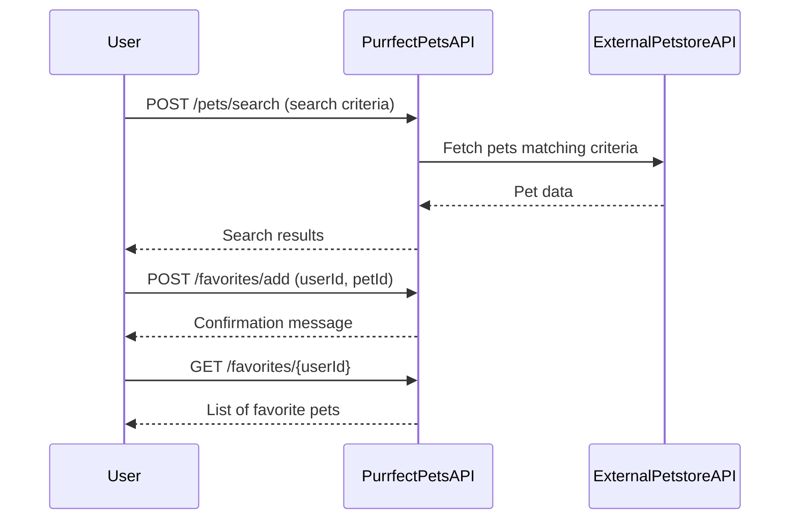
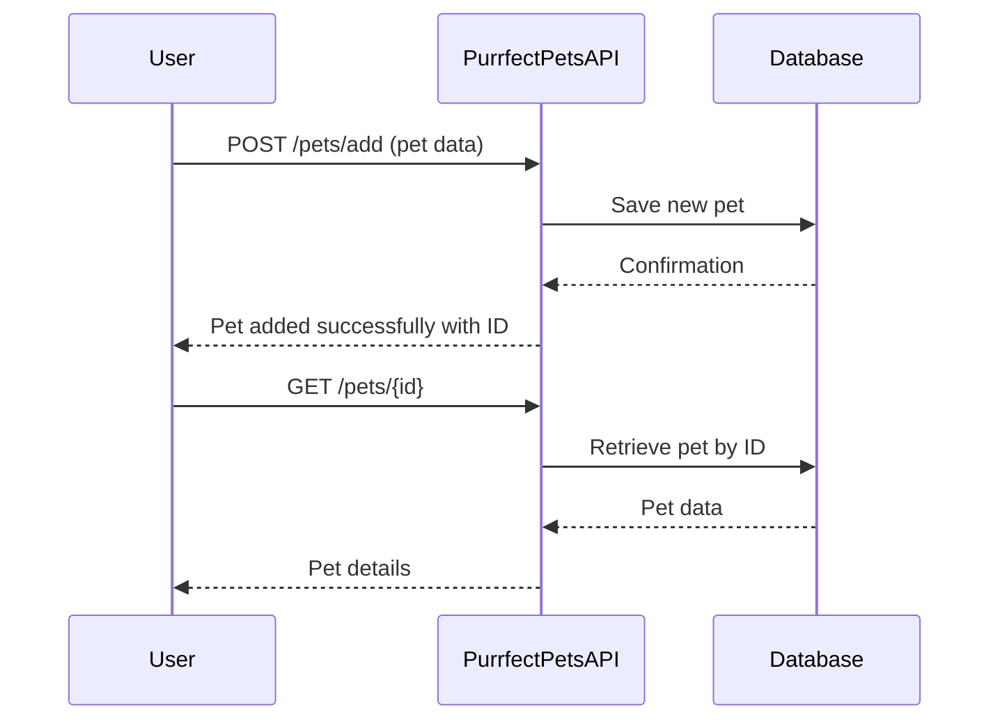

```markdown
# Purrfect Pets API - Functional Requirements

## API Endpoints

### 1. POST /pets/search  
**Description:** Search pets using Petstore API data with filters (type, status, name, etc.).  
**Request:**  
```json
{
  "type": "cat",
  "status": "available",
  "name": "whiskers"
}
```  
**Response:**  
```json
{
  "pets": [
    {
      "id": 1,
      "name": "Whiskers",
      "type": "cat",
      "status": "available",
      "photoUrls": ["url1", "url2"]
    }
  ]
}
```

---

### 2. POST /pets/add  
**Description:** Add a new pet to the store (business logic to validate and save pet).  
**Request:**  
```json
{
  "name": "Mittens",
  "type": "cat",
  "status": "available",
  "photoUrls": ["url1"]
}
```  
**Response:**  
```json
{
  "id": 101,
  "message": "Pet added successfully"
}
```

---

### 3. POST /pets/update  
**Description:** Update pet information (business logic to validate and update pet).  
**Request:**  
```json
{
  "id": 101,
  "name": "Mittens",
  "status": "sold"
}
```  
**Response:**  
```json
{
  "message": "Pet updated successfully"
}
```

---

### 4. GET /pets/{id}  
**Description:** Retrieve pet details by ID (only retrieves data, no external calls).  
**Response:**  
```json
{
  "id": 101,
  "name": "Mittens",
  "type": "cat",
  "status": "sold",
  "photoUrls": ["url1"]
}
```

---

### 5. POST /favorites/add  
**Description:** Add a pet to user favorites.  
**Request:**  
```json
{
  "userId": 1,
  "petId": 101
}
```  
**Response:**  
```json
{
  "message": "Pet added to favorites"
}
```

---

### 6. GET /favorites/{userId}  
**Description:** Get list of favorite pets for a user.  
**Response:**  
```json
{
  "userId": 1,
  "favorites": [
    {
      "id": 101,
      "name": "Mittens",
      "type": "cat",
      "status": "sold"
    }
  ]
}
```

---

## User-App Interaction Sequence


```mermaid
sequenceDiagram
    participant User
    participant PurrfectPetsAPI
    User->>PurrfectPetsAPI: POST /pets/search (search criteria)
    PurrfectPetsAPI->>ExternalPetstoreAPI: Fetch pets matching criteria
    ExternalPetstoreAPI-->>PurrfectPetsAPI: Pet data
    PurrfectPetsAPI-->>User: Search results

    User->>PurrfectPetsAPI: POST /favorites/add (userId, petId)
    PurrfectPetsAPI-->>User: Confirmation message

    User->>PurrfectPetsAPI: GET /favorites/{userId}
    PurrfectPetsAPI-->>User: List of favorite pets
```

---

## Pet Addition and Retrieval Flow


```mermaid
sequenceDiagram
    participant User
    participant PurrfectPetsAPI
    User->>PurrfectPetsAPI: POST /pets/add (pet data)
    PurrfectPetsAPI->>Database: Save new pet
    Database-->>PurrfectPetsAPI: Confirmation
    PurrfectPetsAPI-->>User: Pet added successfully with ID

    User->>PurrfectPetsAPI: GET /pets/{id}
    PurrfectPetsAPI->>Database: Retrieve pet by ID
    Database-->>PurrfectPetsAPI: Pet data
    PurrfectPetsAPI-->>User: Pet details
```
```