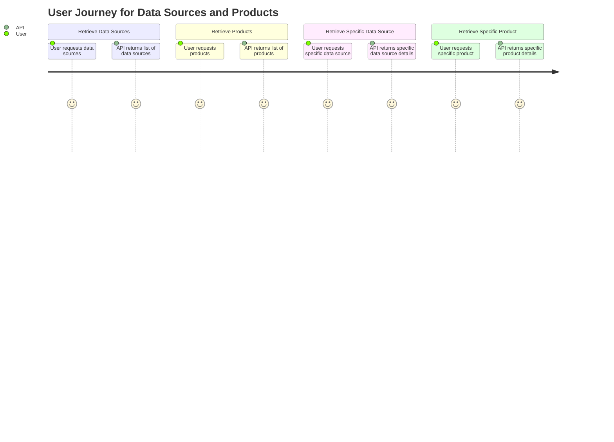

Here are the well-formatted final functional requirements for your project:

### Functional Requirements

#### User Stories

1. **Retrieve Data Sources**
   - **As a user**, I want to retrieve a list of data sources so that I can see what is available.
   - **Endpoint**: `GET /data-sources`
   - **Response**:
     ```json
     [
       {
         "id": "1",
         "name": "Data Source A",
         "description": "Description of Data Source A",
         "type": "Type A",
         "status": "available"
       },
       ...
     ]
     ```

2. **Retrieve Products**
   - **As a user**, I want to retrieve a list of products so that I can see what products are available.
   - **Endpoint**: `GET /products`
   - **Response**:
     ```json
     [
       {
         "id": "1",
         "name": "Product A",
         "description": "Description of Product A",
         "dataSourceId": "1"
       },
       ...
     ]
     ```

3. **Retrieve Specific Data Source**
   - **As a user**, I want to retrieve detailed information about a specific data source.
   - **Endpoint**: `GET /data-sources/{id}`
   - **Response**:
     ```json
     {
       "id": "1",
       "name": "Data Source A",
       "description": "Description of Data Source A",
       "type": "Type A",
       "status": "available"
     }
     ```

4. **Retrieve Specific Product**
   - **As a user**, I want to retrieve detailed information about a specific product.
   - **Endpoint**: `GET /products/{id}`
   - **Response**:
     ```json
     {
       "id": "1",
       "name": "Product A",
       "description": "Description of Product A",
       "dataSourceId": "1"
     }
     ```

#### API Interaction Flow


```mermaid
journey
    title User Journey for Data Sources and Products
    section Retrieve Data Sources
      User requests data sources: 5: User
      API returns list of data sources: 5: API
    section Retrieve Products
      User requests products: 5: User
      API returns list of products: 5: API
    section Retrieve Specific Data Source
      User requests specific data source: 5: User
      API returns specific data source details: 5: API
    section Retrieve Specific Product
      User requests specific product: 5: User
      API returns specific product details: 5: API
```

These functional requirements provide a clear framework for developing your backend application, ensuring that you meet user needs effectively. Feel free to iterate further based on feedback or additional requirements.