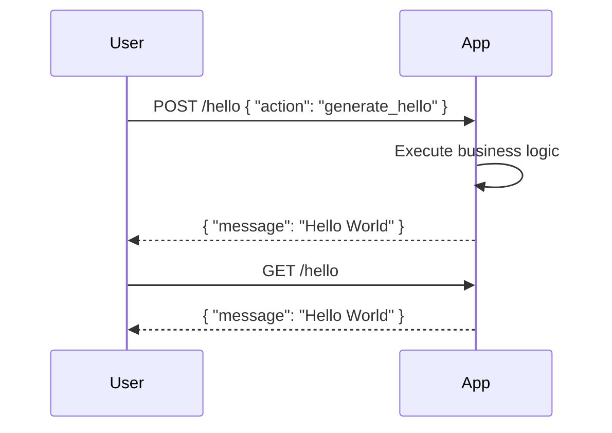
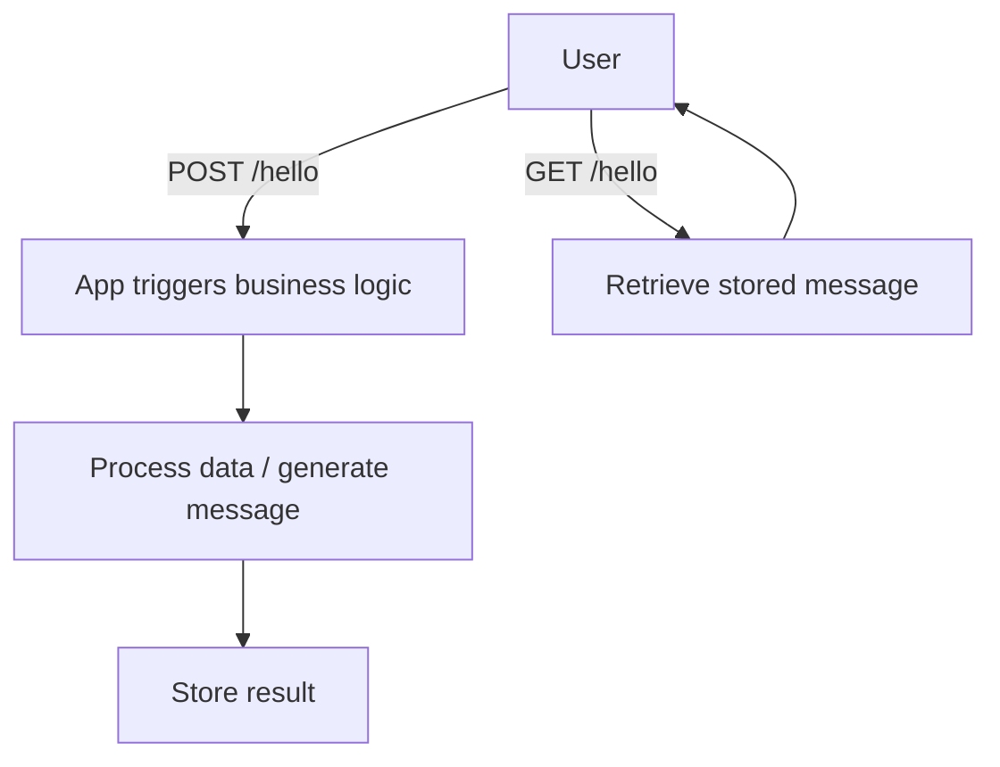

```markdown
# Functional Requirements for "Hello World" Application

## API Endpoints

### 1. `POST /hello`
- **Purpose:** Trigger the business logic to generate the "Hello World" message. This endpoint can be extended later to include external data retrieval or calculations.
- **Request Body:**  
  ```json
  {
    "action": "generate_hello"
  }
  ```
- **Response:**  
  ```json
  {
    "message": "Hello World"
  }
  ```

### 2. `GET /hello`
- **Purpose:** Retrieve the latest generated "Hello World" message.
- **Response:**  
  ```json
  {
    "message": "Hello World"
  }
  ```

---

## User-App Interaction Sequence


```mermaid
sequenceDiagram
    participant User
    participant App

    User->>App: POST /hello { "action": "generate_hello" }
    App->>App: Execute business logic
    App-->>User: { "message": "Hello World" }

    User->>App: GET /hello
    App-->>User: { "message": "Hello World" }
```

---

## User Journey Overview


```mermaid
graph TD
    A[User] -->|POST /hello| B[App triggers business logic]
    B --> C[Process data / generate message]
    C --> D[Store result]
    A -->|GET /hello| E[Retrieve stored message]
    E --> A
```
```