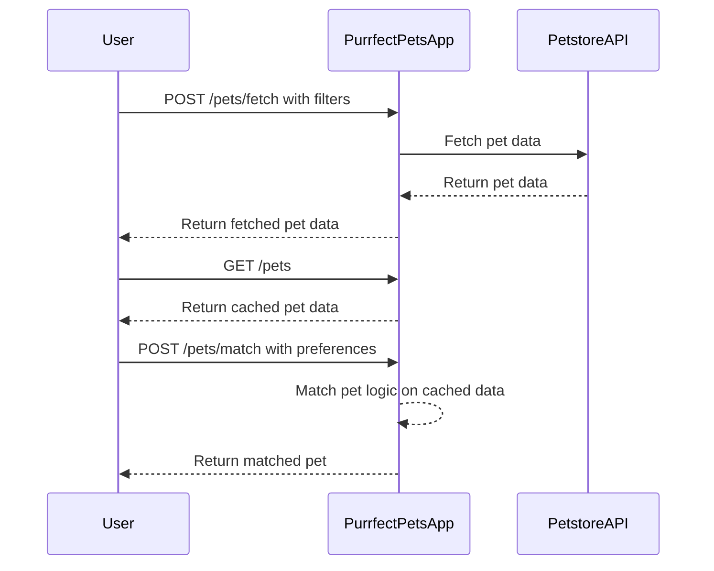
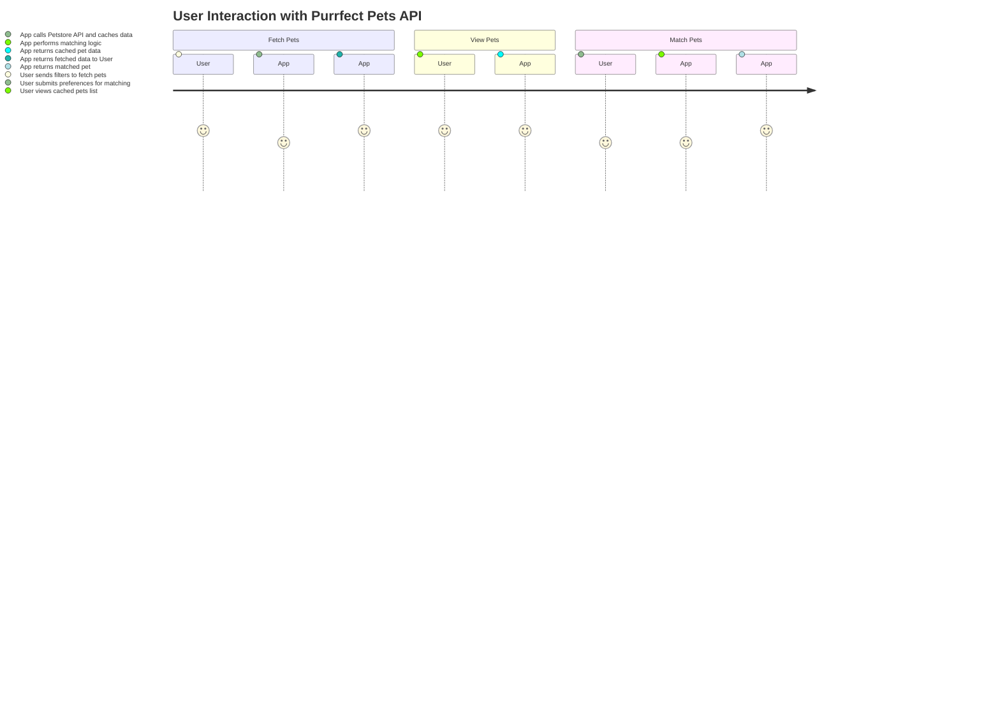

```markdown
# Purrfect Pets API - Functional Requirements

## API Endpoints

### 1. Fetch Pets Data (POST)
- **URL:** `/pets/fetch`
- **Description:** Fetch pet data from the external Petstore API with optional filters.
- **Request Body (JSON):**
  ```json
  {
    "type": "string",         // optional, e.g. "dog", "cat"
    "status": "string"        // optional, e.g. "available", "sold"
  }
  ```
- **Response (JSON):**
  ```json
  {
    "pets": [
      {
        "id": "integer",
        "name": "string",
        "type": "string",
        "status": "string",
        "photoUrls": ["string"]
      },
      ...
    ]
  }
  ```

### 2. Get Cached Pets Data (GET)
- **URL:** `/pets`
- **Description:** Retrieve the most recently fetched pet data cached in the application.
- **Response (JSON):**
  ```json
  {
    "pets": [
      {
        "id": "integer",
        "name": "string",
        "type": "string",
        "status": "string",
        "photoUrls": ["string"]
      },
      ...
    ]
  }
  ```

### 3. Pet Match Interaction (POST)
- **URL:** `/pets/match`
- **Description:** Accept user preferences and return a matched pet from cached data.
- **Request Body (JSON):**
  ```json
  {
    "preferredType": "string",
    "preferredStatus": "string"
  }
  ```
- **Response (JSON):**
  ```json
  {
    "matchedPet": {
      "id": "integer",
      "name": "string",
      "type": "string",
      "status": "string",
      "photoUrls": ["string"]
    }
  }
  ```

---

## User-App Interaction Sequence Diagram


```mermaid
sequenceDiagram
  participant User
  participant PurrfectPetsApp
  participant PetstoreAPI

  User->>PurrfectPetsApp: POST /pets/fetch with filters
  PurrfectPetsApp->>PetstoreAPI: Fetch pet data
  PetstoreAPI-->>PurrfectPetsApp: Return pet data
  PurrfectPetsApp-->>User: Return fetched pet data

  User->>PurrfectPetsApp: GET /pets
  PurrfectPetsApp-->>User: Return cached pet data

  User->>PurrfectPetsApp: POST /pets/match with preferences
  PurrfectPetsApp-->>PurrfectPetsApp: Match pet logic on cached data
  PurrfectPetsApp-->>User: Return matched pet
```

---

## User Journey Diagram


```mermaid
journey
    title User Interaction with Purrfect Pets API
    section Fetch Pets
      User: 5: User sends filters to fetch pets
      App: 4: App calls Petstore API and caches data
      App: 5: App returns fetched data to User
    section View Pets
      User: 5: User views cached pets list
      App: 5: App returns cached pet data
    section Match Pets
      User: 4: User submits preferences for matching
      App: 4: App performs matching logic
      App: 5: App returns matched pet
```
```