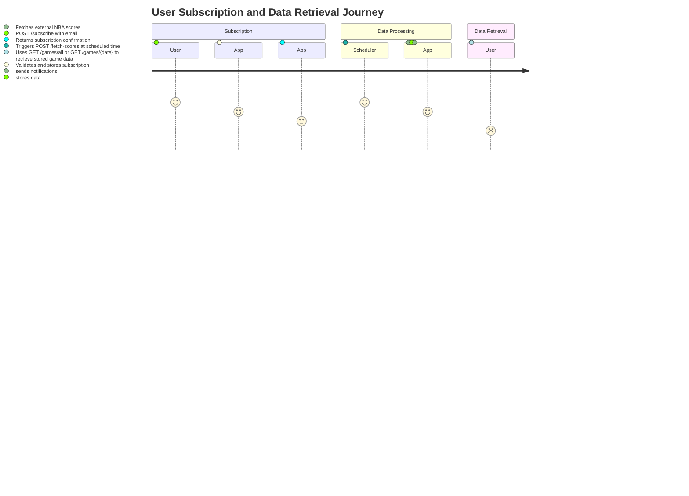
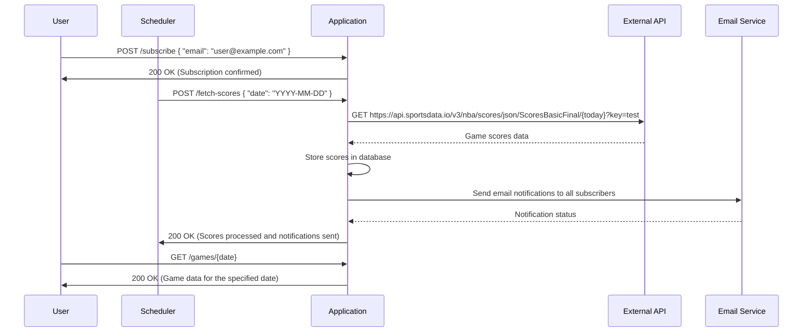

# Final Functional Requirements Document

## Overview
This document outlines the functional requirements for a backend application that fetches NBA game scores, stores them, and notifies users via email.

## API Endpoints

### 1. POST /subscribe
- **Description**: Subscribes a user for daily NBA score notifications.
- **Request Body**:
  ```json
  {
    "email": "user@example.com"
  }
  ```
- **Success Response**:
  ```json
  {
    "message": "Subscription successful.",
    "data": {
      "email": "user@example.com"
    }
  }
  ```
- **Error Response**:
  ```json
  {
    "error": "Invalid email format or subscription already exists."
  }
  ```

### 2. GET /subscribers
- **Description**: Retrieves a list of all subscribed email addresses.
- **Success Response**:
  ```json
  {
    "subscribers": [
      "user1@example.com",
      "user2@example.com"
    ]
  }
  ```

### 3. POST /fetch-scores
- **Description**: Triggers the business logic to fetch NBA game scores from an external API, store the data locally, and send email notifications to subscribers.
- **Request Body** (Optional):
  ```json
  {
    "date": "YYYY-MM-DD" // If omitted, the system uses the current scheduled date.
  }
  ```
- **Success Response**:
  ```json
  {
    "message": "NBA scores fetched and notifications sent.",
    "fetchedGamesCount": 15
  }
  ```
- **Error Response**:
  ```json
  {
    "error": "Failed to fetch data from external API."
  }
  ```

### 4. GET /games/all
- **Description**: Retrieves all stored NBA game scores with optional filtering and pagination.
- **Optional Query Parameters**:
  - `page`: number
  - `limit`: number
  - `team`: string
- **Success Response**:
  ```json
  {
    "results": [
      {
        "date": "YYYY-MM-DD",
        "homeTeam": "Team A",
        "awayTeam": "Team B",
        "score": {
          "home": 100,
          "away": 98
        }
      }
    ],
    "pagination": {
      "currentPage": 1,
      "totalPages": 5
    }
  }
  ```

### 5. GET /games/{date}
- **Description**: Retrieves NBA game scores for a specific date.
- **URL Parameter**:
  - `date`: string in YYYY-MM-DD format.
- **Success Response**:
  ```json
  {
    "date": "YYYY-MM-DD",
    "games": [
      {
        "homeTeam": "Team A",
        "awayTeam": "Team B",
        "score": {
          "home": 100,
          "away": 98
        }
      }
    ]
  }
  ```

## Business Logic and Scheduler
- The `POST /fetch-scores` endpoint encapsulates the business logic to:
  1. Fetch NBA scores from the external API (GET https://api.sportsdata.io/v3/nba/scores/json/ScoresBasicFinal/{today}?key=test).
  2. Persist the fetched data locally, including game details such as date, team names, scores, etc.
  3. Send an email notification to all subscribed users with a summary of the daily NBA scores.
- A background scheduler will automatically trigger the `POST /fetch-scores` endpoint daily at a configured time (e.g., 6:00 PM UTC).

## Diagrams

### User Subscription and Data Retrieval Journey

```mermaid
journey
  title User Subscription and Data Retrieval Journey
  section Subscription
    User: 5: POST /subscribe with email
    App: 4: Validates and stores subscription
    App: 3: Returns subscription confirmation
  section Data Processing
    Scheduler: 5: Triggers POST /fetch-scores at scheduled time
    App: 4: Fetches external NBA scores, stores data, sends notifications
  section Data Retrieval
    User: 2: Uses GET /games/all or GET /games/{date} to retrieve stored game data
```

### Sequence Diagram

```mermaid
sequenceDiagram
  participant U as User
  participant S as Scheduler
  participant A as Application
  participant E as External API
  participant N as Email Service

  U->>A: POST /subscribe { "email": "user@example.com" }
  A->>U: 200 OK (Subscription confirmed)

  S->>A: POST /fetch-scores { "date": "YYYY-MM-DD" }
  A->>E: GET https://api.sportsdata.io/v3/nba/scores/json/ScoresBasicFinal/{today}?key=test
  E-->>A: Game scores data
  A->>A: Store scores in database
  A->>N: Send email notifications to all subscribers
  N-->>A: Notification status
  A->>S: 200 OK (Scores processed and notifications sent)

  U->>A: GET /games/{date}
  A->>U: 200 OK (Game data for the specified date)
```