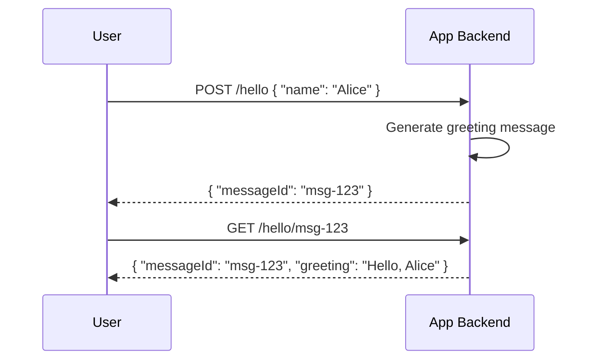

```markdown
# Functional Requirements for Hello World Backend Application

## API Endpoints

### 1. POST `/hello`
- **Purpose**: Trigger any business logic or external data retrieval/calculation that leads to generating a greeting message.
- **Request Format** (JSON):
  ```json
  {
    "name": "string"  // Optional: name to personalize the greeting
  }
  ```
- **Response Format** (JSON):
  ```json
  {
    "messageId": "string"  // Unique identifier for the generated greeting message
  }
  ```
- **Notes**: This endpoint handles logic such as generating or retrieving a greeting message, possibly invoking external services or calculations.

---

### 2. GET `/hello/{messageId}`
- **Purpose**: Retrieve the generated greeting message by its unique identifier.
- **Response Format** (JSON):
  ```json
  {
    "messageId": "string",
    "greeting": "string"  // e.g. "Hello World" or "Hello, <name>"
  }
  ```
- **Notes**: Purely for retrieval of application results. No business logic or external calls.

---

## User-App Interaction Sequence


```mermaid
sequenceDiagram
    participant User
    participant App Backend

    User->>App Backend: POST /hello { "name": "Alice" }
    App Backend->>App Backend: Generate greeting message
    App Backend-->>User: { "messageId": "msg-123" }

    User->>App Backend: GET /hello/msg-123
    App Backend-->>User: { "messageId": "msg-123", "greeting": "Hello, Alice" }
```

---

## Summary

- POST `/hello` initiates greeting creation with optional input data.
- GET `/hello/{messageId}` fetches the resulting greeting.
- Separation of concerns maintained: POST for business logic and external calls, GET for retrieval only.
```