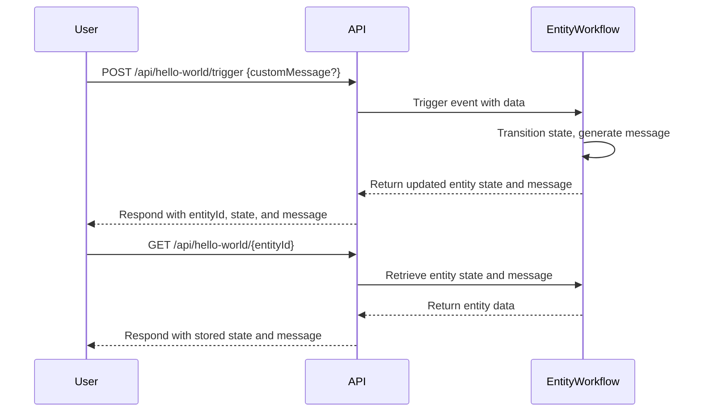

```markdown
# Functional Requirements for Cyoda-Based Hello World Application

## Overview
This backend application is built using Python Quart and follows Cyoda design values. It centers on an entity with a workflow triggered by an event via RESTful API endpoints. The business logic, including any interaction with external data sources or calculations, is handled in POST endpoints, while GET endpoints are strictly for retrieving application results.

---

## API Endpoints

### 1. Trigger Hello World Workflow  
- **Endpoint:** `POST /api/hello-world/trigger`  
- **Description:** Triggers the workflow for the Hello World entity. This endpoint initiates the event that causes the entity’s state machine to transition and execute its process (e.g., generating "Hello World" message).  
- **Request Body:**  
  ```json
  {
    "triggerSource": "string (optional, e.g. 'api_call', 'timer')",
    "customMessage": "string (optional, default: 'Hello World')"
  }
  ```  
- **Response:**  
  ```json
  {
    "entityId": "string",
    "workflowState": "string",
    "message": "string"
  }
  ```  

---

### 2. Retrieve Hello World Result  
- **Endpoint:** `GET /api/hello-world/{entityId}`  
- **Description:** Retrieves the current state and message stored in the Hello World entity after workflow execution.  
- **Response:**  
  ```json
  {
    "entityId": "string",
    "workflowState": "string",
    "message": "string"
  }
  ```  

---

## Business Logic Notes
- All external data retrieval or calculations (if any in future iterations) will be performed inside the POST `/trigger` endpoint.
- The GET endpoint is read-only and returns stored entity state and message.
- The entity state machine handles states such as `initialized`, `triggered`, and `completed`.

---

## User-App Interaction Sequence Diagram


```mermaid
sequenceDiagram
    participant User
    participant API
    participant EntityWorkflow

    User->>API: POST /api/hello-world/trigger {customMessage?}
    API->>EntityWorkflow: Trigger event with data
    EntityWorkflow->>EntityWorkflow: Transition state, generate message
    EntityWorkflow-->>API: Return updated entity state and message
    API-->>User: Respond with entityId, state, and message

    User->>API: GET /api/hello-world/{entityId}
    API->>EntityWorkflow: Retrieve entity state and message
    EntityWorkflow-->>API: Return entity data
    API-->>User: Respond with stored state and message
```

---

## User Journey Diagram

```mermaid
flowchart TD
    A[User wants Hello World] --> B[Trigger workflow via POST]
    B --> C[Entity workflow triggered]
    C --> D[Entity updates state and message]
    D --> E[User retrieves results via GET]
    E --> F[User sees "Hello World" message]
```
```