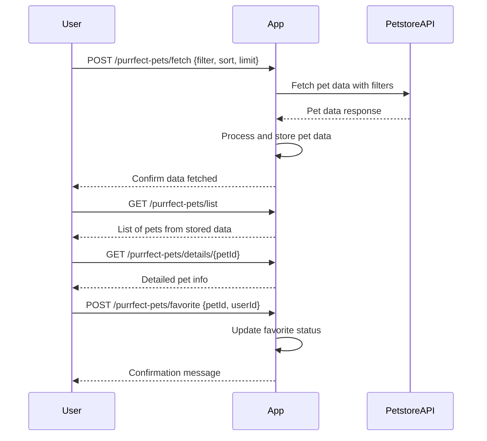
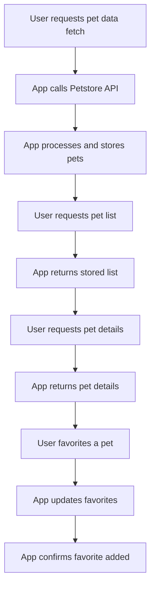

```markdown
# Purrfect Pets API - Functional Requirements

## API Endpoints

### 1. Fetch Pets Data (POST)
- **Path:** `/purrfect-pets/fetch`
- **Description:** Trigger fetching and processing pet data from the external Petstore API. This endpoint handles all external API calls and any processing (e.g., filtering, sorting).
- **Request:**
  ```json
  {
    "filter": {
      "status": "available|pending|sold",   // optional, filter by pet status
      "type": "cat|dog|bird|..."           // optional, filter by pet type
    },
    "sort": "name|status|type",             // optional, sorting field
    "limit": 50                            // optional, max number of pets to fetch
  }
  ```
- **Response:**
  ```json
  {
    "message": "Data fetched and processed successfully",
    "count": 42
  }
  ```

---

### 2. List Pets (GET)
- **Path:** `/purrfect-pets/list`
- **Description:** Retrieve the list of pets fetched and stored in the app’s state.
- **Response:**
  ```json
  [
    {
      "id": 1,
      "name": "Whiskers",
      "type": "cat",
      "status": "available"
    },
    ...
  ]
  ```

---

### 3. Get Pet Details (GET)
- **Path:** `/purrfect-pets/details/{petId}`
- **Description:** Retrieve detailed information about a specific pet.
- **Response:**
  ```json
  {
    "id": 1,
    "name": "Whiskers",
    "type": "cat",
    "status": "available",
    "photoUrls": ["url1", "url2"],
    "tags": ["cute", "small"],
    "description": "A very playful cat."
  }
  ```

---

### 4. Favorite a Pet (POST)
- **Path:** `/purrfect-pets/favorite`
- **Description:** Mark a pet as favorite by user (simple business logic).
- **Request:**
  ```json
  {
    "petId": 1,
    "userId": "user123"
  }
  ```
- **Response:**
  ```json
  {
    "message": "Pet added to favorites"
  }
  ```

---

## Notes:
- All external data fetching and processing happens via POST `/fetch`.
- GET endpoints are for retrieving processed or stored data only.
- Business logic like marking favorites or filtering is done in POST endpoints.
- Data is stored and managed within the app’s state machine (Cyoda entities).

---

## User-App Interaction Sequence


```mermaid
sequenceDiagram
    participant User
    participant App
    participant PetstoreAPI

    User->>App: POST /purrfect-pets/fetch {filter, sort, limit}
    App->>PetstoreAPI: Fetch pet data with filters
    PetstoreAPI-->>App: Pet data response
    App->>App: Process and store pet data
    App-->>User: Confirm data fetched

    User->>App: GET /purrfect-pets/list
    App-->>User: List of pets from stored data

    User->>App: GET /purrfect-pets/details/{petId}
    App-->>User: Detailed pet info

    User->>App: POST /purrfect-pets/favorite {petId, userId}
    App->>App: Update favorite status
    App-->>User: Confirmation message
```

---

## Example API Call Flow (Happy Path)


```mermaid
flowchart TD
    A[User requests pet data fetch] --> B[App calls Petstore API]
    B --> C[App processes and stores pets]
    C --> D[User requests pet list]
    D --> E[App returns stored list]
    E --> F[User requests pet details]
    F --> G[App returns pet details]
    G --> H[User favorites a pet]
    H --> I[App updates favorites]
    I --> J[App confirms favorite added]
```
```