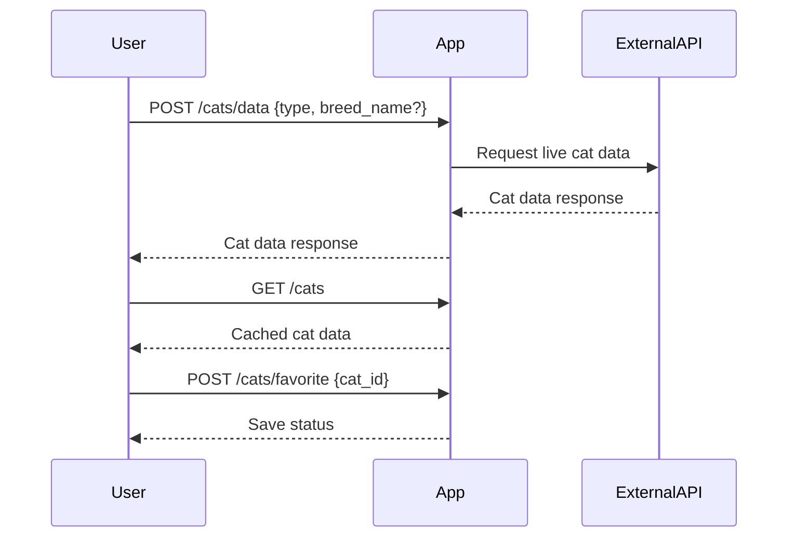
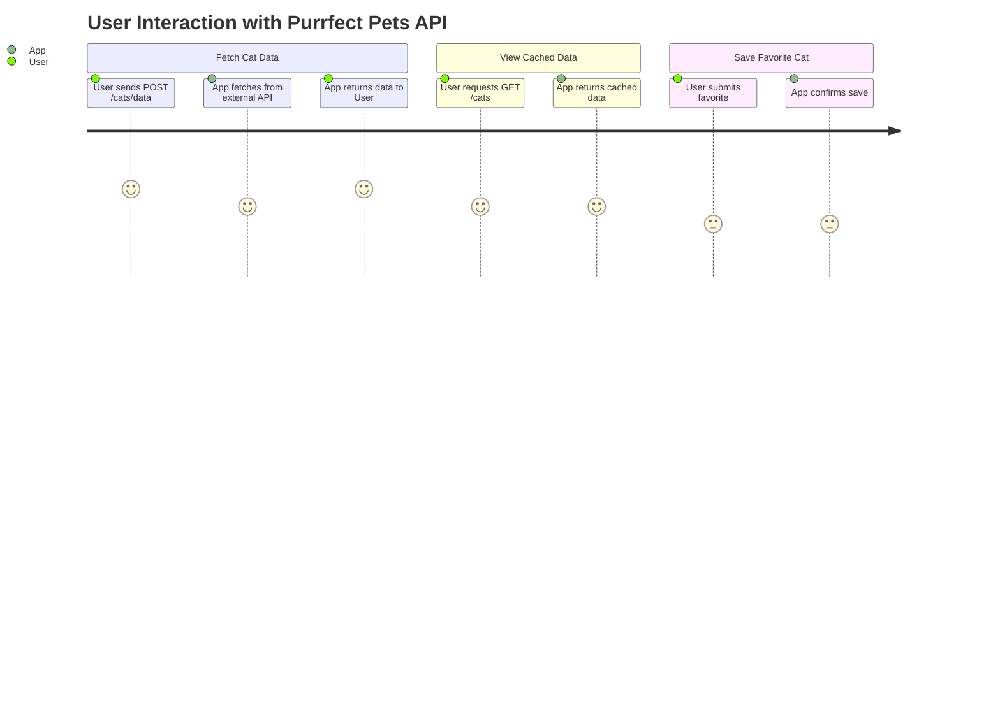

```markdown
# Purrfect Pets API Functional Requirements

## API Endpoints

### 1. POST /cats/data  
**Description:** Fetch live cat data from external sources (images, facts, breeds). Business logic to retrieve and process data here.  
**Request:**  
```json
{
  "type": "random" | "breed",
  "breed_name": "optional if type is breed"
}
```  
**Response:**  
```json
{
  "cats": [
    {
      "id": "string",
      "breed": "string",
      "image_url": "string",
      "fact": "string"
    }
  ]
}
```

### 2. GET /cats  
**Description:** Retrieve cached or previously fetched cat data (results of POST).  
**Response:**  
```json
{
  "cats": [
    {
      "id": "string",
      "breed": "string",
      "image_url": "string",
      "fact": "string"
    }
  ]
}
```

### 3. POST /cats/favorite  
**Description:** Submit a user’s favorite cat info (optional feature to save favorites).  
**Request:**  
```json
{
  "cat_id": "string"
}
```  
**Response:**  
```json
{
  "status": "success" | "failure",
  "message": "string"
}
```

---

## Mermaid Sequence Diagram


```mermaid
sequenceDiagram
    participant User
    participant App
    participant ExternalAPI

    User->>App: POST /cats/data {type, breed_name?}
    App->>ExternalAPI: Request live cat data
    ExternalAPI-->>App: Cat data response
    App-->>User: Cat data response

    User->>App: GET /cats
    App-->>User: Cached cat data

    User->>App: POST /cats/favorite {cat_id}
    App-->>User: Save status
```

---

## Mermaid User Journey Diagram


```mermaid
journey
    title User Interaction with Purrfect Pets API
    section Fetch Cat Data
      User sends POST /cats/data: 5: User
      App fetches from external API: 4: App
      App returns data to User: 5: User
    section View Cached Data
      User requests GET /cats: 4: User
      App returns cached data: 4: App
    section Save Favorite Cat
      User submits favorite: 3: User
      App confirms save: 3: App
```
```