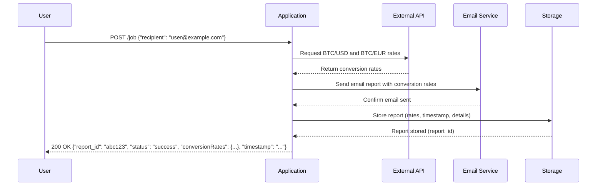
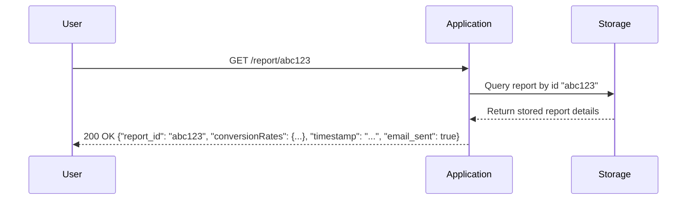

# Functional Requirements Document

## Overview

This document outlines the functional requirements for an application that retrieves the current Bitcoin-to-USD and Bitcoin-to-EUR conversion rates, generates a report, sends it via email, and allows users to retrieve these reports.

## API Endpoints

### 1. POST /job

- **Description:**  
  Initiates the report creation process by fetching the latest Bitcoin conversion rates and sending an email with the results.

- **Request Format:**  
  - **Content-Type:** application/json  
  - **Body Example:**
    ```json
    {
      "recipient": "user@example.com"
    }
    ```

- **Response Format:**  
  - **Content-Type:** application/json  
  - **Body Example:**
    ```json
    {
      "report_id": "abc123",
      "status": "success",
      "conversionRates": {
        "BTC_USD": 30000.50,
        "BTC_EUR": 28000.75
      },
      "timestamp": "2023-10-11T15:23:01Z"
    }
    ```

- **Business Logic:**  
  1. Retrieve the current BTC/USD and BTC/EUR conversion rates from an external API (e.g., Binance).
  2. Generate a report that includes the conversion rates and a timestamp.
  3. Send the report via email to the specified recipient.
  4. Store the report details (conversion rates and metadata) in persistent storage (e.g., database).

### 2. GET /report/{id}

- **Description:**  
  Retrieves a previously stored report using its unique ID.

- **Request Format:**  
  - **URL Parameter:** id (string)

- **Response Format:**  
  - **Content-Type:** application/json  
  - **Body Example:**
    ```json
    {
      "report_id": "abc123",
      "conversionRates": {
        "BTC_USD": 30000.50,
        "BTC_EUR": 28000.75
      },
      "timestamp": "2023-10-11T15:23:01Z",
      "email_sent": true
    }
    ```

- **Business Logic:**  
  1. Query the persistent storage using the provided report ID.
  2. Return the stored conversion rate information along with relevant metadata.

## User-App Interaction

### Sequence Diagram for POST /job


```mermaid
sequenceDiagram
  participant U as User
  participant A as Application
  participant E as External API
  participant M as Email Service
  participant S as Storage

  U->>A: POST /job {"recipient": "user@example.com"}
  A->>E: Request BTC/USD and BTC/EUR rates
  E-->>A: Return conversion rates
  A->>M: Send email report with conversion rates
  M-->>A: Confirm email sent
  A->>S: Store report (rates, timestamp, details)
  S-->>A: Report stored (report_id)
  A-->>U: 200 OK {"report_id": "abc123", "status": "success", "conversionRates": {...}, "timestamp": "..."}
```

### Sequence Diagram for GET /report/{id}


```mermaid
sequenceDiagram
  participant U as User
  participant A as Application
  participant S as Storage

  U->>A: GET /report/abc123
  A->>S: Query report by id "abc123"
  S-->>A: Return stored report details
  A-->>U: 200 OK {"report_id": "abc123", "conversionRates": {...}, "timestamp": "...", "email_sent": true}
```