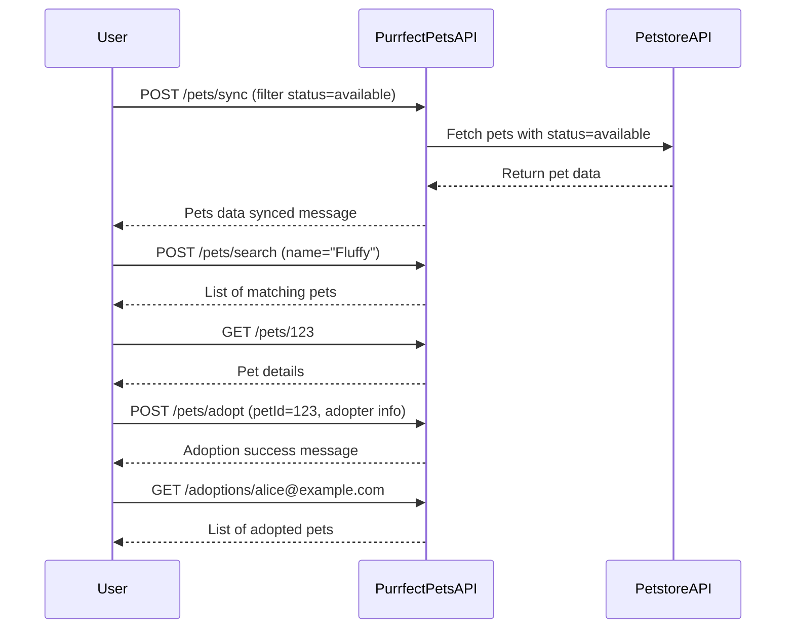

```markdown
# Purrfect Pets API - Functional Requirements

## Overview
The "Purrfect Pets" API app provides pet management and interactive features using Petstore API data. External data retrieval and business logic happen in POST endpoints, while GET endpoints serve cached or processed results.

---

## API Endpoints

### 1. POST /pets/sync  
**Description:** Fetch and sync pet data from external Petstore API.  
**Request:**  
```json
{
  "filter": {
    "status": "available"  // optional: filter by pet status
  }
}
```  
**Response:**  
```json
{
  "syncedCount": 25,
  "message": "Pets data synced successfully."
}
```

---

### 2. POST /pets/search  
**Description:** Search pets with filters and optional sorting.  
**Request:**  
```json
{
  "name": "Fluffy",          // optional partial name match
  "status": ["available"],   // optional list of statuses
  "category": "cat"          // optional category filter
}
```  
**Response:**  
```json
{
  "results": [
    {
      "id": 123,
      "name": "Fluffy",
      "category": "cat",
      "status": "available",
      "tags": ["cute", "playful"]
    }
  ]
}
```

---

### 3. GET /pets/{petId}  
**Description:** Retrieve cached pet details by pet ID.  
**Response:**  
```json
{
  "id": 123,
  "name": "Fluffy",
  "category": "cat",
  "status": "available",
  "tags": ["cute", "playful"]
}
```

---

### 4. POST /pets/adopt  
**Description:** Process a pet adoption request (business logic + validation).  
**Request:**  
```json
{
  "petId": 123,
  "adopter": {
    "name": "Alice",
    "email": "alice@example.com"
  }
}
```  
**Response:**  
```json
{
  "success": true,
  "message": "Congrats Alice! You adopted Fluffy."
}
```

---

### 5. GET /adoptions/{adopterEmail}  
**Description:** Retrieve list of pets adopted by an adopter.  
**Response:**  
```json
{
  "adopter": "alice@example.com",
  "adoptedPets": [
    {
      "id": 123,
      "name": "Fluffy",
      "category": "cat"
    }
  ]
}
```

---

## User-App Interaction Sequence


```mermaid
sequenceDiagram
  participant User
  participant PurrfectPetsAPI
  participant PetstoreAPI

  User->>PurrfectPetsAPI: POST /pets/sync (filter status=available)
  PurrfectPetsAPI->>PetstoreAPI: Fetch pets with status=available
  PetstoreAPI-->>PurrfectPetsAPI: Return pet data
  PurrfectPetsAPI-->>User: Pets data synced message

  User->>PurrfectPetsAPI: POST /pets/search (name="Fluffy")
  PurrfectPetsAPI-->>User: List of matching pets

  User->>PurrfectPetsAPI: GET /pets/123
  PurrfectPetsAPI-->>User: Pet details

  User->>PurrfectPetsAPI: POST /pets/adopt (petId=123, adopter info)
  PurrfectPetsAPI-->>User: Adoption success message

  User->>PurrfectPetsAPI: GET /adoptions/alice@example.com
  PurrfectPetsAPI-->>User: List of adopted pets
```
```