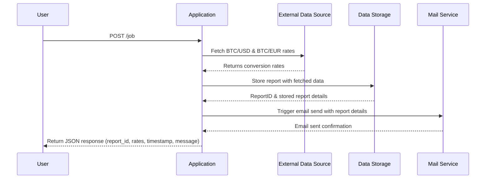
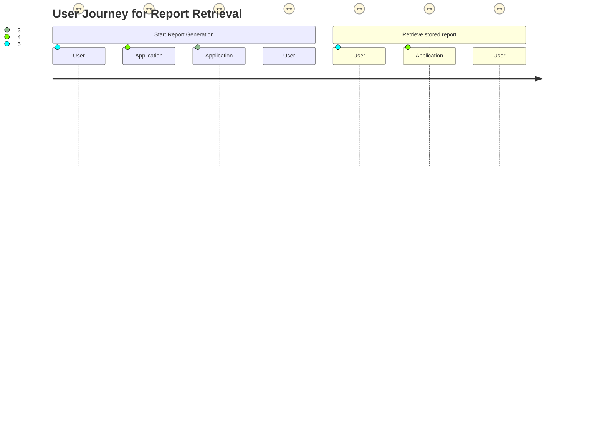

# Functional Requirements Document

## Overview

The application will interact with an external data source to retrieve the latest Bitcoin conversion rates and send an email report containing this information. It will expose two RESTful API endpoints, adhering to the principles of REST.

---

## API Endpoints

### 1. POST /job

- **Purpose:**  
  Initiate the report generation process, which includes:
  - Fetching the latest Bitcoin-to-USD (BTC/USD) and Bitcoin-to-EUR (BTC/EUR) conversion rates.
  - Storing the fetched data in a report format.
  - Sending an email with the report details.

- **Request Format:**  
  - **Content-Type:** application/json  
  - **Body:** (No additional data is required)

- **Response Format:**
  ```json
  {
    "report_id": "string",      // Unique identifier for the stored report
    "btc_usd": "number",        // Retrieved conversion rate BTC to USD
    "btc_eur": "number",        // Retrieved conversion rate BTC to EUR
    "timestamp": "ISO8601",     // Timestamp when the report was created
    "message": "Report successfully generated and email sent"
  }
  ```

- **Business Logic:**
  - Connect to the external data source to fetch the conversion rates.
  - Validate and store the fetched data in the internal data storage.
  - Trigger sending an email report that includes the conversion rates and timestamp.

---

### 2. GET /report/{id}

- **Purpose:**  
  Retrieve a previously stored report using its unique identifier.

- **Request Format:**  
  - **Parameter:**  
    - `id`: string (in URL path)

- **Response Format:**
  ```json
  {
    "report_id": "string",
    "btc_usd": "number",
    "btc_eur": "number",
    "timestamp": "ISO8601"
  }
  ```

- **Business Logic:**
  - Look up the report by its unique identifier in the internal data storage.
  - Return the report details without making any external data source calls.

---

## User-App Interaction Diagrams

### Sequence Diagram for Report Generation (POST /job)


```mermaid
sequenceDiagram
    participant U as User
    participant A as Application
    participant E as External Data Source
    participant DS as Data Storage
    participant M as Mail Service

    U->>A: POST /job
    A->>E: Fetch BTC/USD & BTC/EUR rates
    E-->>A: Returns conversion rates
    A->>DS: Store report with fetched data
    DS-->>A: ReportID & stored report details
    A->>M: Trigger email send with report details
    M-->>A: Email sent confirmation
    A-->>U: Return JSON response (report_id, rates, timestamp, message)
```

### Journey Diagram for User Interaction with the Application


```mermaid
journey
    title User Journey for Report Retrieval
    section Start Report Generation
      User: Initiates report generation via POST /job: 5: Application
      Application: Fetches external data & stores report: 4: External Data Source, Data Storage
      Application: Triggers email sending of the report: 3: Mail Service
      User: Receives confirmation with report details

    section Retrieve stored report
      User: Requests stored report via GET /report/{id}: 5: Application
      Application: Returns stored report details: 4: Data Storage
      User: Views report data (rates and timestamp)
```

--- 

This document outlines the essential functional requirements for the application, ensuring clarity in the API interactions and the expected behaviors.