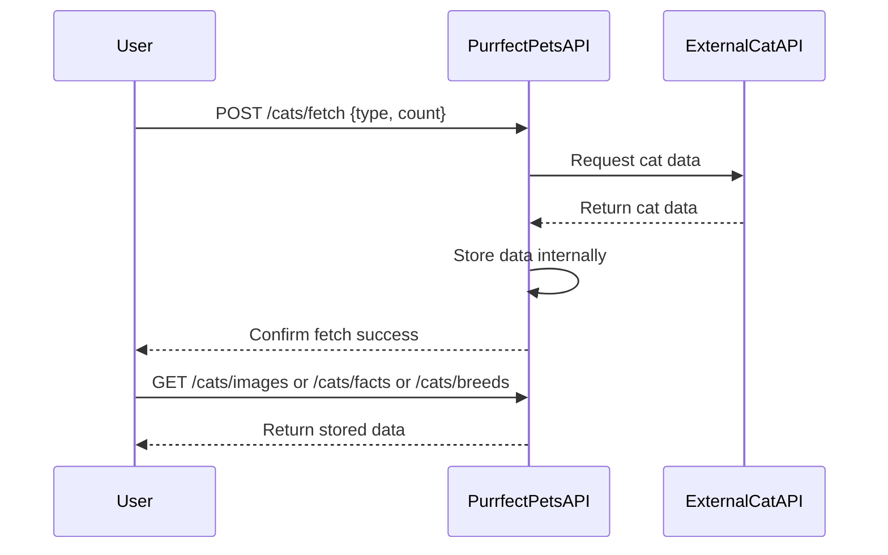
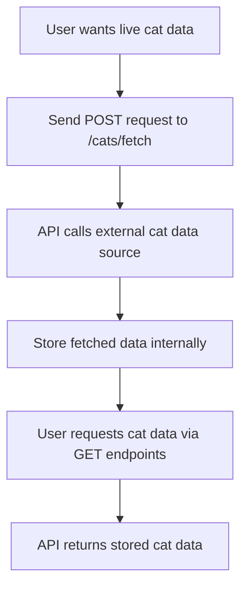

```markdown
# Purrfect Pets API - Functional Requirements

## API Endpoints

### 1. POST /cats/fetch
- **Description:** Triggers fetching live cat data from an external API (e.g., cat images, facts, breeds).
- **Request:**
  ```json
  {
    "type": "images" | "facts" | "breeds",  // Type of cat data to fetch
    "count": 1                              // Number of items to fetch
  }
  ```
- **Response:**
  ```json
  {
    "status": "success",
    "message": "Cat data fetched and stored",
    "fetched_count": 1
  }
  ```

### 2. GET /cats/images
- **Description:** Retrieve stored cat images.
- **Response:**
  ```json
  {
    "images": [
      {
        "id": "abc123",
        "url": "https://cdn.example.com/cat1.jpg"
      }
    ]
  }
  ```

### 3. GET /cats/facts
- **Description:** Retrieve stored cat facts.
- **Response:**
  ```json
  {
    "facts": [
      {
        "id": "fact123",
        "text": "Cats sleep 70% of their lives."
      }
    ]
  }
  ```

### 4. GET /cats/breeds
- **Description:** Retrieve stored cat breed information.
- **Response:**
  ```json
  {
    "breeds": [
      {
        "id": "breed123",
        "name": "Siamese",
        "origin": "Thailand",
        "description": "Siamese cats are known for their social and vocal nature."
      }
    ]
  }
  ```

---

## Business Logic Notes
- All external API calls to fetch live cat data are triggered via `POST /cats/fetch`.
- The fetched data is stored internally for retrieval via `GET` endpoints.
- The `GET` endpoints only serve stored data; no external calls.

---

## User-App Interaction Sequence Diagram


```mermaid
sequenceDiagram
    participant User
    participant PurrfectPetsAPI
    participant ExternalCatAPI

    User->>PurrfectPetsAPI: POST /cats/fetch {type, count}
    PurrfectPetsAPI->>ExternalCatAPI: Request cat data
    ExternalCatAPI-->>PurrfectPetsAPI: Return cat data
    PurrfectPetsAPI->>PurrfectPetsAPI: Store data internally
    PurrfectPetsAPI-->>User: Confirm fetch success

    User->>PurrfectPetsAPI: GET /cats/images or /cats/facts or /cats/breeds
    PurrfectPetsAPI-->>User: Return stored data
```

---

## User Journey Diagram


```mermaid
flowchart TD
    A[User wants live cat data] --> B[Send POST request to /cats/fetch]
    B --> C[API calls external cat data source]
    C --> D[Store fetched data internally]
    D --> E[User requests cat data via GET endpoints]
    E --> F[API returns stored cat data]
```
```