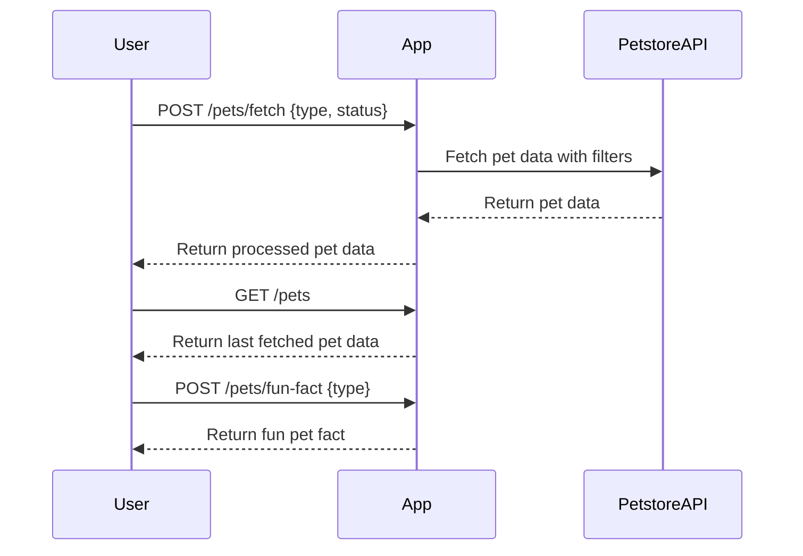
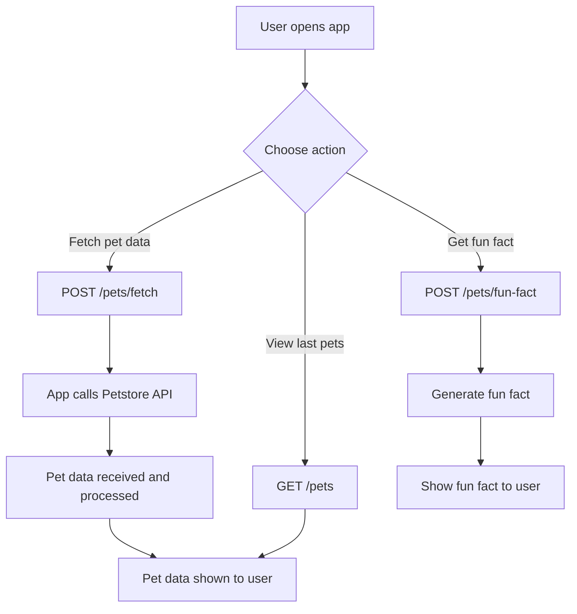

```markdown
# Purrfect Pets API - Functional Requirements

## API Endpoints

### 1. POST /pets/fetch  
**Description:** Fetch pet data from Petstore API based on filter criteria and process any business logic.  
**Request Body:**  
```json
{
  "type": "string",      // e.g., "dog", "cat", or "all"
  "status": "string"     // e.g., "available", "sold", "pending" (optional)
}
```  
**Response:**  
```json
{
  "pets": [
    {
      "id": "integer",
      "name": "string",
      "type": "string",
      "status": "string",
      "tags": ["string"],
      "photoUrls": ["string"]
    }
  ]
}
```

### 2. GET /pets  
**Description:** Retrieve the last fetched pet data stored in the application.  
**Response:**  
```json
{
  "pets": [
    {
      "id": "integer",
      "name": "string",
      "type": "string",
      "status": "string",
      "tags": ["string"],
      "photoUrls": ["string"]
    }
  ]
}
```

### 3. POST /pets/fun-fact  
**Description:** Generate a fun pet fact or name based on request parameters.  
**Request Body:**  
```json
{
  "type": "string"  // e.g., "dog", "cat", or "random"
}
```  
**Response:**  
```json
{
  "fact": "string"
}
```

---

## User-App Interaction Sequence Diagram


```mermaid
sequenceDiagram
    participant User
    participant App
    participant PetstoreAPI

    User->>App: POST /pets/fetch {type, status}
    App->>PetstoreAPI: Fetch pet data with filters
    PetstoreAPI-->>App: Return pet data
    App-->>User: Return processed pet data

    User->>App: GET /pets
    App-->>User: Return last fetched pet data

    User->>App: POST /pets/fun-fact {type}
    App-->>User: Return fun pet fact
```

---

## User Journey Diagram


```mermaid
flowchart TD
    A[User opens app] --> B{Choose action}
    B -->|Fetch pet data| C[POST /pets/fetch]
    C --> D[App calls Petstore API]
    D --> E[Pet data received and processed]
    E --> F[Pet data shown to user]

    B -->|View last pets| G[GET /pets]
    G --> F

    B -->|Get fun fact| H[POST /pets/fun-fact]
    H --> I[Generate fun fact]
    I --> J[Show fun fact to user]
```
```