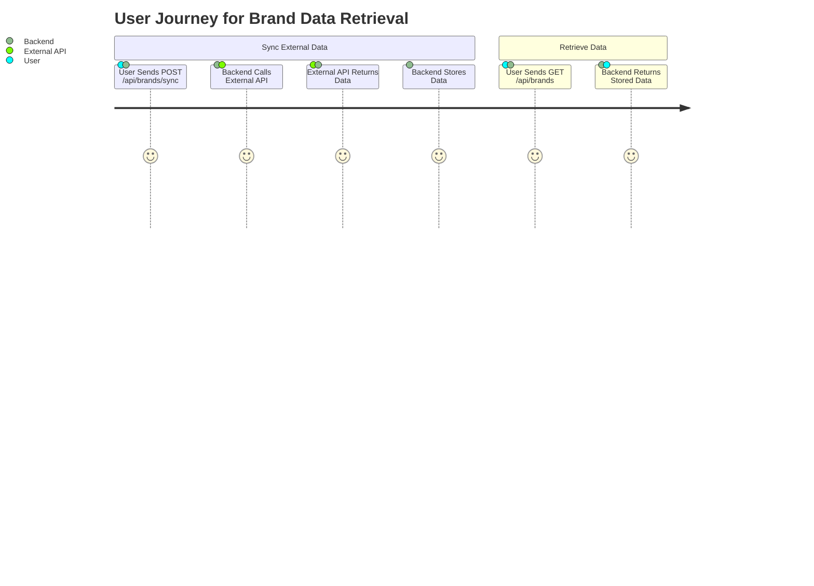
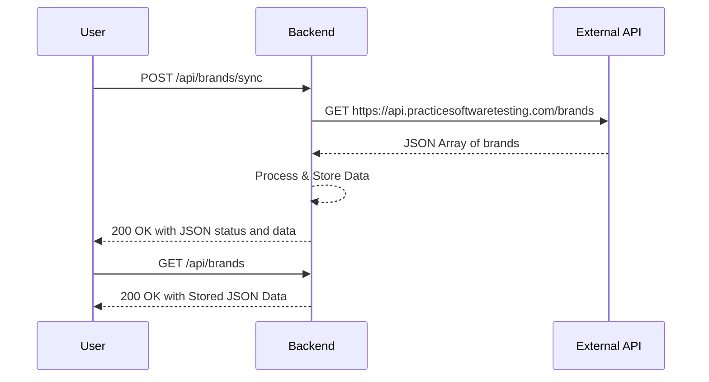

# Functional Requirements Document

## API Endpoints

### 1. POST /api/brands/sync

- **Purpose:**  
  Invokes the external data source and fetches the latest brand details from the open-source API.

- **Request Format:**  
  - **Method:** POST  
  - **URL:** /api/brands/sync  
  - **Headers:**  
    - Content-Type: application/json  
  - **Body:**  
    - Optional filters or parameters (if applicable).  
    - **Example:**
      ```json
      {
        "query": {} // reserved for future filter options
      }
      ```

- **Business Logic:**  
  - Validate any input parameters if provided.
  - Call external API: GET `https://api.practicesoftwaretesting.com/brands`.
  - Check and handle response codes; if response is 200, parse and process the JSON array.
  - Perform any data transformation or additional calculations (if needed).
  - Store the retrieved data in an internal store/cache for subsequent GET requests.

- **Response Format:**  
  - **On Success (HTTP 200):**
    ```json
    {
      "status": "success",
      "data": [  
        {
          "id": "01JMWZK3N7PT3XMTMXMQTBACRV",
          "name": "ForgeFlex Tools",
          "slug": "forgeflex-tools"
        },
        {
          "id": "01JMWZK3N7PT3XMTMXMQTBACRW",
          "name": "MightyCraft Hardware",
          "slug": "mightycraft-hardware"
        }
      ]
    }
    ```
  - **On Failure (HTTP 4xx/5xx):**
    ```json
    {
      "status": "error",
      "message": "Error message detailing the issue."
    }
    ```

### 2. GET /api/brands

- **Purpose:**  
  Retrieve the stored application results from the last sync operation performed by the POST endpoint.

- **Request Format:**  
  - **Method:** GET  
  - **URL:** /api/brands  
  - **Headers:**  
    - Accept: application/json  
  - **No Request Body.**

- **Response Format:**  
  - **On Success (HTTP 200):**
    ```json
    {
      "status": "success",
      "data": [  
        {
          "id": "01JMWZK3N7PT3XMTMXMQTBACRV",
          "name": "ForgeFlex Tools",
          "slug": "forgeflex-tools"
        },
        {
          "id": "01JMWZK3N7PT3XMTMXMQTBACRW",
          "name": "MightyCraft Hardware",
          "slug": "mightycraft-hardware"
        }
      ]
    }
    ```
  - **On Failure (HTTP 404/500):**
    ```json
    {
      "status": "error",
      "message": "Error message detailing the issue."
    }
    ```

## User-App Interaction Diagrams

### Journey Diagram


```mermaid
journey
    title User Journey for Brand Data Retrieval
    section Sync External Data
      User Sends POST /api/brands/sync: 5: User, Backend
      Backend Calls External API: 5: Backend, External API
      External API Returns Data: 5: External API, Backend
      Backend Stores Data: 5: Backend
    section Retrieve Data
      User Sends GET /api/brands: 5: User, Backend
      Backend Returns Stored Data: 5: Backend, User
```

### Sequence Diagram


```mermaid
sequenceDiagram
    participant U as User
    participant B as Backend
    participant E as External API

    U->>B: POST /api/brands/sync
    B->>E: GET https://api.practicesoftwaretesting.com/brands
    E-->>B: JSON Array of brands
    B-->>B: Process & Store Data
    B-->>U: 200 OK with JSON status and data

    U->>B: GET /api/brands
    B-->>U: 200 OK with Stored JSON Data
```