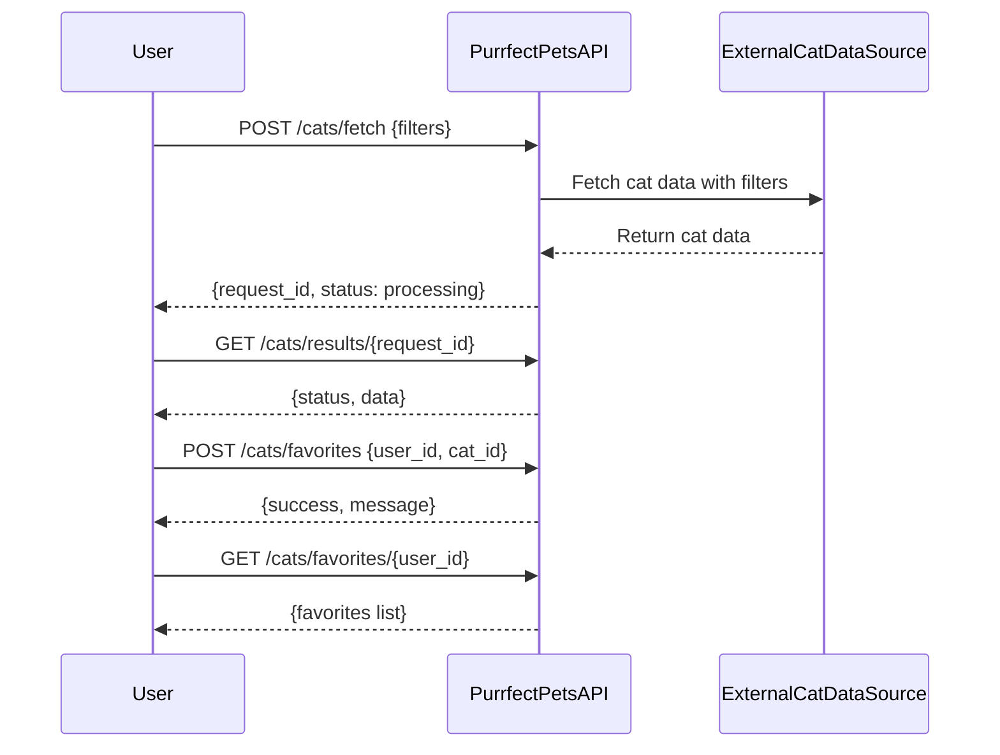

```markdown
# Purrfect Pets API - Functional Requirements

## Overview
The "Purrfect Pets" API provides live cat data in a fun and engaging way. The API follows RESTful principles:
- **POST endpoints** handle business logic such as fetching or calculating data from external sources.
- **GET endpoints** retrieve results stored or processed by the application.

## API Endpoints

### 1. POST /cats/fetch
Fetch live cat data from external sources (e.g., cat breeds, images, facts).

- **Request:**
```json
{
  "source": "string",  // e.g., "cat_api", "shelter_data"
  "filters": {         // optional filters for data retrieval
    "breed": "string",
    "age": "string",
    "location": "string"
  }
}
```

- **Response:**
```json
{
  "request_id": "string",  // unique ID for the fetch request
  "status": "processing"
}
```

### 2. GET /cats/results/{request_id}
Retrieve the results of a previously submitted fetch request.

- **Response:**
```json
{
  "request_id": "string",
  "status": "completed", // or "processing", "failed"
  "data": [
    {
      "id": "string",
      "breed": "string",
      "age": "string",
      "image_url": "string",
      "fact": "string",
      "location": "string"
    }
  ]
}
```

### 3. POST /cats/favorites
Add a cat to user's favorites.

- **Request:**
```json
{
  "user_id": "string",
  "cat_id": "string"
}
```

- **Response:**
```json
{
  "success": true,
  "message": "Cat added to favorites"
}
```

### 4. GET /cats/favorites/{user_id}
Retrieve the list of favorite cats for a user.

- **Response:**
```json
{
  "user_id": "string",
  "favorites": [
    {
      "cat_id": "string",
      "breed": "string",
      "image_url": "string"
    }
  ]
}
```

## User-App Interaction Sequence


```mermaid
sequenceDiagram
    participant User
    participant PurrfectPetsAPI
    participant ExternalCatDataSource

    User->>PurrfectPetsAPI: POST /cats/fetch {filters}
    PurrfectPetsAPI->>ExternalCatDataSource: Fetch cat data with filters
    ExternalCatDataSource-->>PurrfectPetsAPI: Return cat data
    PurrfectPetsAPI-->>User: {request_id, status: processing}

    User->>PurrfectPetsAPI: GET /cats/results/{request_id}
    PurrfectPetsAPI-->>User: {status, data}

    User->>PurrfectPetsAPI: POST /cats/favorites {user_id, cat_id}
    PurrfectPetsAPI-->>User: {success, message}

    User->>PurrfectPetsAPI: GET /cats/favorites/{user_id}
    PurrfectPetsAPI-->>User: {favorites list}
```

## Notes
- All POST endpoints trigger business logic or external data fetching.
- GET endpoints are used strictly for retrieving processed or stored data.
- Request and response formats use JSON.
```