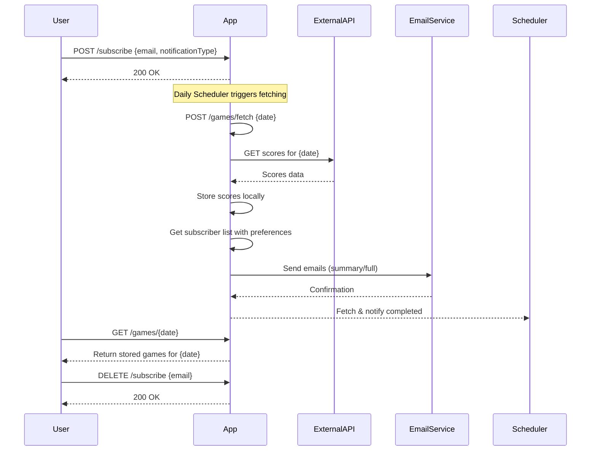

```markdown
# Functional Requirements for Event-Driven NBA Score Update System

## API Endpoints

### 1. POST /subscribe  
Subscribe or update subscription preferences.

- **Request Body:**
```json
{
  "email": "user@example.com",
  "notificationType": "summary"  // "summary" or "full"
}
```

- **Response:**
```json
{
  "message": "Subscription added/updated successfully"
}
```

### 2. DELETE /subscribe  
Unsubscribe a user.

- **Request Body:**
```json
{
  "email": "user@example.com"
}
```

- **Response:**
```json
{
  "message": "Subscription removed successfully"
}
```

### 3. GET /subscribers  
Retrieve all subscribers with their notification preferences.

- **Response:**
```json
[
  {
    "email": "user@example.com",
    "notificationType": "summary"
  },
  {
    "email": "another@example.com",
    "notificationType": "full"
  }
]
```

### 4. POST /games/fetch  
Trigger fetching NBA scores for a specific date from external API and store locally. Also sends notifications to subscribers.

- **Request Body:**
```json
{
  "date": "YYYY-MM-DD"
}
```

- **Response:**
```json
{
  "message": "Scores fetched, stored, and notifications sent"
}
```

### 5. GET /games/all  
Retrieve all stored NBA games, with pagination support.

- **Query Parameters:**
  - `offset` (integer, default 0)
  - `pagesize` (integer, default 20)

- **Response:**
```json
{
  "total": 100,
  "offset": 0,
  "pagesize": 20,
  "games": [
    {
      "date": "YYYY-MM-DD",
      "homeTeam": "Team A",
      "awayTeam": "Team B",
      "homeScore": 110,
      "awayScore": 105,
      "details": {...}
    }
  ]
}
```

### 6. GET /games/{date}  
Retrieve all stored NBA games for a specific date.

- **Response:**
```json
[
  {
    "date": "YYYY-MM-DD",
    "homeTeam": "Team A",
    "awayTeam": "Team B",
    "homeScore": 110,
    "awayScore": 105,
    "details": {...}
  }
]
```

## Business Logic Notes

- Subscription preferences (summary or full) are specified during subscription and can be updated.
- Users can unsubscribe via DELETE /subscribe.
- External API data fetching and notifications are performed only in POST /games/fetch.
- GET endpoints serve only locally stored data.
- Scheduler triggers POST /games/fetch daily automatically.
- Pagination parameters have defaults: offset=0, pagesize=20.

---

## User-App Interaction Sequence Diagram


```mermaid
sequenceDiagram
    participant User
    participant App
    participant ExternalAPI
    participant EmailService

    User->>App: POST /subscribe {email, notificationType}
    App-->>User: 200 OK

    Note over App: Daily Scheduler triggers fetching

    App->>App: POST /games/fetch {date}
    App->>ExternalAPI: GET scores for {date}
    ExternalAPI-->>App: Scores data
    App->>App: Store scores locally
    App->>App: Get subscriber list with preferences
    App->>EmailService: Send emails (summary/full)
    EmailService-->>App: Confirmation
    App-->>Scheduler: Fetch & notify completed

    User->>App: GET /games/{date}
    App-->>User: Return stored games for {date}

    User->>App: DELETE /subscribe {email}
    App-->>User: 200 OK
```
```