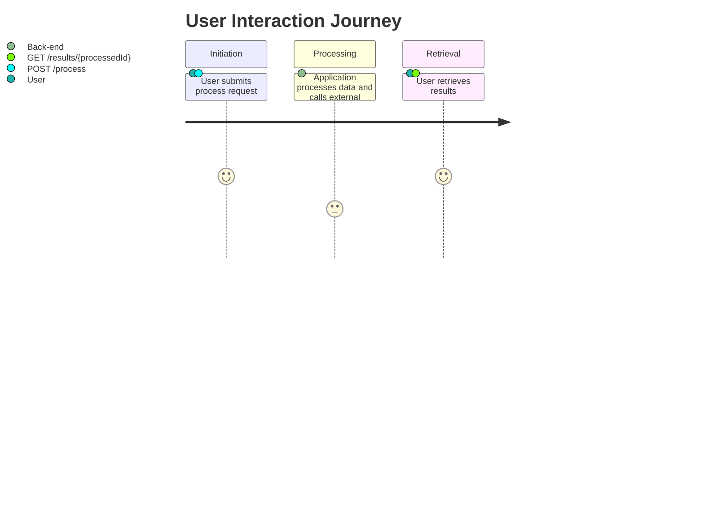
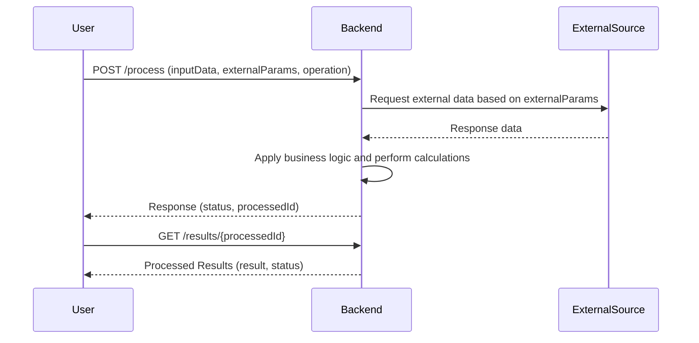

# Functional Requirements Document

## Overview
This document provides the final, well-structured functional requirements for the project, including API endpoints and user interaction diagrams.

## API Endpoints

### 1. POST /process
- **Purpose**: Initiate a process that involves calling external data sources, applying business logic, performing calculations, and storing the processed results.
- **Request**  
  - **Content-Type**: application/json  
  - **Body Parameters**:
    - `inputData` (object): Key/value pairs required for processing.
    - `externalParams` (object): Parameters needed to query external data sources.
    - `operation` (string): Indicates the type of processing or calculation.
    
  - **Example**:
    ```json
    {
      "inputData": {
        "id": "12345",
        "value": 100
      },
      "externalParams": {
        "source": "api",
        "query": "fetch_info"
      },
      "operation": "calculate_discount"
    }
    ```
- **Response**  
  - **Content-Type**: application/json  
  - **Body**:
    - `status` (string): Operation status ("success", "error").
    - `message` (string): Additional details.
    - `processedId` (string): Identifier of the processed result for later retrieval.
    
  - **Example**:
    ```json
    {
      "status": "success",
      "message": "Processing initiated.",
      "processedId": "abc123"
    }
    ```

### 2. GET /results/{processedId}
- **Purpose**: Retrieve the results of a previously processed request.
- **Request**
  - **Path Parameter**:
    - `processedId` (string): Identifier returned from the POST /process endpoint.
- **Response**
  - **Content-Type**: application/json  
  - **Body**:
    - `status` (string): Retrieval status ("found", "not_found").
    - `result` (object): The processed data result when found.
    
  - **Example**:
    ```json
    {
      "status": "found",
      "result": {
        "id": "12345",
        "calculation": 90,
        "details": "Discount applied."
      }
    }
    ```

## User-App Interaction Diagrams

### Journey Diagram

```mermaid
journey
    title User Interaction Journey
    section Initiation
      User submits process request: 5: User, POST /process
    section Processing
      Application processes data and calls external sources: 3: Back-end
    section Retrieval
      User retrieves results: 5: User, GET /results/{processedId}
```

### Sequence Diagram

```mermaid
sequenceDiagram
    participant User
    participant Backend
    participant ExternalSource

    User->>Backend: POST /process (inputData, externalParams, operation)
    Backend->>ExternalSource: Request external data based on externalParams
    ExternalSource-->>Backend: Response data
    Backend->>Backend: Apply business logic and perform calculations
    Backend-->>User: Response (status, processedId)
    User->>Backend: GET /results/{processedId}
    Backend-->>User: Processed Results (result, status)
```