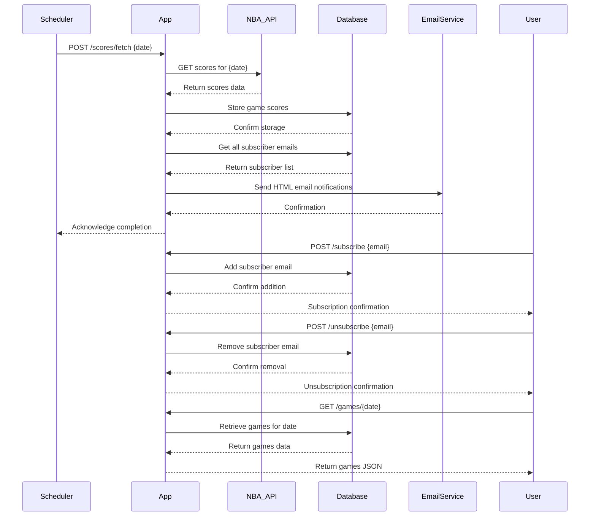

```markdown
# Final Functional Requirements and API Design for NBA Scores Notification System

## API Endpoints

### 1. Subscribe User  
**POST** `/subscribe`  
- Description: Add a user email to the subscription list.  
- Request Body:  
  ```json
  {
    "email": "user@example.com"
  }
  ```  
- Response:  
  ```json
  {
    "message": "Subscription successful",
    "email": "user@example.com"
  }
  ```

### 2. Unsubscribe User  
**POST** `/unsubscribe`  
- Description: Remove a user email from the subscription list.  
- Request Body:  
  ```json
  {
    "email": "user@example.com"
  }
  ```  
- Response:  
  ```json
  {
    "message": "Unsubscribed successfully",
    "email": "user@example.com"
  }
  ```

### 3. Get Subscribers  
**GET** `/subscribers`  
- Description: Retrieve a list of all subscribed emails.  
- Response:  
  ```json
  {
    "subscribers": [
      "user1@example.com",
      "user2@example.com"
    ]
  }
  ```

### 4. Fetch and Store NBA Scores (Scheduled)  
**POST** `/scores/fetch`  
- Description: Fetch NBA game scores for a given date from external API, store them locally, and send notifications.  
- Request Body:  
  ```json
  {
    "date": "YYYY-MM-DD"
  }
  ```  
- Response:  
  ```json
  {
    "message": "Scores fetched and notifications sent",
    "date": "YYYY-MM-DD",
    "gamesStored": 10,
    "notificationsSent": 25
  }
  ```

### 5. Get All Games  
**GET** `/games/all`  
- Description: Retrieve all stored NBA games, optionally paginated or filtered by date range (query params).  
- Query Parameters (optional):  
  - `page` (int)  
  - `pageSize` (int)  
  - `startDate` (YYYY-MM-DD)  
  - `endDate` (YYYY-MM-DD)  
- Response:  
  ```json
  {
    "games": [
      {
        "gameId": 123,
        "date": "2025-03-25",
        "homeTeam": "Lakers",
        "awayTeam": "Warriors",
        "homeScore": 110,
        "awayScore": 105,
        "status": "Final"
      },
      ...
    ],
    "page": 1,
    "pageSize": 10,
    "totalGames": 50
  }
  ```

### 6. Get Games by Date  
**GET** `/games/{date}`  
- Description: Retrieve all NBA games data for a specific date.  
- Response:  
  ```json
  {
    "date": "2025-03-25",
    "games": [
      {
        "gameId": 123,
        "homeTeam": "Lakers",
        "awayTeam": "Warriors",
        "homeScore": 110,
        "awayScore": 105,
        "status": "Final"
      },
      ...
    ]
  }
  ```

---

## Business Logic Notes

- The `POST /scores/fetch` endpoint is triggered daily at 6:00 PM UTC by a background scheduler.
- This endpoint asynchronously fetches NBA scores from the external API, persists them, and sends HTML email notifications to all subscribed users.
- GET endpoints are read-only and return stored data only.
- Subscription and unsubscription actions use POST endpoints to modify subscriber list.

---

## User-App Interaction Sequence Diagram


```mermaid
sequenceDiagram
    participant Scheduler
    participant App
    participant NBA_API
    participant Database
    participant EmailService
    participant User

    Scheduler->>App: POST /scores/fetch {date}
    App->>NBA_API: GET scores for {date}
    NBA_API-->>App: Return scores data
    App->>Database: Store game scores
    Database-->>App: Confirm storage
    App->>Database: Get all subscriber emails
    Database-->>App: Return subscriber list
    App->>EmailService: Send HTML email notifications
    EmailService-->>App: Confirmation
    App-->>Scheduler: Acknowledge completion

    User->>App: POST /subscribe {email}
    App->>Database: Add subscriber email
    Database-->>App: Confirm addition
    App-->>User: Subscription confirmation

    User->>App: POST /unsubscribe {email}
    App->>Database: Remove subscriber email
    Database-->>App: Confirm removal
    App-->>User: Unsubscription confirmation

    User->>App: GET /games/{date}
    App->>Database: Retrieve games for date
    Database-->>App: Return games data
    App-->>User: Return games JSON
```

---

If you have no further changes or questions, I can proceed with the implementation. Otherwise, feel free to ask!  
Thank you for your collaboration. 😊

---

**finish_discussion**