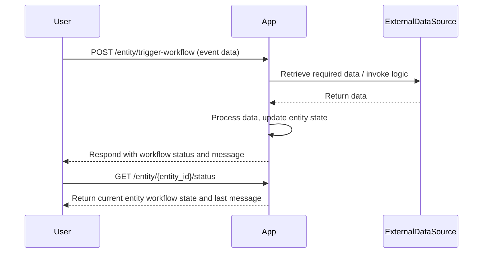

```markdown
# Functional Requirements for Hello World Application using Cyoda Design Principles

## Overview
The application is centered around an entity with a workflow triggered by an event. It exposes RESTful API endpoints that follow these rules:
- **POST endpoints** handle business logic including invoking external data sources, data retrieval, or calculations.
- **GET endpoints** are used solely for retrieving application results or entity state.

---

## API Endpoints

### 1. POST /entity/trigger-workflow
- **Purpose:** Trigger the workflow on the entity based on an event.
- **Request:**
  ```json
  {
    "entity_id": "string",
    "event_type": "string",
    "event_payload": { "key": "value" }
  }
  ```
- **Response:**
  ```json
  {
    "status": "success",
    "workflow_state": "string",
    "message": "Hello World processed"
  }
  ```
- **Description:**  
  Accepts an event to trigger the entity's workflow. Executes business logic including any external data retrieval or computation required.

---

### 2. GET /entity/{entity_id}/status
- **Purpose:** Retrieve the current state or output of the entity's workflow.
- **Response:**
  ```json
  {
    "entity_id": "string",
    "workflow_state": "string",
    "last_message": "string"
  }
  ```
- **Description:**  
  Retrieves the current status and latest output (e.g., "Hello World") of the entity.

---

## Business Logic Notes
- All external data retrieval or complex calculations are initiated through the POST `/entity/trigger-workflow`.
- GET `/entity/{entity_id}/status` only returns stored or computed results without triggering any external calls.

---

## User-App Interaction Sequence


```mermaid
sequenceDiagram
    participant User
    participant App
    participant ExternalDataSource

    User->>App: POST /entity/trigger-workflow (event data)
    App->>ExternalDataSource: Retrieve required data / invoke logic
    ExternalDataSource-->>App: Return data
    App->>App: Process data, update entity state
    App-->>User: Respond with workflow status and message

    User->>App: GET /entity/{entity_id}/status
    App-->>User: Return current entity workflow state and last message
```

---

## User Journey Overview

```mermaid
flowchart TD
    Start[User starts interaction]
    Trigger[User triggers event via POST /entity/trigger-workflow]
    Process[App processes event, invokes external data sources, updates entity state]
    Response[App responds with workflow status]
    CheckStatus[User checks workflow result via GET /entity/{entity_id}/status]
    Display[App returns current workflow state and message]
    End[User receives result]

    Start --> Trigger --> Process --> Response --> CheckStatus --> Display --> End
```
```