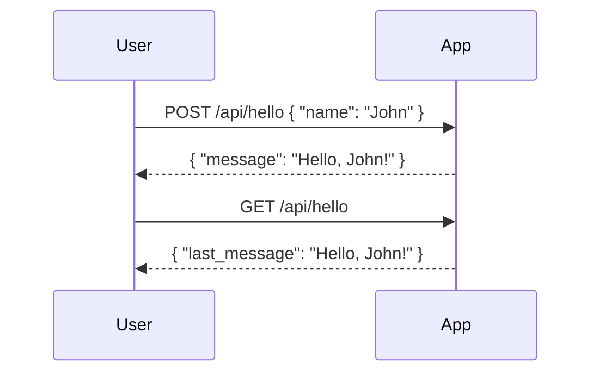
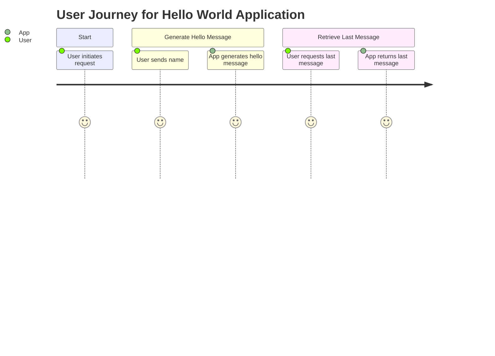

```markdown
# Functional Requirements Document

## API Endpoints

### 1. **POST /api/hello**
- **Description**: Generates a "Hello World" message.
- **Request Format**:
  - **Content-Type**: application/json
  - **Body**:
    ```json
    {
      "name": "string"
    }
    ```
- **Response Format**:
  - **Content-Type**: application/json
  - **Body**:
    ```json
    {
      "message": "Hello, {name}!"
    }
    ```

### 2. **GET /api/hello**
- **Description**: Retrieves the last generated hello message.
- **Response Format**:
  - **Content-Type**: application/json
  - **Body**:
    ```json
    {
      "last_message": "string"
    }
    ```

## User-App Interaction Diagram


```mermaid
sequenceDiagram
    participant User
    participant App
    User->>App: POST /api/hello { "name": "John" }
    App-->>User: { "message": "Hello, John!" }
    User->>App: GET /api/hello
    App-->>User: { "last_message": "Hello, John!" }
```

## User Journey Diagram


```mermaid
journey
    title User Journey for Hello World Application
    section Start
      User initiates request: 5: User
    section Generate Hello Message
      User sends name: 5: User
      App generates hello message: 5: App
    section Retrieve Last Message
      User requests last message: 5: User
      App returns last message: 5: App
```
```