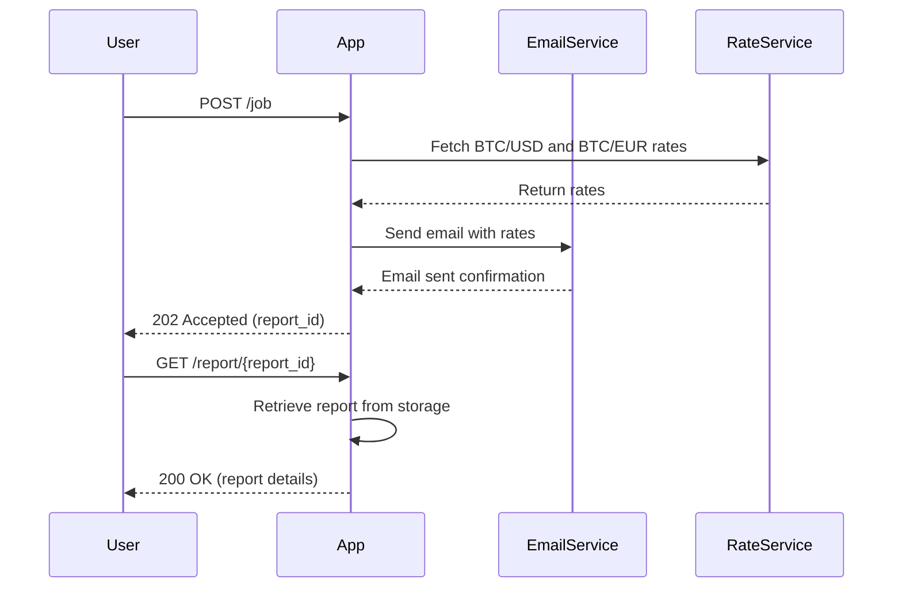

Here are the finalized functional requirements for your application, clearly structured and formatted:

### Functional Requirements for Bitcoin Conversion Rate Reporting Application

#### User Stories

1. **Report Creation**
   - **As a user**, I want to initiate a report creation process so that I can receive the latest Bitcoin conversion rates via email.
     - **Endpoint**: `POST /job`
     - **Request**:
       - **Body**: 
         ```json
         {
           "email": "user@example.com"
         }
         ```
     - **Response**:
       - **Status**: `202 Accepted`
       - **Body**: 
         ```json
         {
           "report_id": "12345",
           "message": "Report generation initiated."
         }
         ```

2. **Report Retrieval**
   - **As a user**, I want to retrieve my report by its ID so that I can view the conversion rates.
     - **Endpoint**: `GET /report/{report_id}`
     - **Request**:
       - **URL Parameter**: `report_id`
     - **Response**:
       - **Status**: `200 OK`
       - **Body**: 
         ```json
         {
           "report_id": "12345",
           "btc_usd": "X.XX",
           "btc_eur": "Y.YY",
           "timestamp": "YYYY-MM-DDTHH:MM:SSZ"
         }
         ```
     - **Error Response**:
       - **Status**: `404 Not Found`
       - **Body**: 
         ```json
         {
           "error": "Report not found."
         }
         ```

#### API Endpoints Summary

| Method | Endpoint                | Request Body                        | Response Format                                                                                           |
|--------|-------------------------|-------------------------------------|-----------------------------------------------------------------------------------------------------------|
| POST   | `/job`                  | `{ "email": "user@example.com" }` | `{ "report_id": "12345", "message": "Report generation initiated." }`                                   |
| GET    | `/report/{report_id}`   | N/A                                 | `{ "report_id": "12345", "btc_usd": "X.XX", "btc_eur": "Y.YY", "timestamp": "YYYY-MM-DDTHH:MM:SSZ" }` |
|        |                         |                                     | Error: `{ "error": "Report not found." }`                                                                |

#### User-App Interaction Diagram


```mermaid
sequenceDiagram
    participant User
    participant App
    participant EmailService
    participant RateService

    User->>App: POST /job
    App->>RateService: Fetch BTC/USD and BTC/EUR rates
    RateService-->>App: Return rates
    App->>EmailService: Send email with rates
    EmailService-->>App: Email sent confirmation
    App-->>User: 202 Accepted (report_id)

    User->>App: GET /report/{report_id}
    App->>App: Retrieve report from storage
    App-->>User: 200 OK (report details)
```

This document serves as a complete overview of the functional requirements for your application, detailing user interactions, API endpoints, and expected behavior. You can further develop or modify these requirements as you progress in your project.