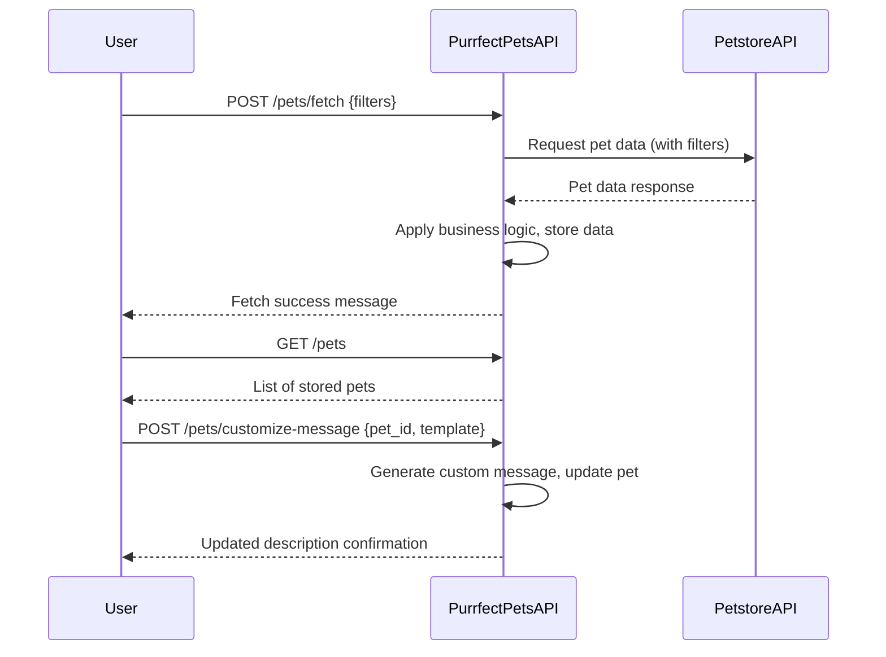

```markdown
# Purrfect Pets API - Functional Requirements

## API Endpoints

### 1. POST /pets/fetch
- **Purpose:** Fetch pet data from the external Petstore API, apply any business logic (e.g., filtering, enrichment, playful messages), and store results internally.
- **Request Body:**
  ```json
  {
    "status": "available" | "pending" | "sold",  // optional filter
    "type": "dog" | "cat" | "other",            // optional filter
    "limit": 10                                 // optional pagination limit
  }
  ```
- **Response Body:**
  ```json
  {
    "message": "Pets data fetched and processed successfully",
    "count": 8
  }
  ```

### 2. GET /pets
- **Purpose:** Retrieve the list of pets stored internally after the last fetch.
- **Response Body:**
  ```json
  [
    {
      "id": 1,
      "name": "Fluffy",
      "type": "cat",
      "status": "available",
      "description": "A playful cat who loves naps and yarn."
    },
    ...
  ]
  ```

### 3. POST /pets/customize-message
- **Purpose:** Accept pet ID and a message template, apply custom message logic, and update pet description.
- **Request Body:**
  ```json
  {
    "pet_id": 1,
    "message_template": "Meet {name}, your new best friend!"
  }
  ```
- **Response Body:**
  ```json
  {
    "pet_id": 1,
    "updated_description": "Meet Fluffy, your new best friend!"
  }
  ```

---

## Mermaid Sequence Diagram - User Interaction


```mermaid
sequenceDiagram
    participant User
    participant PurrfectPetsAPI
    participant PetstoreAPI

    User->>PurrfectPetsAPI: POST /pets/fetch {filters}
    PurrfectPetsAPI->>PetstoreAPI: Request pet data (with filters)
    PetstoreAPI-->>PurrfectPetsAPI: Pet data response
    PurrfectPetsAPI->>PurrfectPetsAPI: Apply business logic, store data
    PurrfectPetsAPI-->>User: Fetch success message

    User->>PurrfectPetsAPI: GET /pets
    PurrfectPetsAPI-->>User: List of stored pets

    User->>PurrfectPetsAPI: POST /pets/customize-message {pet_id, template}
    PurrfectPetsAPI->>PurrfectPetsAPI: Generate custom message, update pet
    PurrfectPetsAPI-->>User: Updated description confirmation
```
```