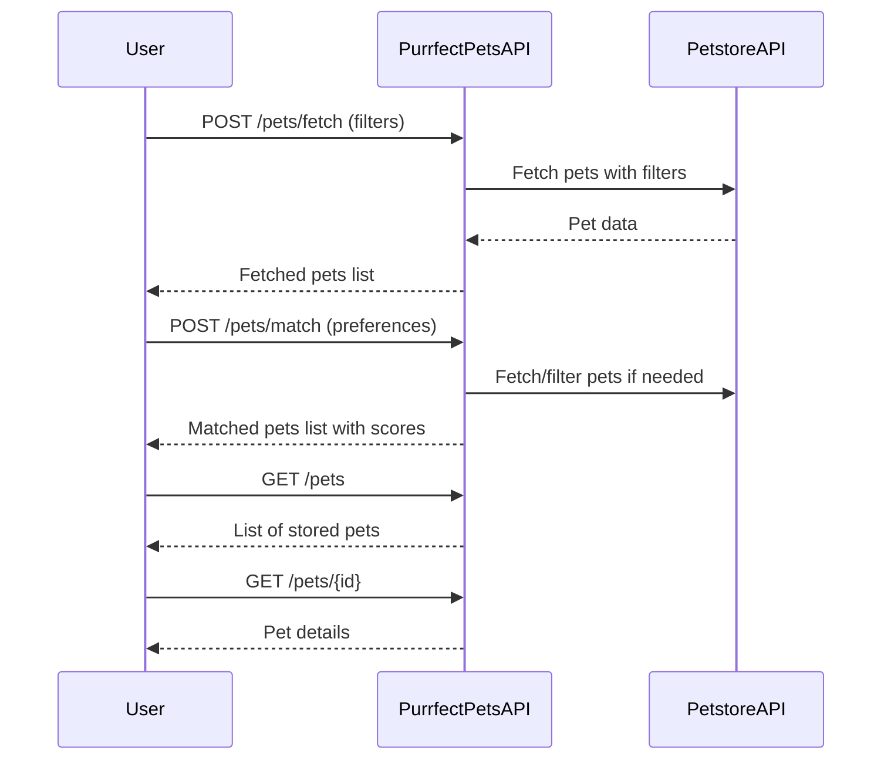

```markdown
# Purrfect Pets API - Functional Requirements

## Overview
The "Purrfect Pets" API allows users to explore and interact with pet data sourced from the Petstore API. External data retrieval and any business logic (filtering, matching, calculations) are handled via POST endpoints. GET endpoints provide access to stored or processed results.

---

## API Endpoints

### 1. POST /pets/fetch  
**Purpose:** Retrieve pet data from the external Petstore API based on filters or criteria.  
**Request:**  
```json
{
  "type": "cat" | "dog" | "bird" | "all",  // Pet type filter
  "status": "available" | "pending" | "sold" | "all",  // Status filter
  "limit": integer  // Number of records to fetch (optional)
}
```

**Response:**  
```json
{
  "fetchedCount": integer,
  "pets": [
    {
      "id": integer,
      "name": string,
      "type": string,
      "status": string,
      "photoUrls": [string]
    },
    ...
  ]
}
```

---

### 2. POST /pets/match  
**Purpose:** Perform pet matching logic (e.g., suggest pets based on user preferences).  
**Request:**  
```json
{
  "preferences": {
    "type": "cat" | "dog" | "bird",
    "status": "available",
    "maxResults": integer
  }
}
```

**Response:**  
```json
{
  "matches": [
    {
      "id": integer,
      "name": string,
      "type": string,
      "status": string,
      "photoUrls": [string],
      "matchScore": number  // e.g., 0-1
    },
    ...
  ]
}
```

---

### 3. GET /pets  
**Purpose:** Retrieve the list of pets stored or previously fetched by the app (read-only).  
**Response:**  
```json
[
  {
    "id": integer,
    "name": string,
    "type": string,
    "status": string,
    "photoUrls": [string]
  },
  ...
]
```

---

### 4. GET /pets/{id}  
**Purpose:** Retrieve detailed info of a single pet by ID.  
**Response:**  
```json
{
  "id": integer,
  "name": string,
  "type": string,
  "status": string,
  "photoUrls": [string],
  "description": string (optional)
}
```

---

## User-App Interaction Sequence Diagram


```mermaid
sequenceDiagram
    participant User
    participant PurrfectPetsAPI
    participant PetstoreAPI

    User->>PurrfectPetsAPI: POST /pets/fetch (filters)
    PurrfectPetsAPI->>PetstoreAPI: Fetch pets with filters
    PetstoreAPI-->>PurrfectPetsAPI: Pet data
    PurrfectPetsAPI-->>User: Fetched pets list

    User->>PurrfectPetsAPI: POST /pets/match (preferences)
    PurrfectPetsAPI->>PetstoreAPI: Fetch/filter pets if needed
    PurrfectPetsAPI-->>User: Matched pets list with scores

    User->>PurrfectPetsAPI: GET /pets
    PurrfectPetsAPI-->>User: List of stored pets

    User->>PurrfectPetsAPI: GET /pets/{id}
    PurrfectPetsAPI-->>User: Pet details
```

---

## Summary

- POST endpoints handle all external data fetch and business logic.
- GET endpoints provide read-only access to app data.
- Requests and responses are JSON formatted.
- Pet matching and filtering logic is done inside POST endpoints.
```
