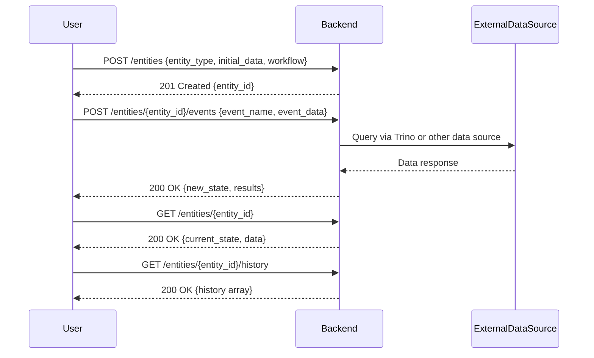

```markdown
# Functional Requirements and API Design for Cyoda Application

## Overview
The application is an event-driven backend system built with Python Quart, implementing Cyoda design principles: entities with event-triggered workflows, state machines, dynamic workflows, and Trino integration. External data retrieval and business logic execution happen in POST endpoints; GET endpoints are reserved for retrieving application results.

---

## API Endpoints

### 1. Create Entity
**POST** `/entities`

- **Description:** Create a new entity with initial state and workflow configuration.
- **Request JSON:**
  ```json
  {
    "entity_type": "string",
    "initial_data": { "key": "value" },
    "workflow": {
      "states": ["state1", "state2", "..."],
      "transitions": [
        {"from": "state1", "to": "state2", "event": "event_name"}
      ]
    }
  }
  ```
- **Response JSON:**
  ```json
  {
    "entity_id": "uuid",
    "status": "created"
  }
  ```

---

### 2. Trigger Event on Entity
**POST** `/entities/{entity_id}/events`

- **Description:** Trigger an event to advance the entity's workflow/state machine, potentially invoking external data sources (e.g., via Trino).
- **Request JSON:**
  ```json
  {
    "event_name": "string",
    "event_data": { "key": "value" }
  }
  ```
- **Response JSON:**
  ```json
  {
    "entity_id": "uuid",
    "new_state": "string",
    "workflow_status": "updated",
    "results": { "key": "value" }
  }
  ```

---

### 3. Retrieve Entity State and Data
**GET** `/entities/{entity_id}`

- **Description:** Retrieve the current state, workflow status, and stored data for the entity.
- **Response JSON:**
  ```json
  {
    "entity_id": "uuid",
    "entity_type": "string",
    "current_state": "string",
    "workflow_status": "string",
    "data": { "key": "value" }
  }
  ```

---

### 4. Query Workflow History
**GET** `/entities/{entity_id}/history`

- **Description:** Retrieve the sequence of events and state transitions for the entity.
- **Response JSON:**
  ```json
  {
    "entity_id": "uuid",
    "history": [
      {
        "timestamp": "ISO8601 string",
        "event": "string",
        "from_state": "string",
        "to_state": "string",
        "metadata": { "key": "value" }
      }
    ]
  }
  ```

---

## User-App Interaction Sequence Diagram


```mermaid
sequenceDiagram
    participant User
    participant Backend
    participant ExternalDataSource

    User->>Backend: POST /entities {entity_type, initial_data, workflow}
    Backend-->>User: 201 Created {entity_id}

    User->>Backend: POST /entities/{entity_id}/events {event_name, event_data}
    Backend->>ExternalDataSource: Query via Trino or other data source
    ExternalDataSource-->>Backend: Data response
    Backend-->>User: 200 OK {new_state, results}

    User->>Backend: GET /entities/{entity_id}
    Backend-->>User: 200 OK {current_state, data}

    User->>Backend: GET /entities/{entity_id}/history
    Backend-->>User: 200 OK {history array}
```

---

## Notes
- POST endpoints handle complex business logic and external data retrieval.
- GET endpoints are read-only, exposing only stored application results.
- Workflow and state machine logic is encapsulated in the backend, triggered by events.
```