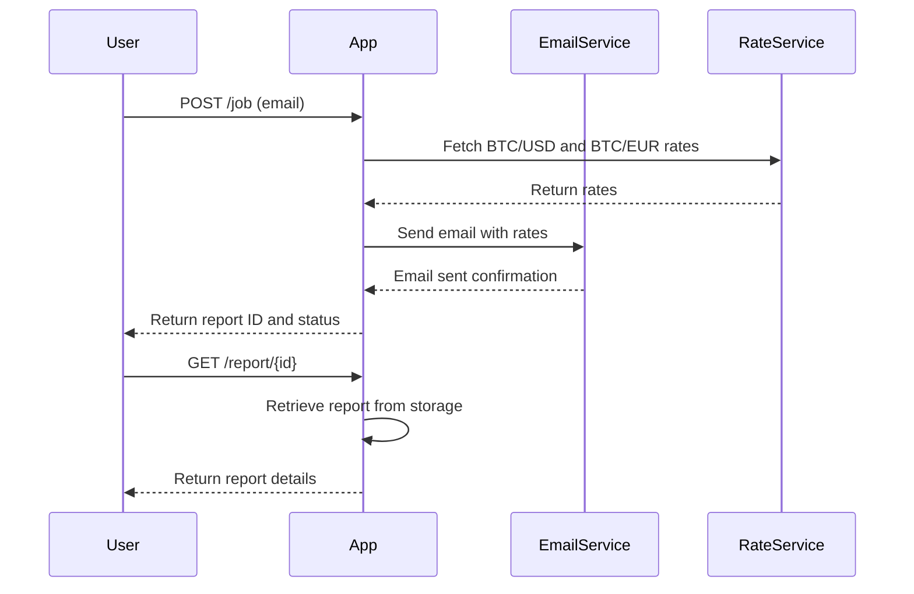

Here are the final functional requirements for your Bitcoin conversion rate report application, presented in a clear and structured format:

### Functional Requirements

#### User Stories

1. **Initiate Report Creation**
   - **User Story**: As a user, I want to initiate the report creation process so that I can receive the latest Bitcoin conversion rates.
   - **Endpoint**: `POST /job`
   - **Request Format**:
     ```json
     {
       "email": "user@example.com"
     }
     ```
   - **Response Format**:
     ```json
     {
       "report_id": "12345",
       "status": "Report is being generated."
     }
     ```

2. **Retrieve Report by ID**
   - **User Story**: As a user, I want to retrieve my report by its ID so that I can see the conversion rates I requested.
   - **Endpoint**: `GET /report/{id}`
   - **Request Format**:
     - **URL**: `/report/12345`
   - **Response Format**:
     ```json
     {
       "id": "12345",
       "btc_usd": "50000",
       "btc_eur": "45000",
       "timestamp": "2023-10-01T12:00:00Z"
     }
     ```

#### System Behavior

- **Data Source**: The application will fetch Bitcoin conversion rates from a reliable external API.
- **Email Configuration**: The application will use an email service to send reports, requiring proper authentication.
- **Report Storage**: Reports will be stored in a database for retrieval by ID.
- **Error Handling**: The application will log errors and notify users in case of rate retrieval or email sending failures.
- **Security**: Endpoints may require authentication tokens to ensure secure access.
- **Rate Limits**: The application will respect API rate limits when fetching conversion rates.
- **Response Structure**: Responses will follow the specified formats for consistency and ease of use.

### Visual Representation

Here’s the sequence diagram representing user-app interaction:


```mermaid
sequenceDiagram
    participant User
    participant App
    participant EmailService
    participant RateService

    User->>App: POST /job (email)
    App->>RateService: Fetch BTC/USD and BTC/EUR rates
    RateService-->>App: Return rates
    App->>EmailService: Send email with rates
    EmailService-->>App: Email sent confirmation
    App-->>User: Return report ID and status

    User->>App: GET /report/{id}
    App->>App: Retrieve report from storage
    App-->>User: Return report details
```

These functional requirements provide a comprehensive foundation for your application, detailing the essential user interactions and system behaviors necessary for successful implementation.