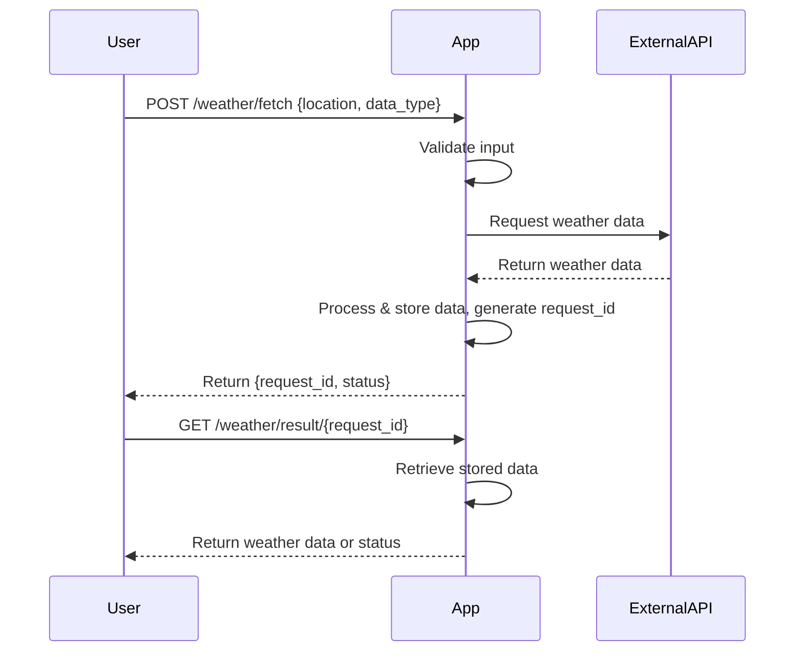
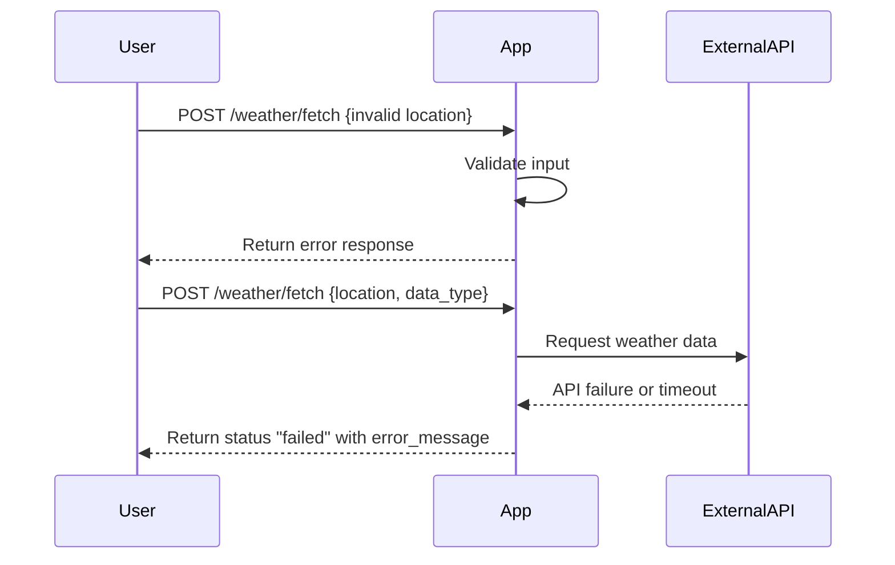

```markdown
# Functional Requirements for Weather Data Fetching Backend

## API Endpoints

### 1. Fetch Weather Data (POST)
- **Endpoint:** `/weather/fetch`
- **Description:** Accepts location details and fetches weather data from the external API. Performs any necessary processing or calculations.
- **Request Format (JSON):**
  ```json
  {
    "location": {
      "city": "string",          // Optional if coordinates provided
      "latitude": "number",      // Optional if city provided
      "longitude": "number"      // Optional if city provided
    },
    "data_type": "string"        // "current", "forecast", or "historical"
  }
  ```
- **Response Format (JSON):**
  ```json
  {
    "request_id": "string",      // Unique ID for this data fetch request
    "status": "string",          // e.g., "processing", "completed", "failed"
    "message": "string"          // Optional human-readable info
  }
  ```
- **Business Logic:**
  - Validates input location.
  - Calls external weather API.
  - Processes and stores results linked to `request_id`.
  - Returns immediate status response.

---

### 2. Retrieve Weather Data (GET)
- **Endpoint:** `/weather/result/{request_id}`
- **Description:** Retrieves the processed weather data for a previously fetched request.
- **Request Parameters:**
  - `request_id` (path parameter): The unique ID returned by the `/weather/fetch` POST call.
- **Response Format (JSON):**
  ```json
  {
    "request_id": "string",
    "location": {
      "city": "string",
      "latitude": "number",
      "longitude": "number"
    },
    "data_type": "string",
    "status": "string",          // "completed", "processing", or "failed"
    "weather_data": {            // Present only if status is "completed"
      // weather details depending on data_type
    },
    "error_message": "string"    // Present only if status is "failed"
  }
  ```

---

## User-App Interaction Sequence Diagram


```mermaid
sequenceDiagram
    participant User
    participant App
    participant ExternalAPI

    User->>App: POST /weather/fetch {location, data_type}
    App->>App: Validate input
    App->>ExternalAPI: Request weather data
    ExternalAPI-->>App: Return weather data
    App->>App: Process & store data, generate request_id
    App-->>User: Return {request_id, status}

    User->>App: GET /weather/result/{request_id}
    App->>App: Retrieve stored data
    App-->>User: Return weather data or status
```

---

## Alternative Interaction Flow (Error Handling)


```mermaid
sequenceDiagram
    participant User
    participant App
    participant ExternalAPI

    User->>App: POST /weather/fetch {invalid location}
    App->>App: Validate input
    App-->>User: Return error response

    User->>App: POST /weather/fetch {location, data_type}
    App->>ExternalAPI: Request weather data
    ExternalAPI-->>App: API failure or timeout
    App-->>User: Return status "failed" with error_message
```
```