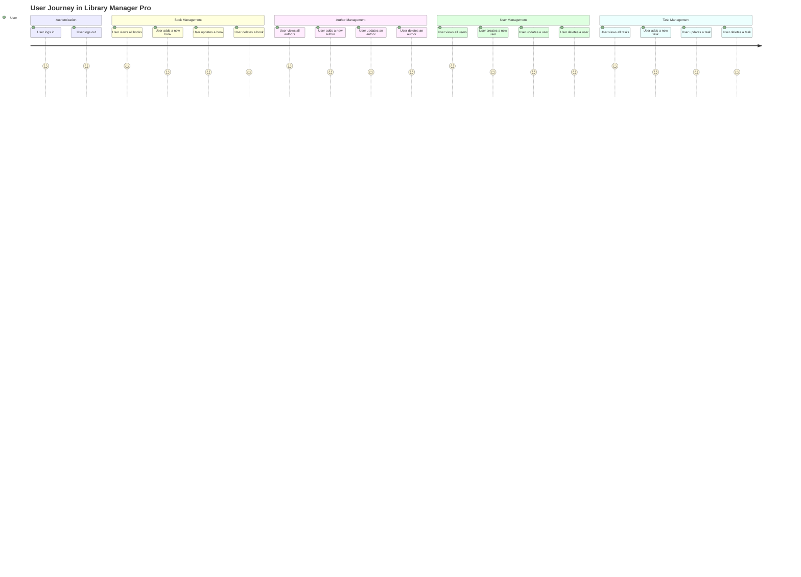

```markdown
# Library Manager Pro - Functional Requirements

## API Endpoints

### 1. Book Management

#### a. Get All Books
- **Endpoint:** `GET /api/books`
- **Response:**
  ```json
  {
    "books": [
      {
        "id": "string",
        "title": "string",
        "description": "string",
        "authorId": "string"
      }
    ]
  }
  ```

#### b. Add New Book
- **Endpoint:** `POST /api/books`
- **Request:**
  ```json
  {
    "title": "string",
    "description": "string",
    "authorId": "string"
  }
  ```
- **Response:**
  ```json
  {
    "message": "Book added successfully.",
    "bookId": "string"
  }
  ```

#### c. Update Book
- **Endpoint:** `POST /api/books/update`
- **Request:**
  ```json
  {
    "id": "string",
    "title": "string",
    "description": "string",
    "authorId": "string"
  }
  ```
- **Response:**
  ```json
  {
    "message": "Book updated successfully."
  }
  ```

#### d. Delete Book
- **Endpoint:** `POST /api/books/delete`
- **Request:**
  ```json
  {
    "id": "string"
  }
  ```
- **Response:**
  ```json
  {
    "message": "Book deleted successfully."
  }
  ```

### 2. Author Management

#### a. Get All Authors
- **Endpoint:** `GET /api/authors`
- **Response:**
  ```json
  {
    "authors": [
      {
        "id": "string",
        "name": "string"
      }
    ]
  }
  ```

#### b. Add New Author
- **Endpoint:** `POST /api/authors`
- **Request:**
  ```json
  {
    "name": "string"
  }
  ```
- **Response:**
  ```json
  {
    "message": "Author added successfully.",
    "authorId": "string"
  }
  ```

#### c. Update Author
- **Endpoint:** `POST /api/authors/update`
- **Request:**
  ```json
  {
    "id": "string",
    "name": "string"
  }
  ```
- **Response:**
  ```json
  {
    "message": "Author updated successfully."
  }
  ```

#### d. Delete Author
- **Endpoint:** `POST /api/authors/delete`
- **Request:**
  ```json
  {
    "id": "string"
  }
  ```
- **Response:**
  ```json
  {
    "message": "Author deleted successfully."
  }
  ```

### 3. User Management

#### a. Get All Users
- **Endpoint:** `GET /api/users`
- **Response:**
  ```json
  {
    "users": [
      {
        "id": "string",
        "name": "string",
        "email": "string"
      }
    ]
  }
  ```

#### b. Create New User
- **Endpoint:** `POST /api/users`
- **Request:**
  ```json
  {
    "name": "string",
    "email": "string"
  }
  ```
- **Response:**
  ```json
  {
    "message": "User created successfully.",
    "userId": "string"
  }
  ```

#### c. Update User
- **Endpoint:** `POST /api/users/update`
- **Request:**
  ```json
  {
    "id": "string",
    "name": "string",
    "email": "string"
  }
  ```
- **Response:**
  ```json
  {
    "message": "User updated successfully."
  }
  ```

#### d. Remove User
- **Endpoint:** `POST /api/users/delete`
- **Request:**
  ```json
  {
    "id": "string"
  }
  ```
- **Response:**
  ```json
  {
    "message": "User deleted successfully."
  }
  ```

### 4. Task Management

#### a. Get All Tasks
- **Endpoint:** `GET /api/tasks`
- **Response:**
  ```json
  {
    "tasks": [
      {
        "id": "string",
        "title": "string",
        "description": "string",
        "status": "string"
      }
    ]
  }
  ```

#### b. Add New Task
- **Endpoint:** `POST /api/tasks`
- **Request:**
  ```json
  {
    "title": "string",
    "description": "string",
    "status": "string"
  }
  ```
- **Response:**
  ```json
  {
    "message": "Task added successfully.",
    "taskId": "string"
  }
  ```

#### c. Update Task
- **Endpoint:** `POST /api/tasks/update`
- **Request:**
  ```json
  {
    "id": "string",
    "title": "string",
    "description": "string",
    "status": "string"
  }
  ```
- **Response:**
  ```json
  {
    "message": "Task updated successfully."
  }
  ```

#### d. Delete Task
- **Endpoint:** `POST /api/tasks/delete`
- **Request:**
  ```json
  {
    "id": "string"
  }
  ```
- **Response:**
  ```json
  {
    "message": "Task deleted successfully."
  }
  ```

### 5. Authentication

#### a. User Login
- **Endpoint:** `POST /api/authentication/login`
- **Request:**
  ```json
  {
    "username": "string",
    "password": "string"
  }
  ```
- **Response:**
  ```json
  {
    "message": "Login successful.",
    "token": "string"
  }
  ```

#### b. User Logout
- **Endpoint:** `POST /api/authentication/logout`
- **Request:**
  ```json
  {
    "token": "string"
  }
  ```
- **Response:**
  ```json
  {
    "message": "Logout successful."
  }
  ```

### 6. User Activities

#### a. Get User Activities
- **Endpoint:** `GET /api/activities`
- **Response:**
  ```json
  {
    "activities": [
      {
        "id": "string",
        "activity": "string",
        "timestamp": "string"
      }
    ]
  }
  ```

---

## User-App Interaction Diagram

### User Journey

```mermaid
journey
    title User Journey in Library Manager Pro
    section Authentication
      User logs in: 5: User
      User logs out: 5: User
    section Book Management
      User views all books: 5: User
      User adds a new book: 4: User
      User updates a book: 4: User
      User deletes a book: 4: User
    section Author Management
      User views all authors: 5: User
      User adds a new author: 4: User
      User updates an author: 4: User
      User deletes an author: 4: User
    section User Management
      User views all users: 5: User
      User creates a new user: 4: User
      User updates a user: 4: User
      User deletes a user: 4: User
    section Task Management
      User views all tasks: 5: User
      User adds a new task: 4: User
      User updates a task: 4: User
      User deletes a task: 4: User
```
```