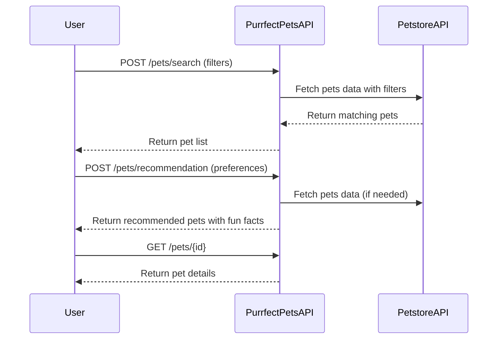

```markdown
# Purrfect Pets API - Functional Requirements

## API Endpoints

### 1. POST /pets/search  
- **Description**: Search pets using Petstore API data with filters (type, status, etc.)  
- **Request** (JSON):  
```json
{
  "type": "cat|dog|all",
  "status": "available|pending|sold",
  "name": "optional string"
}
```  
- **Response** (JSON):  
```json
{
  "pets": [
    {
      "id": "int",
      "name": "string",
      "type": "string",
      "status": "string",
      "photoUrls": ["string"]
    },
    ...
  ]
}
```

### 2. POST /pets/recommendation  
- **Description**: Get fun pet recommendations based on user preferences or random selection  
- **Request** (JSON):  
```json
{
  "preferredType": "cat|dog|all",
  "mood": "fun|calm|energetic"
}
```  
- **Response** (JSON):  
```json
{
  "recommendedPets": [
    {
      "id": "int",
      "name": "string",
      "type": "string",
      "status": "string",
      "funFact": "string"
    },
    ...
  ]
}
```

### 3. GET /pets/{id}  
- **Description**: Retrieve details of a specific pet by ID (data fetched from internal store/cache after POST search)  
- **Response** (JSON):  
```json
{
  "id": "int",
  "name": "string",
  "type": "string",
  "status": "string",
  "photoUrls": ["string"],
  "description": "string"
}
```

---

## User-App Interaction Sequence


```mermaid
sequenceDiagram
    participant User
    participant PurrfectPetsAPI
    participant PetstoreAPI

    User->>PurrfectPetsAPI: POST /pets/search (filters)
    PurrfectPetsAPI->>PetstoreAPI: Fetch pets data with filters
    PetstoreAPI-->>PurrfectPetsAPI: Return matching pets
    PurrfectPetsAPI-->>User: Return pet list

    User->>PurrfectPetsAPI: POST /pets/recommendation (preferences)
    PurrfectPetsAPI->>PetstoreAPI: Fetch pets data (if needed)
    PurrfectPetsAPI-->>User: Return recommended pets with fun facts

    User->>PurrfectPetsAPI: GET /pets/{id}
    PurrfectPetsAPI-->>User: Return pet details
```

---

## Summary

- POST endpoints handle external data fetching and business logic.
- GET endpoints only return stored or processed results.
- Responses are JSON formatted.
- Fun features like recommendations and fun facts enhance user experience.
```