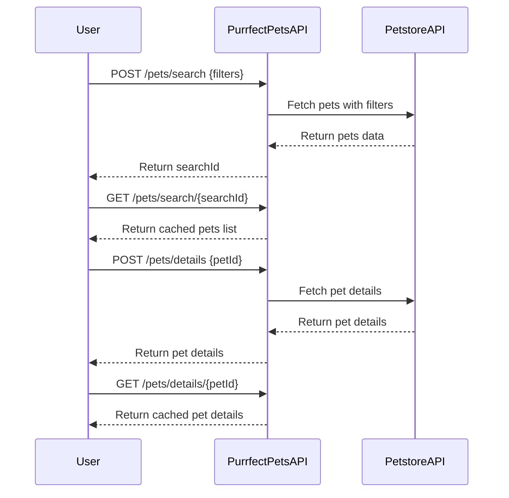

```markdown
# Purrfect Pets API Functional Requirements

## Overview
The "Purrfect Pets" API app provides pet-related information by integrating with the external Petstore API. It offers RESTful endpoints where all external data retrieval or business logic is triggered via POST requests, and GET requests are used only for retrieving previously processed or cached application results.

---

## API Endpoints

### 1. POST /pets/search
- **Description:** Search pets from Petstore API based on filters such as type, status, or name.
- **Request:**
  ```json
  {
    "type": "cat",        // optional, e.g. "cat", "dog", "bird"
    "status": "available",// optional, e.g. "available", "sold"
    "name": "Fluffy"      // optional, partial or full name search
  }
  ```
- **Response:**
  ```json
  {
    "searchId": "string"  // unique ID to retrieve results later
  }
  ```

### 2. GET /pets/search/{searchId}
- **Description:** Retrieve search results by searchId.
- **Response:**
  ```json
  {
    "pets": [
      {
        "id": 1,
        "name": "Fluffy",
        "type": "cat",
        "status": "available",
        "photoUrls": ["url1", "url2"]
      },
      ...
    ]
  }
  ```

### 3. POST /pets/details
- **Description:** Request detailed information for a specific pet by ID, fetching fresh data from Petstore API.
- **Request:**
  ```json
  {
    "petId": 1
  }
  ```
- **Response:**
  ```json
  {
    "id": 1,
    "name": "Fluffy",
    "type": "cat",
    "status": "available",
    "photoUrls": ["url1", "url2"],
    "description": "A friendly cat",
    "tags": ["cute", "playful"]
  }
  ```

### 4. GET /pets/details/{petId}
- **Description:** Retrieve cached pet details by petId.
- **Response:** Same as POST /pets/details response.

---

## Business Logic Notes
- All POST endpoints invoke the external Petstore API to fetch or calculate data, then store/cache results associated with unique IDs (searchId or petId).
- GET endpoints retrieve stored results without external calls.
- Cache expiration and refresh logic is out of scope for now.

---

## User-App Interaction Sequence Diagram


```mermaid
sequenceDiagram
    participant User
    participant PurrfectPetsAPI
    participant PetstoreAPI

    User->>PurrfectPetsAPI: POST /pets/search {filters}
    PurrfectPetsAPI->>PetstoreAPI: Fetch pets with filters
    PetstoreAPI-->>PurrfectPetsAPI: Return pets data
    PurrfectPetsAPI-->>User: Return searchId

    User->>PurrfectPetsAPI: GET /pets/search/{searchId}
    PurrfectPetsAPI-->>User: Return cached pets list

    User->>PurrfectPetsAPI: POST /pets/details {petId}
    PurrfectPetsAPI->>PetstoreAPI: Fetch pet details
    PetstoreAPI-->>PurrfectPetsAPI: Return pet details
    PurrfectPetsAPI-->>User: Return pet details

    User->>PurrfectPetsAPI: GET /pets/details/{petId}
    PurrfectPetsAPI-->>User: Return cached pet details
```

---

## User Journey Diagram

```mermaid
flowchart TD
    A[User wants to find pets] --> B[Submit search filters via POST /pets/search]
    B --> C[Receive searchId]
    C --> D[Retrieve results with GET /pets/search/{searchId}]
    D --> E[View list of pets]
    E --> F[Request pet details POST /pets/details]
    F --> G[Receive detailed pet info]
    G --> H[View pet details or get cached details via GET /pets/details/{petId}]
```
```