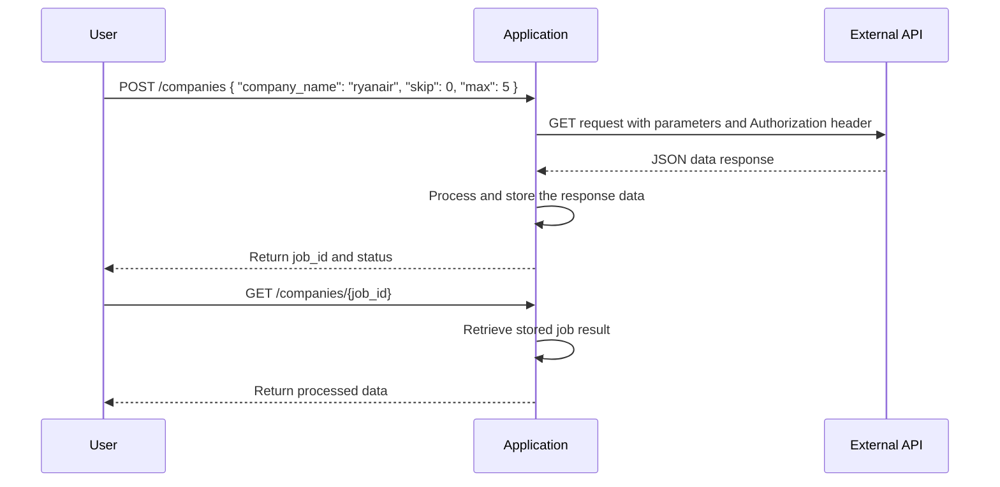
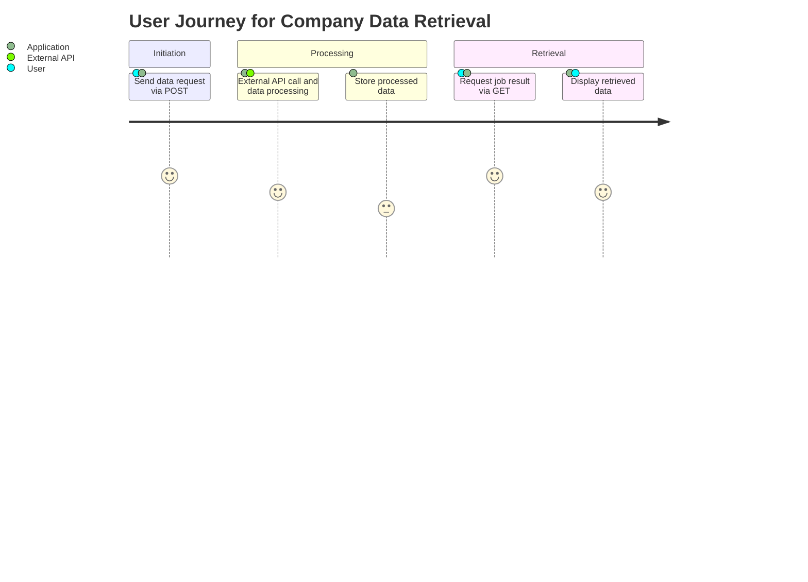

# Functional Requirements for Company Data Retrieval Application

## Overview
The application will retrieve company information from an external API using a POST endpoint to initiate data retrieval and a GET endpoint to retrieve results. The architecture adheres to RESTful principles, ensuring clear separation of concerns.

## API Endpoints

### 1. POST /companies
- **Purpose:**  
  Initiate a job to retrieve company data from the external API.

- **URL:**  
  `/companies`

- **Method:**  
  POST

- **Request Body (JSON):**  
  ```json
  {
    "company_name": "string",    // Required: The name of the company to search.
    "skip": "integer",           // Optional: The number of records to skip (default 0).
    "max": "integer"             // Optional: Maximum number of records to retrieve (default 5).
  }
  ```

- **Behavior:**  
  1. Validate input parameters.
  2. Formulate and execute a GET request to the external API:
     - URL structure:  
       `https://services.cro.ie/cws/companies?&company_name=<company_name>&skip=<skip>&max=<max>&htmlEnc=1`
     - Include the required Authorization header.
  3. Process the JSON response received from the external API.
  4. Store the retrieved data in an internal datastore or cache.
  5. Return a unique job identifier along with the processing status to the client.

- **Successful Response (JSON):**  
  ```json
  {
    "job_id": "unique_identifier",
    "status": "completed",
    "data": [ ... ] // Optional: May include data if the job processing is synchronous.
  }
  ```

- **Error Response (JSON):**  
  ```json
  {
    "error": "error_message",
    "status": "failed"
  }
  ```

### 2. GET /companies/{job_id}
- **Purpose:**  
  Retrieve the result of a previously initiated data retrieval job.

- **URL:**  
  `/companies/{job_id}`

- **Method:**  
  GET

- **Behavior:**  
  1. Validate the job_id parameter.
  2. Retrieve the processed data from the internal datastore or cache.
  3. Return the stored result to the client.

- **Successful Response (JSON):**  
  ```json
  {
    "job_id": "job_identifier",
    "status": "completed",
    "data": [ ... ]
  }
  ```

- **Error Response (JSON):**  
  ```json
  {
    "error": "Job not found or processing failed",
    "status": "failed"
  }
  ```

## Business Logic Summary
- External API calls, data retrieval, and processing occur exclusively within the POST endpoint.
- The GET endpoint is solely for returning data that has been previously processed and stored.
- Input validation, error handling, and logging mechanisms will be implemented for robustness and maintainability.

## Diagrams

### User-App Interaction Flow

```mermaid
sequenceDiagram
    participant U as User
    participant A as Application
    participant E as External API
    U->>A: POST /companies { "company_name": "ryanair", "skip": 0, "max": 5 }
    A->>E: GET request with parameters and Authorization header
    E-->>A: JSON data response
    A->>A: Process and store the response data
    A-->>U: Return job_id and status
    U->>A: GET /companies/{job_id}
    A->>A: Retrieve stored job result
    A-->>U: Return processed data
```

### User Journey Diagram

```mermaid
journey
    title User Journey for Company Data Retrieval
    section Initiation
      Send data request via POST: 5: User, Application
    section Processing
      External API call and data processing: 4: Application, External API
      Store processed data: 3: Application
    section Retrieval
      Request job result via GET: 5: User, Application
      Display retrieved data: 4: Application, User
``` 

These functional requirements provide a comprehensive guide for developing the application, ensuring clarity in implementation and user interaction.