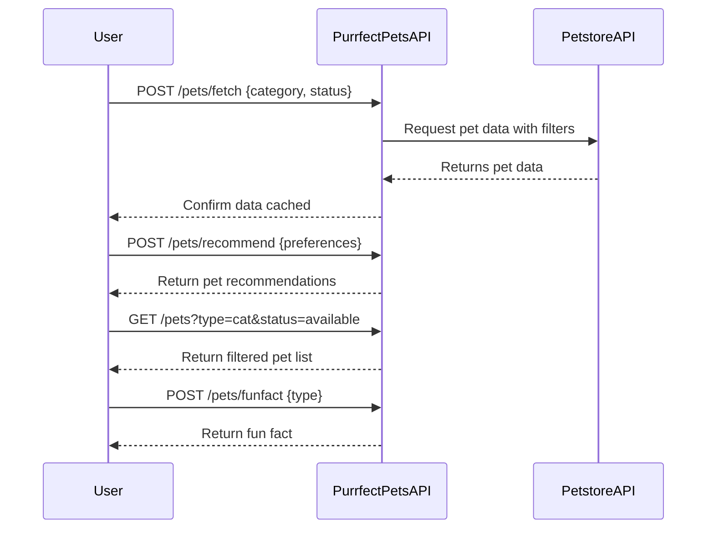
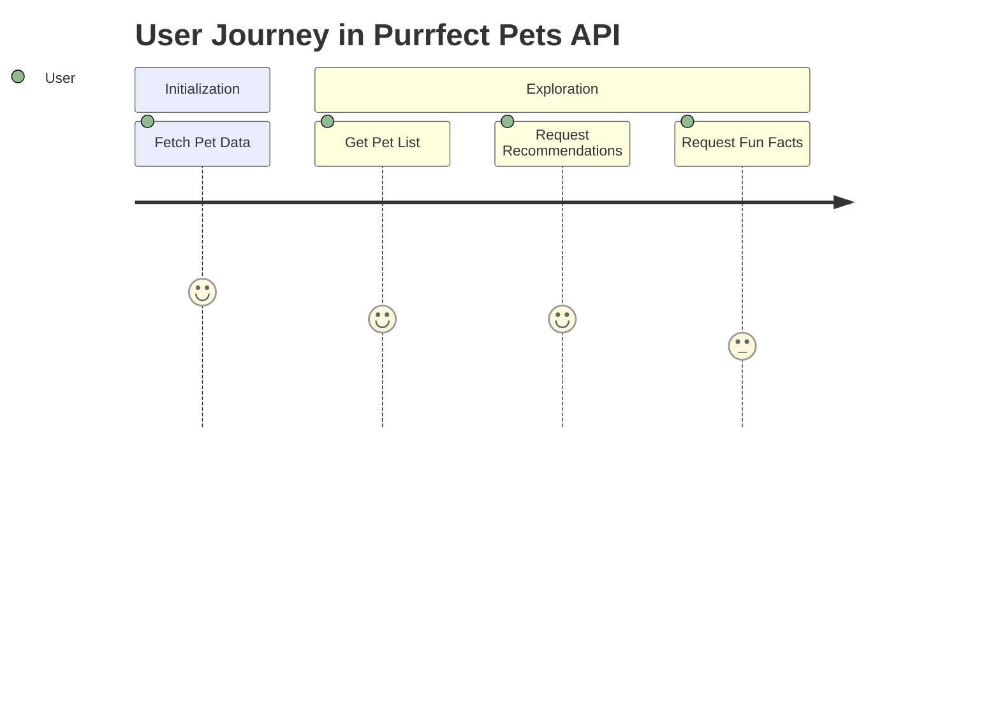

```markdown
# Purrfect Pets API - Functional Requirements

## Overview
The API will interact with the external Petstore API via POST endpoints for fetching and processing data, while GET endpoints serve to retrieve processed results or application state. The app provides pet-related information and fun features.

---

## API Endpoints

### 1. POST /pets/fetch
- **Description:** Fetch and cache pet data from the external Petstore API.
- **Request Body:**
  ```json
  {
    "category": "string",     // e.g. "cats", "dogs", optional
    "status": "string"        // e.g. "available", "sold", optional
  }
  ```
- **Response:**
  ```json
  {
    "message": "Data fetched and cached successfully",
    "fetchedCount": 123
  }
  ```

---

### 2. POST /pets/recommend
- **Description:** Generate pet recommendations based on user preferences.
- **Request Body:**
  ```json
  {
    "preferences": {
      "type": "string",        // e.g. "cat", "dog"
      "ageRange": [int, int],  // e.g. [1, 5]
      "friendly": true         // optional
    }
  }
  ```
- **Response:**
  ```json
  {
    "recommendations": [
      {
        "id": 1,
        "name": "Whiskers",
        "age": 3,
        "type": "cat"
      }
    ]
  }
  ```

---

### 3. GET /pets
- **Description:** Retrieve cached pet data or filtered results.
- **Query Parameters:** (optional)
  - `type` (string)
  - `status` (string)
- **Response:**
  ```json
  {
    "pets": [
      {
        "id": 1,
        "name": "Fluffy",
        "type": "cat",
        "status": "available"
      }
    ]
  }
  ```

---

### 4. POST /pets/funfact
- **Description:** Generate a fun fact or trivia about a pet type.
- **Request Body:**
  ```json
  {
    "type": "string"   // e.g. "cat", "dog"
  }
  ```
- **Response:**
  ```json
  {
    "funFact": "Cats have five toes on their front paws, but only four on the back."
  }
  ```

---

## Mermaid Sequence Diagram: User Interaction with Purrfect Pets API


```mermaid
sequenceDiagram
    participant User
    participant PurrfectPetsAPI
    participant PetstoreAPI

    User->>PurrfectPetsAPI: POST /pets/fetch {category, status}
    PurrfectPetsAPI->>PetstoreAPI: Request pet data with filters
    PetstoreAPI-->>PurrfectPetsAPI: Returns pet data
    PurrfectPetsAPI-->>User: Confirm data cached

    User->>PurrfectPetsAPI: POST /pets/recommend {preferences}
    PurrfectPetsAPI-->>User: Return pet recommendations

    User->>PurrfectPetsAPI: GET /pets?type=cat&status=available
    PurrfectPetsAPI-->>User: Return filtered pet list

    User->>PurrfectPetsAPI: POST /pets/funfact {type}
    PurrfectPetsAPI-->>User: Return fun fact
```

---

## Mermaid Journey Diagram: Typical Use Case


```mermaid
journey
    title User Journey in Purrfect Pets API
    section Initialization
      Fetch Pet Data: 5: User
    section Exploration
      Get Pet List: 4: User
      Request Recommendations: 4: User
      Request Fun Facts: 3: User
```
```