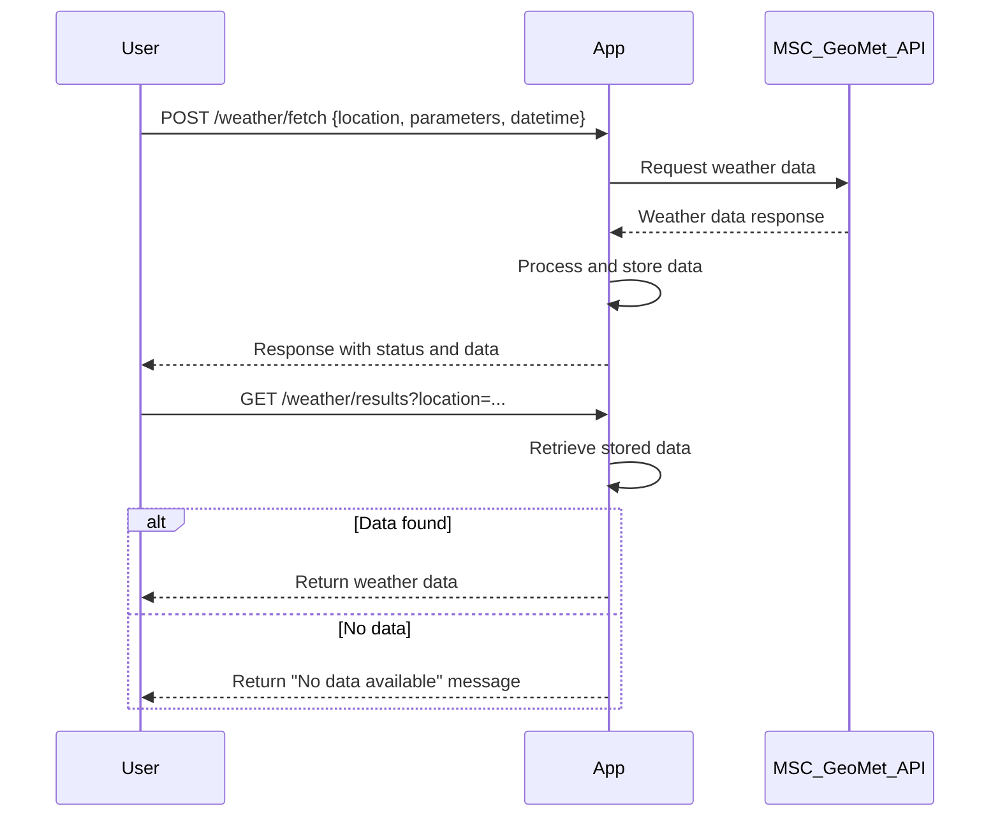

```markdown
# Functional Requirements for Weather Data App (MSC GeoMet)

## API Endpoints

### 1. POST /weather/fetch
- **Purpose:** Trigger fetching weather data from MSC GeoMet API and perform any necessary processing.
- **Request:**
  ```json
  {
    "location": "string",          // e.g., city name or coordinates
    "parameters": ["string"],      // e.g., ["temperature", "humidity"]
    "datetime": "string|null"      // Optional ISO8601 datetime for historical data or null for current
  }
  ```
- **Response:**
  ```json
  {
    "status": "success|failure",
    "message": "string",
    "data": {
      "temperature": "number|null",
      "humidity": "number|null",
      "wind_speed": "number|null"
      // ... requested parameters
    }
  }
  ```

### 2. GET /weather/results
- **Purpose:** Retrieve the latest fetched weather data for a given location.
- **Query Parameters:**
  - `location` (required): string
- **Response:**
  ```json
  {
    "location": "string",
    "timestamp": "string",          // ISO8601 datetime when data was fetched
    "data": {
      "temperature": "number|null",
      "humidity": "number|null",
      "wind_speed": "number|null"
      // ... other available parameters
    }
  }
  ```

---

## Business Logic Notes

- External API calls to MSC GeoMet happen **only** in the `POST /weather/fetch` endpoint.
- The `GET /weather/results` endpoint returns stored or cached results from previous fetches.
- If no data is available for a requested location in `GET /weather/results`, respond with an appropriate message.

---

## User-App Interaction Sequence


```mermaid
sequenceDiagram
    participant User
    participant App
    participant MSC_GeoMet_API

    User->>App: POST /weather/fetch {location, parameters, datetime}
    App->>MSC_GeoMet_API: Request weather data
    MSC_GeoMet_API-->>App: Weather data response
    App->>App: Process and store data
    App-->>User: Response with status and data

    User->>App: GET /weather/results?location=...
    App->>App: Retrieve stored data
    alt Data found
        App-->>User: Return weather data
    else No data
        App-->>User: Return "No data available" message
    end
```

---

## Example user response (copy-paste if no preferences):

```markdown
I want to trigger fetching weather data by POST /weather/fetch with location and parameters, and retrieve stored results via GET /weather/results. The data should include temperature, humidity, and wind speed.
```
```