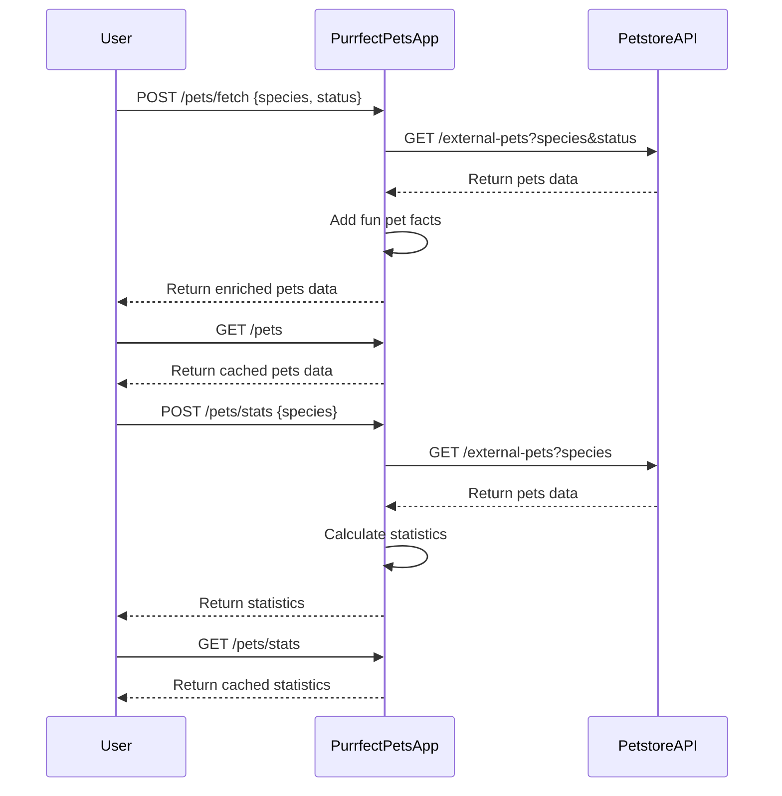

```markdown
# Purrfect Pets API - Functional Requirements

## API Endpoints

### 1. Fetch Pets Data (POST)
- **Endpoint:** `/pets/fetch`
- **Purpose:** Retrieve pets data from the external Petstore API, optionally filtered by species or status, and enrich with fun pet facts.
- **Request:**
```json
{
  "species": "dog",          // optional, filter by species
  "status": "available"      // optional, filter by pet status
}
```
- **Response:**
```json
{
  "pets": [
    {
      "id": 123,
      "name": "Fluffy",
      "species": "dog",
      "status": "available",
      "fun_fact": "Dogs have three eyelids!"
    }
  ]
}
```

---

### 2. Get Cached/List Pets (GET)
- **Endpoint:** `/pets`
- **Purpose:** Retrieve the last cached pets data stored in the app (read-only).
- **Request:** None
- **Response:**
```json
{
  "pets": [
    {
      "id": 123,
      "name": "Fluffy",
      "species": "dog",
      "status": "available",
      "fun_fact": "Dogs have three eyelids!"
    }
  ]
}
```

---

### 3. Fetch and Calculate Pet Statistics (POST)
- **Endpoint:** `/pets/stats`
- **Purpose:** Retrieve pet data from the external API (optionally filtered by species) and calculate statistics such as total count and status breakdown.
- **Request:**
```json
{
  "species": "cat"  // optional filter
}
```
- **Response:**
```json
{
  "species": "cat",
  "total_pets": 42,
  "available": 30,
  "pending": 8,
  "sold": 4
}
```

---

### 4. Get Cached Pet Statistics (GET)
- **Endpoint:** `/pets/stats`
- **Purpose:** Retrieve the last calculated pet statistics stored in the app.
- **Request:** None
- **Response:**
```json
{
  "species": "cat",
  "total_pets": 42,
  "available": 30,
  "pending": 8,
  "sold": 4
}
```

---

## User-App Interaction Sequence


```mermaid
sequenceDiagram
  participant User
  participant PurrfectPetsApp
  participant PetstoreAPI

  User->>PurrfectPetsApp: POST /pets/fetch {species, status}
  PurrfectPetsApp->>PetstoreAPI: GET /external-pets?species&status
  PetstoreAPI-->>PurrfectPetsApp: Return pets data
  PurrfectPetsApp->>PurrfectPetsApp: Add fun pet facts
  PurrfectPetsApp-->>User: Return enriched pets data

  User->>PurrfectPetsApp: GET /pets
  PurrfectPetsApp-->>User: Return cached pets data

  User->>PurrfectPetsApp: POST /pets/stats {species}
  PurrfectPetsApp->>PetstoreAPI: GET /external-pets?species
  PetstoreAPI-->>PurrfectPetsApp: Return pets data
  PurrfectPetsApp->>PurrfectPetsApp: Calculate statistics
  PurrfectPetsApp-->>User: Return statistics

  User->>PurrfectPetsApp: GET /pets/stats
  PurrfectPetsApp-->>User: Return cached statistics
```

---

## Notes
- POST endpoints trigger external data fetch and business logic.
- GET endpoints return cached or previously processed data.
- Request and response bodies use JSON.
```