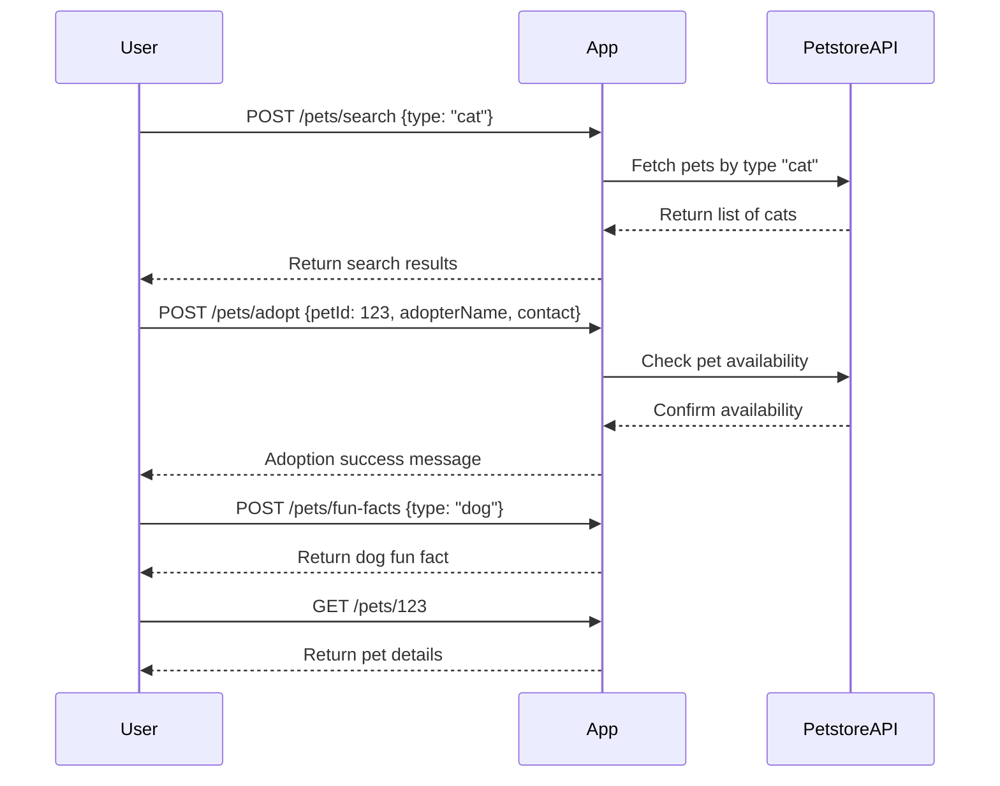

```markdown
# Functional Requirements for 'Purrfect Pets' API App

## Overview
The app integrates with the Petstore API data and provides a fun and useful interface for users to manage and explore pets. It follows RESTful principles with:

- **POST** endpoints for any business logic, external data retrieval, or calculations.
- **GET** endpoints only for retrieving application results.

---

## API Endpoints

### 1. POST /pets/search
- **Description:** Search pets by criteria (type, status, name, etc.) by invoking Petstore API.
- **Request:**
```json
{
  "type": "cat",                // optional: cat, dog, etc.
  "status": "available",        // optional: available, pending, sold
  "name": "Fluffy"              // optional: partial/full name
}
```
- **Response:**
```json
{
  "results": [
    {
      "id": 123,
      "name": "Fluffy",
      "type": "cat",
      "status": "available",
      "photoUrls": ["http://example.com/photo1.jpg"],
      "description": "A cute fluffy cat"
    }
  ]
}
```

---

### 2. POST /pets/adopt
- **Description:** Process pet adoption request; validates availability and marks pet as adopted internally.
- **Request:**
```json
{
  "petId": 123,
  "adopterName": "Alice",
  "contact": "alice@example.com"
}
```
- **Response:**
```json
{
  "success": true,
  "message": "Pet Fluffy adopted successfully!"
}
```

---

### 3. POST /pets/fun-facts
- **Description:** Returns a fun pet fact or joke, optionally filtered by pet type.
- **Request:**
```json
{
  "type": "dog"               // optional
}
```
- **Response:**
```json
{
  "fact": "Dogs can learn more than 1000 words!"
}
```

---

### 4. GET /pets/{petId}
- **Description:** Retrieve cached or processed pet details by pet ID.
- **Response:**
```json
{
  "id": 123,
  "name": "Fluffy",
  "type": "cat",
  "status": "available",
  "photoUrls": ["http://example.com/photo1.jpg"],
  "description": "A cute fluffy cat"
}
```

---

## User-App Interaction Sequence


```mermaid
sequenceDiagram
  participant User
  participant App
  participant PetstoreAPI

  User->>App: POST /pets/search {type: "cat"}
  App->>PetstoreAPI: Fetch pets by type "cat"
  PetstoreAPI-->>App: Return list of cats
  App-->>User: Return search results

  User->>App: POST /pets/adopt {petId: 123, adopterName, contact}
  App->>PetstoreAPI: Check pet availability
  PetstoreAPI-->>App: Confirm availability
  App-->>User: Adoption success message

  User->>App: POST /pets/fun-facts {type: "dog"}
  App-->>User: Return dog fun fact

  User->>App: GET /pets/123
  App-->>User: Return pet details
```
```