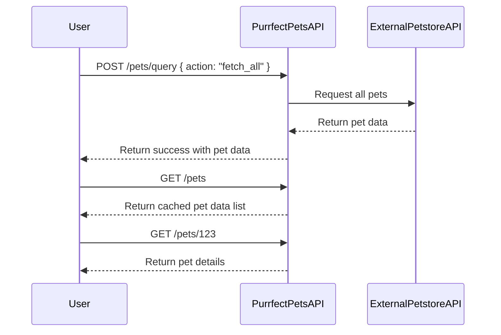
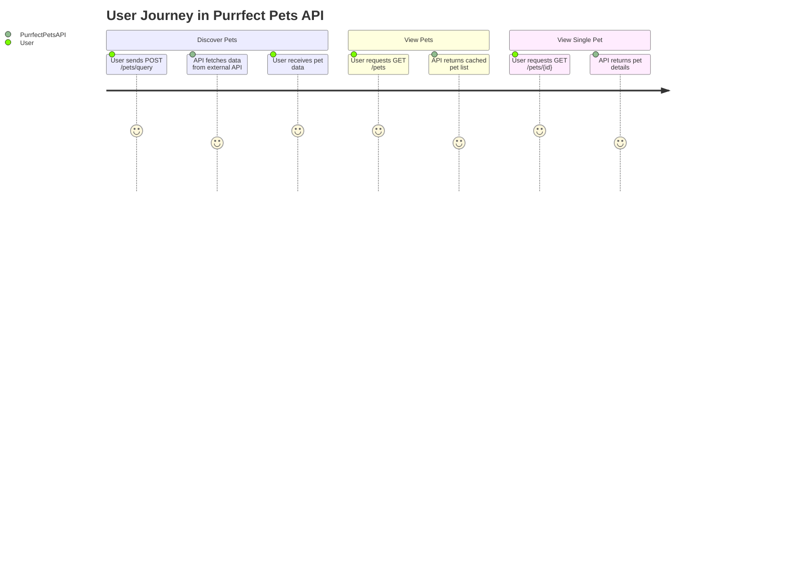

```markdown
# Functional Requirements for Purrfect Pets API

## API Endpoints

### 1. POST /pets/query
- **Purpose:** Retrieve or update pet data by invoking external Petstore API or performing calculations.
- **Request:**
  ```json
  {
    "action": "fetch_all" | "fetch_by_type" | "add_pet" | "update_pet" | "delete_pet",
    "data": { ... }  // depends on action
  }
  ```
- **Response:**
  ```json
  {
    "status": "success" | "error",
    "message": "Optional message",
    "result": { ... }  // data returned or confirmation
  }
  ```
- **Business logic:**
  - Fetch all pets or filter by type (cat, dog, etc.) from external Petstore API.
  - Add, update, or delete pets in local app storage.
  - Perform any calculations or enrichment (e.g., adoption status).

---

### 2. GET /pets
- **Purpose:** Retrieve processed pet data stored or cached inside the app.
- **Request:** None
- **Response:**
  ```json
  [
    {
      "id": "123",
      "name": "Whiskers",
      "type": "cat",
      "status": "available",
      "details": { ... }
    },
    ...
  ]
  ```

---

### 3. GET /pets/{id}
- **Purpose:** Retrieve detailed info about a single pet by ID.
- **Request:** None
- **Response:**
  ```json
  {
    "id": "123",
    "name": "Whiskers",
    "type": "cat",
    "status": "available",
    "details": { ... }
  }
  ```

---

# Mermaid Sequence Diagram: User Interaction with Purrfect Pets API


```mermaid
sequenceDiagram
    participant User
    participant PurrfectPetsAPI
    participant ExternalPetstoreAPI

    User->>PurrfectPetsAPI: POST /pets/query { action: "fetch_all" }
    PurrfectPetsAPI->>ExternalPetstoreAPI: Request all pets
    ExternalPetstoreAPI-->>PurrfectPetsAPI: Return pet data
    PurrfectPetsAPI-->>User: Return success with pet data

    User->>PurrfectPetsAPI: GET /pets
    PurrfectPetsAPI-->>User: Return cached pet data list

    User->>PurrfectPetsAPI: GET /pets/123
    PurrfectPetsAPI-->>User: Return pet details
```

---

# Mermaid Journey Diagram: Typical User Flow


```mermaid
journey
    title User Journey in Purrfect Pets API
    section Discover Pets
      User sends POST /pets/query: 5: User
      API fetches data from external API: 4: PurrfectPetsAPI
      User receives pet data: 5: User
    section View Pets
      User requests GET /pets: 5: User
      API returns cached pet list: 4: PurrfectPetsAPI
    section View Single Pet
      User requests GET /pets/{id}: 5: User
      API returns pet details: 4: PurrfectPetsAPI
```
```