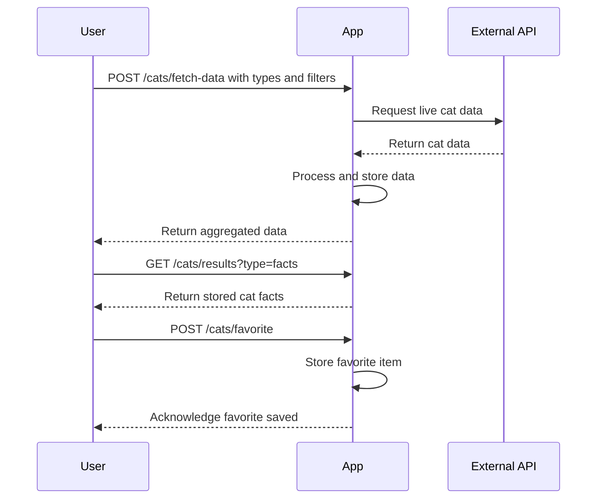

```markdown
# Purrfect Pets API - Functional Requirements

## API Endpoints

### 1. POST /cats/fetch-data  
**Description:**  
Fetch live cat data from external sources (facts, images, breeds). Business logic to retrieve and aggregate data happens here.

**Request Format:**  
```json
{
  "types": ["facts", "images", "breeds"],  // array of requested data types
  "filters": {
    "breed": "Siamese"                      // optional filter by breed
  }
}
```

**Response Format:**  
```json
{
  "facts": [
    "Cats sleep 70% of their lives.",
    "A group of cats is called a clowder."
  ],
  "images": [
    "https://example.com/cat1.jpg",
    "https://example.com/cat2.jpg"
  ],
  "breeds": [
    {
      "name": "Siamese",
      "origin": "Thailand",
      "description": "Sleek and social cat breed."
    }
  ]
}
```

---

### 2. GET /cats/results  
**Description:**  
Retrieve the latest fetched cat data stored in the application.

**Request Format:**  
No body, query params optional:
```
?type=facts
```

**Response Format:**  
```json
{
  "type": "facts",
  "data": [
    "Cats sleep 70% of their lives.",
    "A group of cats is called a clowder."
  ]
}
```

---

### 3. POST /cats/favorite  
**Description:**  
Submit a favorite cat image or fact (optional interactive feature).

**Request Format:**  
```json
{
  "type": "image",        // "image" or "fact"
  "content": "https://example.com/cat_fav.jpg"
}
```

**Response Format:**  
```json
{
  "status": "success",
  "message": "Favorite saved."
}
```

---

## User-App Interaction Sequence Diagram


```mermaid
sequenceDiagram
    participant User
    participant App

    User->>App: POST /cats/fetch-data with types and filters
    App->>External API: Request live cat data
    External API-->>App: Return cat data
    App->>App: Process and store data
    App-->>User: Return aggregated data

    User->>App: GET /cats/results?type=facts
    App-->>User: Return stored cat facts

    User->>App: POST /cats/favorite
    App->>App: Store favorite item
    App-->>User: Acknowledge favorite saved
```

---

## Summary

- POST endpoints invoke external data sources and perform business logic.  
- GET endpoints serve stored application data.  
- JSON is used for all request/response payloads.  
- Optional favorite feature provides user interaction.
```