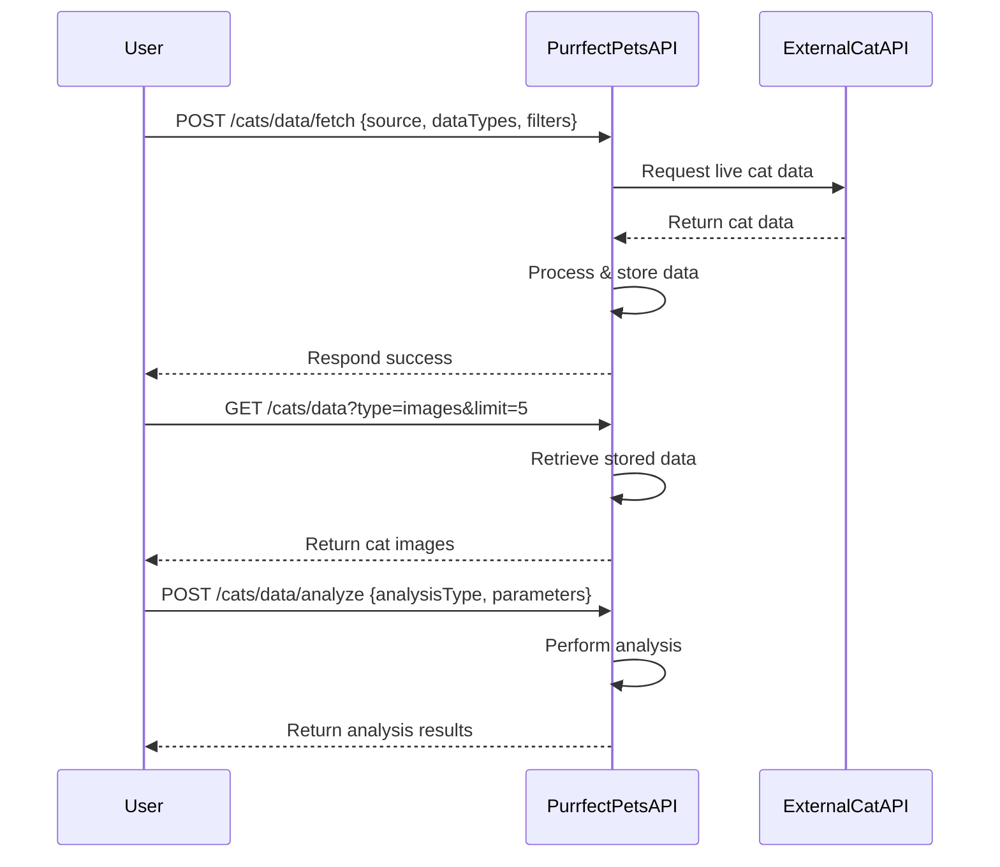

```markdown
# Purrfect Pets API - Functional Requirements

## Overview
The API provides live cat data by invoking external cat data APIs via POST endpoints and serves processed/stored results to clients via GET endpoints.

---

## API Endpoints

### 1. POST /cats/data/fetch  
**Description:** Fetch live cat data from external source(s), process it, and store results for later retrieval.  
**Request:**  
```json
{
  "source": "string",          // Optional: specify external API or "default"
  "dataTypes": ["string"],     // e.g. ["images", "breeds", "facts"]
  "filters": {                 // Optional filtering parameters
    "breed": "string",
    "limit": number
  }
}
```

**Response:**  
```json
{
  "status": "success",
  "message": "Data fetched and stored",
  "count": number              // Number of records fetched
}
```

### 2. GET /cats/data  
**Description:** Retrieve stored cat data based on query parameters.  
**Request Query Parameters:**  
- `type` (string, optional): data type to retrieve (e.g. "images", "breeds", "facts")  
- `breed` (string, optional): filter by breed  
- `limit` (number, optional): max number of items returned  

**Response:**  
```json
{
  "dataType": "string",
  "data": [
    {
      "id": "string",
      "content": "string or object" // E.g., URL for image, breed info object, fact string
    }
  ]
}
```

### 3. POST /cats/data/analyze  
**Description:** Perform calculations or analysis on stored data (e.g., breed popularity, fact frequency).  
**Request:**  
```json
{
  "analysisType": "string",   // e.g., "popularity", "factFrequency"
  "parameters": {             // optional params depending on analysisType
    "breed": "string",
    "timeRange": "string"
  }
}
```

**Response:**  
```json
{
  "analysisType": "string",
  "result": "object or string"
}
```

---

## User-App Interaction Sequence


```mermaid
sequenceDiagram
    participant User
    participant PurrfectPetsAPI
    participant ExternalCatAPI

    User->>PurrfectPetsAPI: POST /cats/data/fetch {source, dataTypes, filters}
    PurrfectPetsAPI->>ExternalCatAPI: Request live cat data
    ExternalCatAPI-->>PurrfectPetsAPI: Return cat data
    PurrfectPetsAPI->>PurrfectPetsAPI: Process & store data
    PurrfectPetsAPI-->>User: Respond success

    User->>PurrfectPetsAPI: GET /cats/data?type=images&limit=5
    PurrfectPetsAPI->>PurrfectPetsAPI: Retrieve stored data
    PurrfectPetsAPI-->>User: Return cat images

    User->>PurrfectPetsAPI: POST /cats/data/analyze {analysisType, parameters}
    PurrfectPetsAPI->>PurrfectPetsAPI: Perform analysis
    PurrfectPetsAPI-->>User: Return analysis results
```

---

## Notes
- POST endpoints handle all external API calls and data processing.
- GET endpoint only returns already stored results.
- Filters and parameters enhance flexibility of data retrieval and analysis.
```
